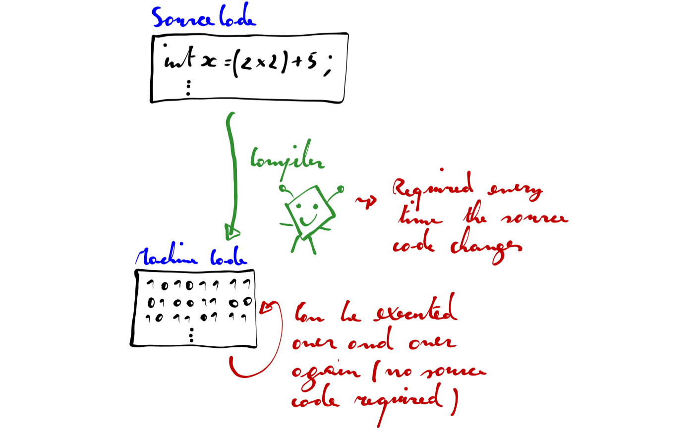
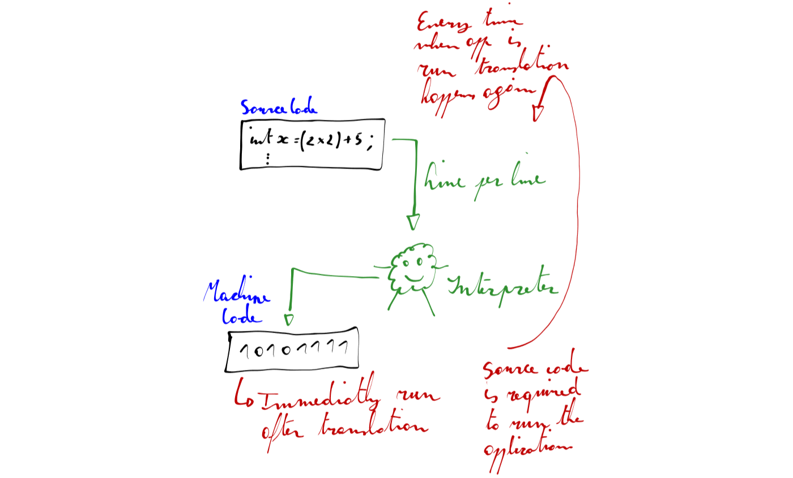
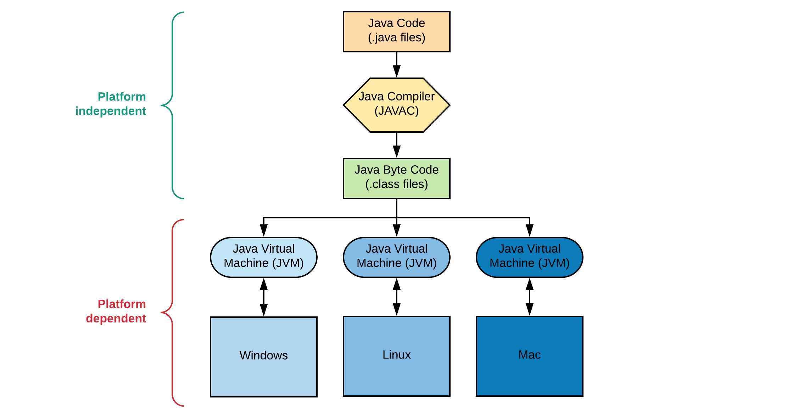

## A Programming Language

A programming language is, as the name would suggest, a **language developed to express programs**. All computers have a native programming language that they understand, commonly referred to as **machine code**. However, machine code is a difficult language for us to follow: amongst a number of difficulties, it is typically expressed in the binary number system, and it is unique to a particular computer architecture (thus two different computers could potentially use two different versions of machine code).

Other programming languages, such as Assembly, BASIC, Java and C++ exist to provide a better interface between us, the programmers, and the computer. They allow programs to be expressed in a language that is easier for us to understand and potentially common to a number of computer architectures, but which can still be **translated into machine code**. In order for this to happen, a computer must either **compile or interpret** programs written in one of these languages before they can be executed.

### Compilation vs Interpretation

An application written in a compiled programming language has to be translated into machine code before it can be executed. A **compiler** translates the programming language to machine code, which is then permanently stored as an **executable**. As an analogy, think of a novel that was written in one language and then translated into another. For example, the Harry Potter novels were written in British English, and were then subsequently translated into 67 other languages.

In much the same way, a computer program can be compiled (or "translated") into machine code, and it may potentially be compiled into different architectures (or "dialects") of machine code to suit different computers. Each translation will be a unique version of the program, in the same way that each translated book is a unique version of the original novel.

An interpreted program is stored in it's original human-readable form. When the program is executed, an **interpreter** translates the human-readable content to machine code as it is run.

This is analogous to the role that a human interpreter performs. For example, rather than translating the British English version of Harry Potter into Latvian and then providing the Latvian version to someone who understands the language, (as per compilation), we could hire a translator who knows both British English and Latvian. The translator may choose to read each line from the British English novel, translate each line (one at a time) into Latvian, and, as each line is translated, relate it to the listener.

The computer interpreter performs the same function: it reads an instruction in one programming language, translates it into machine code, and then executes the machine code version. Once that instruction is out of the way it moves along to the next, performing exactly the same task, in much the same way that the interpreter of the Harry Potter novel would move on to the next line once the first has been related. Unlike compiled programs, at no point is a complete, discrete, machine code version of the program produced: at any point in time only a small number of instructions exist as machine code versions, and these will be removed from the computer's memory when they are no longer required.

There are advantages for both types of software development. As a generalization, **compiled programs are faster to run but slower to develop**. Compiled programs often run faster because the computer only needs to execute the previously translated instructions. In interpreted languages, every time the program is run the computer also needs to translate each of the instructions. This translation causes a delay, slowing the execution of the program. On the other hand, interpreted languages are often written in a smaller time frame, because whole program does not need to be compiled each time a new feature is implemented.

The table below gives an overview of the most important differences between a compiler and an interpreter.

| &nbsp; | A Compiler | An Interpreter |
| --- | --- | --- |
| Input | Takes an entire program as its input | Takes a single line of code as its input |
| Output | An executable | None |
| Execution Speed | Faster | Slower as each instruction needs to be translated to machine code |
| Development Speed | Slower as it needs to be compiled every time | Faster |
| Errors | Often harder to find as code might be optimized | Easier as execution happens line by line |

#### What About Java

Java implementations typically use a two-step compilation process. Java source code is compiled down to bytecode by the Java compiler. The bytecode is then executed by a Java Virtual Machine (JVM). Modern JVMs use a technique called Just-in-Time (JIT) compilation to compile the bytecode to native instructions understood by hardware CPU on the fly at runtime.

Some implementations of JVM may choose to interpret the bytecode instead of JIT compiling it to machine code, and running it directly. While this is still considered an "interpreter," It's quite different from interpreters that read and execute the high level source code (i.e. in this case, Java source code is not interpreted directly, the bytecode, output of Java compiler, is.)

It is technically possible to compile Java down to native code ahead-of-time and run the resulting binary. It is also possible to interpret the Java code directly.

