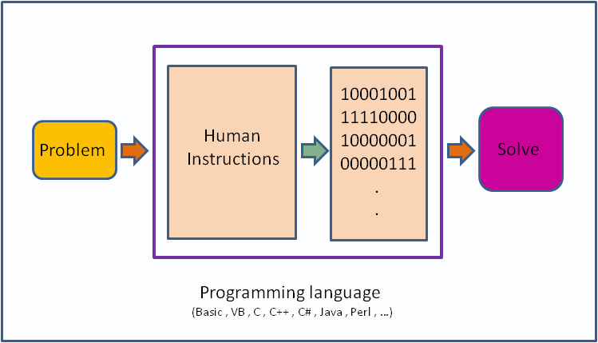

## An Application

A computer is a tool for solving problems with data. A program or an application is a sequence of instructions that tell a computer how to do a certain task. When a computer follows the instructions in a program, it is said **it executes the program**.

Before we see what a computer programming language looks like, let's use a spoken language such as the English language to describe how to do something as a series of steps. A common exercise that really gets you thinking about what computer programming can be like is to describe a process you are familiar with.

Try for example to come up with a sequence of instructions to tell someone how to clean a car. Don't leave out any steps, or put them in the wrong order.

Was that easy? Did you remember all the steps? Maybe you forgot to tell me to use a sponge to rub the soap on the car. Now I might be rubbing a car with my bare hands. Of course, you say, a person wouldn't be that dumb. But a computer is that dumb. A computer will only do what you tell it to do. This might make programming frustrating at first, but it's also relieving in a way: if you do everything right, you know exactly what the computer is going to do, because you told it to.

While this is certainly a useful exercise you can already feel that programming in a natural language can become very complex and computers are just not ready for it yet. Heck, most humans aren't even ready for it yet.

> So what will be the result? I expect natural language programming will eventually become ubiquitous as a way of telling computers what to do. People will be able to get started in doing programming-like tasks without learning anything about official "programming" and programming languages: they’ll just converse with their computers as they might converse with another person.
>
> *Stephen Wolfram*


**Don't blame the Computer, blame the programmer.**

As a future programmer you should never state that the computer is doing something wrong when your applications fails, crashes or does something unexpected. You should instead ask yourself, did I tell the computer how to do the job correctly? Did I forget something? Did I misinterpret the problem or do I have the solution wrong?


Of course, computers don't understand recipes written on paper. Computers are machines, and at the most basic level, they are a collection of switches - where 1 represents "on" and 0 represents "off". Everything that a computer does is implemented in this most basic of all numbering systems - binary. If you really wanted to tell a computer what to do directly, you'd have to talk to it in binary, giving it coded sequences of 1s and 0s that tell it which instructions to execute. However, this is nearly impossible. In practice, we use a programming language.

