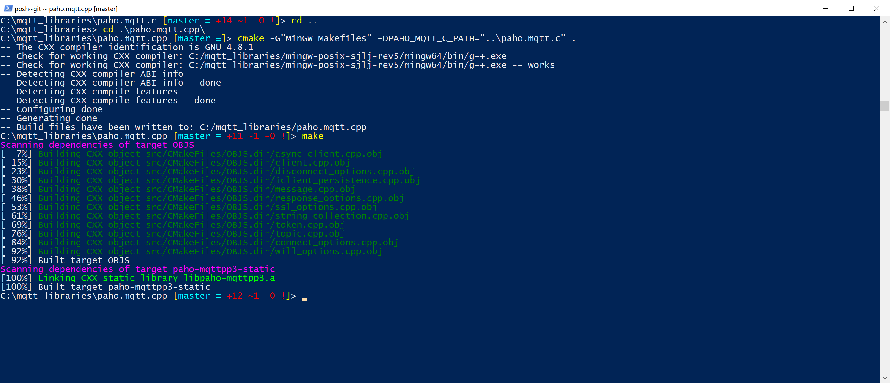

## Console and GUI Applications

Applications come in many different kinds and flavors. Some application run as a **service in the background** (take for example a webserver). Some run **in a terminal** (take for example GIT). Other run as **graphical application** (take for example Visual Studio Code) or **inside a browser** (take for example the Scratch editor).

A console application is a computer program designed to be used via a text-only computer interface, such as

* a text terminal, the command line interface of some operating systems (Unix, DOS, etc.)
* or the text-based interface included with most Graphical User Interface (GUI) operating systems, such as the Win32 console in Microsoft Windows, the Terminal in Mac OS X, and xterm in Unix.

A user typically interacts with a console application using only a keyboard and display screen, as opposed to GUI applications, which normally require the use of a mouse or other pointing device. Many console applications such as command line interpreters are command line tools, but numerous text-based user interface (TUI) programs also exist.

As the speed and ease-of-use of GUI (Graphical User Interface) applications have improved over time, the use of console applications has greatly diminished, but not disappeared. Some users simply prefer console based applications, while some organizations still rely on existing console applications to handle key data processing tasks.

The ability to create console applications is kept as a feature of modern programming environments such as Visual Studio and the .NET Framework on Microsoft Windows because it greatly simplifies the learning process of a new programming language by removing the complexity of a graphical user interface.


**Task Automation**

Another huge advantage of working with console applications compared to a GUI application is the **ability to automate certain tasks**. It is very easy to create a small script to automate certain processes. One could for example schedule a task that automatically backups our system every few days. Automating GUI applications is not always easy.


For data processing tasks and computer administration, these programming environments represent the next level of operating system or data processing control after scripting. If an application is only going to be run by the original programmer and/or a few colleagues, there may be no need for a pretty graphical user interface, leaving the application leaner, faster and easier to maintain.

