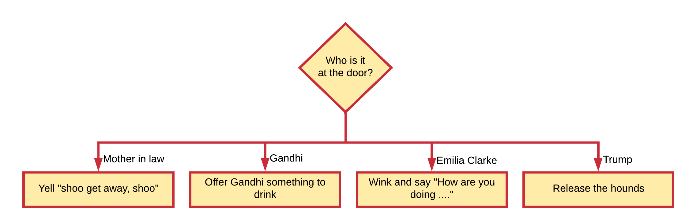

## Decision Making

Computer programs often have different things to do based on a certain situation. At certain points in the code, a decision has to be made. This requires that a **decision making** construct is available.

This is also called **branching** (think about the branches of a tree). A branch is an instruction in a computer program that can cause a computer to begin executing a different instruction sequence and thus deviate from its default behavior of executing instructions in order.

A decision asks a question. The answer to the question determines which arrow you follow out of the decision shape. Always make sure to label the branch arrows coming from a decision.

Take a good look at the example below of a possible students evening routine. Take a note on the different decisions that are shown. Now you should notice where the term branching refers to.

The arrows flowing from the decision shape are usually labeled with *Yes*, *No* or *True*, *False*. But you can label them any way you want as long as the meaning is clear.

At least two arrows should emerge from a decision symbol. If your choice is not binary, add more arrows as shown below.

