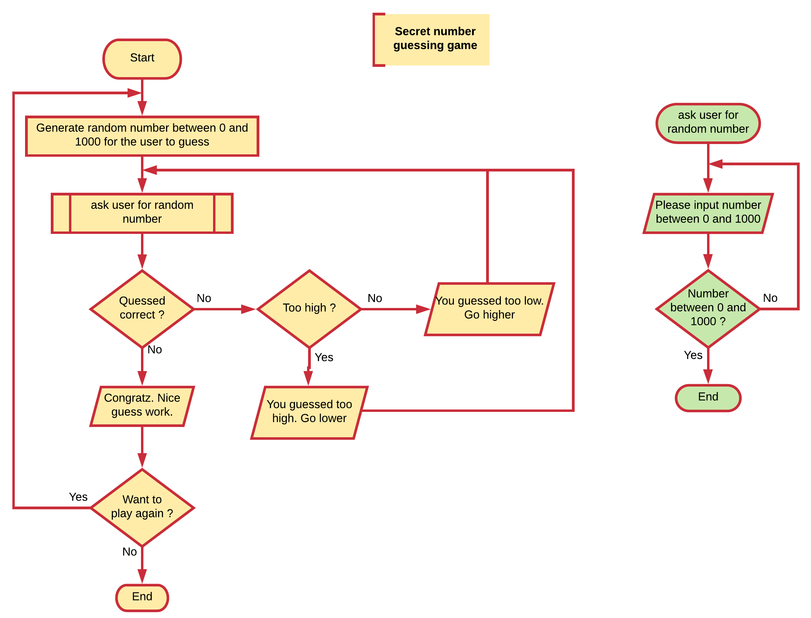

## Functions

Every programming language lets you create **named blocks of code that perform a specific task** called **functions**. Using the name of the function can be **called** from other parts of the application. Calling a function is asking the compiler/interpreter to execute the code inside of the function.

Functions usually **take in data**, **process it**, and **return a result**. How the function does this is most of the time only important to the people that created the functions. Other programmers are often only interested in how to use the function and what the result will be. For this same reason, functions are often called **black-boxes**.

Ideally, a function performs a single, related action. Functions provide better modularity for your application and a high degree of code reusing.

Programming lanuages often have many built-in functions that can be used by the developer. On the other hand, as a developer you are also able to create your own functions.


**Definition of a function**

A function is a named **self contained** block of code that performs a specific task.


Based on the type of programming language, a distinction can be made between functions, sub-routines, procedures and methods. While each is a bit different they all have the same basic concept: a **self contained** entity of code that accomplish a specific task.

### Square Root function

A well-known example of a function is the square root math operation. Every programming language that supports math operations will have some sort of function readily available for you to calculate the square root of a value.

This example also proves the black box principle. While there are many algorithms available to determine the square root of a number, we as a user of the square root function don't care how the result is accomplished. Ofcourse we need to know what inputs the function requires and what output it will generate.

### Functions in flowcharts

Functions in flowcharts are actually called sub-processes. Each sub-process is a named flowchart on itself that can be used from inside another (sub-)process. Inputs and outputs are of less importance when using or defining sub-processes in flowcharts. These are more language specific. Calling a sub-process is achieved by placing a rectangle with double-struck vertical edges with the name of the sub-process inside of it.

Take a look at the example flowchart below. It models a very simple guessing game. The game generates a random number between 0 and 1000. The user is asked to guess the number, while the game states if the user should guess higher or lower.

