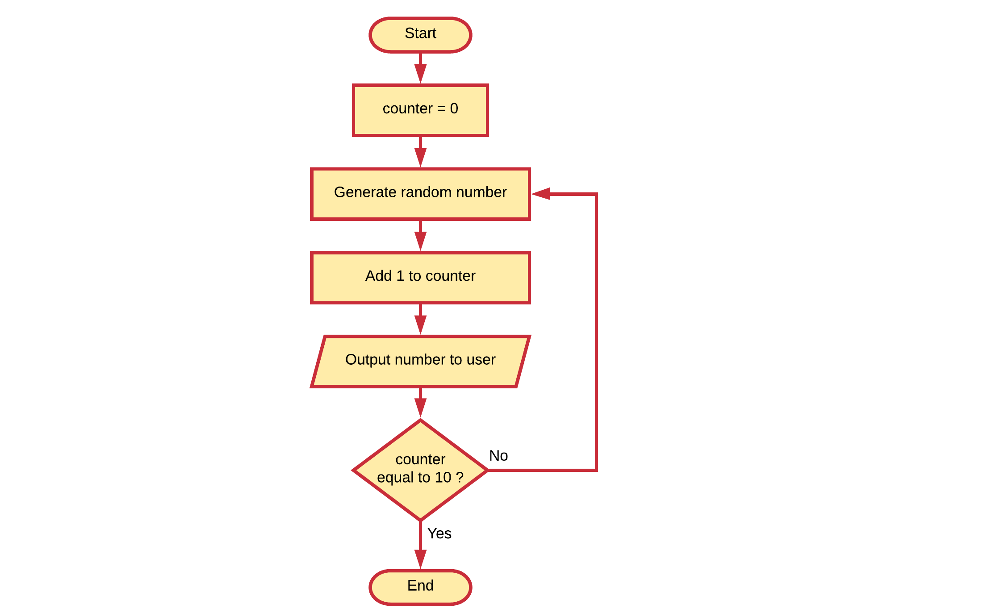

## Loop Constructs

Software is ideal for executing repetitive tasks (things that have to be done multiple times). To be able to do things multiple times a programming languages needs some sort **loop constructs**.

Programming languages often multiple looping constructs, such as for loops, while loops, foreach loops, do-while loops, ... While these can all be modelled using flowcharts, we don't actually have to know them to be able to create a loop in a flowchart.

All we need is a condition in a flowchart that is checked. In one of the outcomes we loop again, in the other we quit the loop. Which outcome you use to quit the loop is up to you.

Take a look at the example below. Here the process consist of checking if the cat is hungry. If it is, we feed it a little and check again. If it's not or not anymore, we stop giving food.

Notice how we first check if it is hungry before we give it food. Now take a look at another implementation where we first give it food and we check after it has eaten if we need to give more food. Basically the outcome is the same: the cat is fed. However the subtle difference here is that we may give food to a cat that was never hungry in the first place.

The condition can also be a counter variable. The process below will output 10 random numbers for the user.

