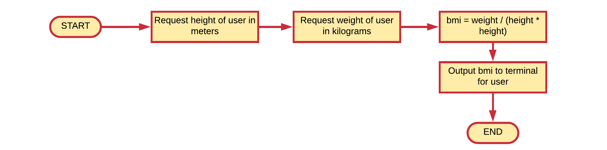

## Operators

Most programs will performs all sorts of operations on data they have at their disposal. We often say that **they process the data**. For this processing a programming language needs **operators**. Many of the operators you will already be familiar with from Math. Some examples are multiplication `*`, addition `+`, subtraction `-`, assignment `=` and so on.

### Body Mass Index example

Consider a small example application that calculates the BMI (Body Mass Index) of a person. This is a measure of body fat based on height and weight that applies to adult men and women. It is an attempt to quantify the amount of tissue mass (muscle, fat, and bone) in an individual, and then categorizes that person as underweight, normal weight, overweight, or obese based on that value.

The BMI is defined as the weight divided by the square of the body height, and is universally expressed in units of `kg/m2`, resulting from mass in kilograms and height in meters.

First one needs to identify the information required from the user:
* the weight of the person in kilograms
* the height of the person in meters

Next the BMI can be calculated using the formula `weight / (height * height)`, where `/` is the division operator and `()` are braces that group calculations just as in Math.

For this small program we would need at least three variables: `weight`, `height` and `bmi`.

This appliciation could be modelled using the flowchart shown below:

