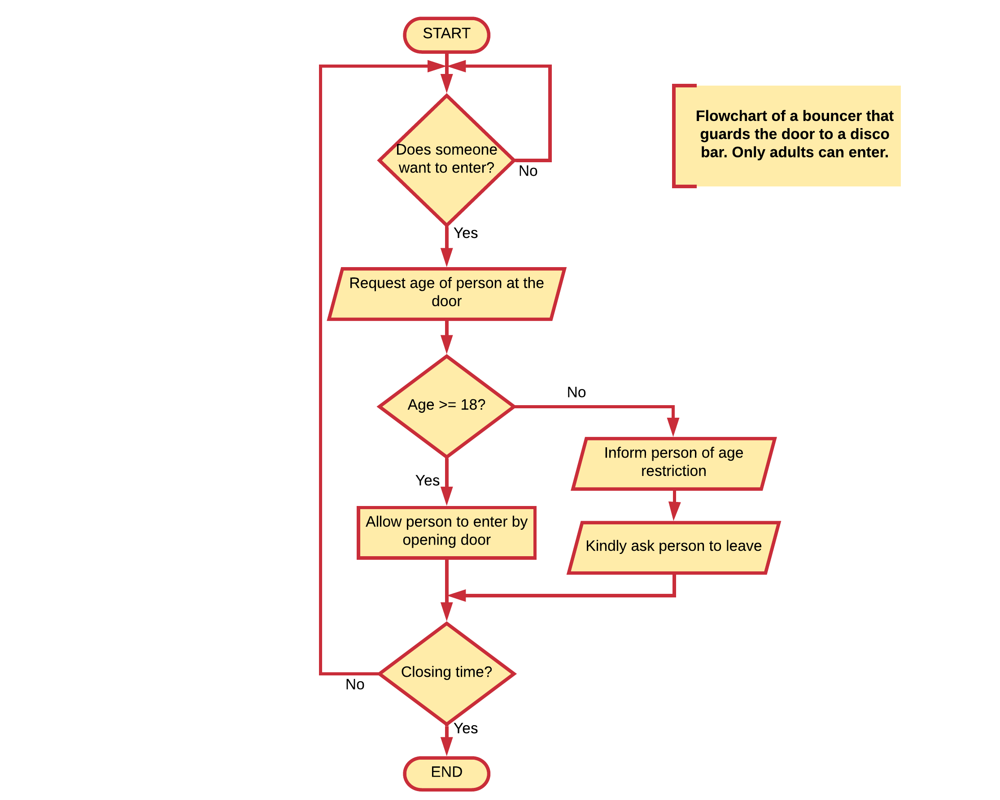

## Variables

The base of almost any computer program is the manipulation of data. Of course before a program can manipulate data it needs to be able to store it. For this it can use the computer memory. This computer memory is accessed via **variables**. Variables are used to store information to be referenced and manipulated in a computer program. They also provide a way of labeling data with a descriptive name, so our programs can be understood more clearly by the reader and ourselves. It is helpful to think of variables as containers that hold information. Their sole purpose is to label and store data in memory. This data can then be used throughout your program.


**Definition of a variable**

A symbolic name associated with a value and whose associated value may be changed.


### Variables in Math

As a student you actually have already been using variables for quite a while. When doing math you also use symbolic names for variables. In the example below, `x`, `y` and `p` are all variables.

```text
x = 15
y = 13

p = x * y
```

Or when defining a linear equation

```text
y = f(x) = ax + b
```

### Using variables

Variables and the data they hold are used for all sorts of things. Producing new values based on the available data, making decisions, outputting information to the user, sending information to the Internet, and so on.

Consider the bouncer example again from the start of this chapter:



Several pieces of information can be identified here which are probable stored in the memory of the computer and made available through variables:
* the age of the person at the door
* the minimum age
* the state of the door (open or closed)
* the current time
* the closing time

While not directly apparent, an application typically handles a lot of information via variables. This is the reason why variables are a basic building block of every programming language.