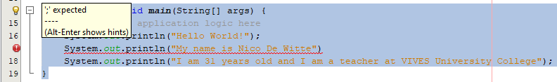

## Terminal Output

A lot can be said about this single line of code.

```java
System.out.println("Hello World!");
```

Most lines of code such as shown above are called `statements`. A statement is an action that is performed in code, often acting on some part of data or information. In the example above, the information is a piece of text, namely "Hello World!". This piece of text is called a **String** in programming languages and is most often specified between two quotes `"Place some text between quotes to make a string"`. A statement is also typically terminated using a semicolon `;`. By placing this at the end of a statement, the Java interpreter knows that the line of code has ended.

If you run the code you will get the following result inside the terminal:

```text
Hello World!
BUILD SUCCESSFUL (total time: 0 seconds)
```

The first example also showed the "BUILD SUCCESSFUL (total time: 0 seconds)" part so this is not new (and this will not be shown in this course anymore from this point on). However before that, the text "Hello World!" was outputted to the terminal. This immediately explains what the new line of code does. It outputs some text to the terminal.

Actually `println` is the name of a method that prints a new line of text to the terminal every time it is used. Try placing multiple statements with `println` below each other, every time with a different string. For example

```java
public static void main(String[] args) {
    // TODO code application logic here
    System.out.println("Hello World!");
    System.out.println("My name is Nico De Witte");
    System.out.println("I am 31 years old and I am a teacher at VIVES University College");
}
```

This will result in the following output:

```text
Hello World!
My name is Nico De Witte
I am 31 years old and I am a teacher at VIVES University College
```

Notice how every statement in the code is terminated (ended) with a semicolon. Also note that `println` starts a new line every time it is called with a string to display. The string we provide to `println` is called an **argument**. It is a piece of information that is given to a method so it can be used inside the method - to be displayed, processed or handled in another way.

Forgetting to place a semicolon at the end of a statement will throw of the Java interpreter and generate what is known as a **syntax error**. Take for example the code below where the second `println` has not terminated correctly. In this case NetBeans will warn you, even before actually running the code. It will generate a message stating that a `;` is expected. The line of code will also be marked using red squiggly lines below the code. If you hover over the exclamation mark on the left side, the message *; expected* is shown.

```java
public static void main(String[] args) {
    // TODO code application logic here
    System.out.println("Hello World!");
    System.out.println("My name is Nico De Witte")
    System.out.println("I am 31 years old and I am a teacher at VIVES University College");
}
```



Strings can be concatenated in Java by placing a `+` sign between the different parts. Java can also concatenate strings
with other types such as numbers. When Java detects that a string is required for an operation, it will automatically
try to convert the given information to a string. The code below shows different examples of string concatenations.

```java
public static void main(String[] args) {
    // TODO code application logic here
    System.out.println("It is now " + "7:44 PM");
    System.out.println("My class counts " + 18 + " students");
    System.out.println("I am currently about " + 980106323 + " seconds old");
    System.out.println("Number of cats in my house: " + 0);
    System.out.println("I am " + 1.86 + "meters tall");
}
```

This code outputs:

```text
It is now 7:44 PM
My class counts 18 students
I am currently about 980106323 seconds old
Number of cats in my house: 0
I am 1.86 meters tall
```

The code above shows both integer numbers and floating point numbers. Floating point numbers use a point `.` as a decimal separator when specifying floating point numbers.