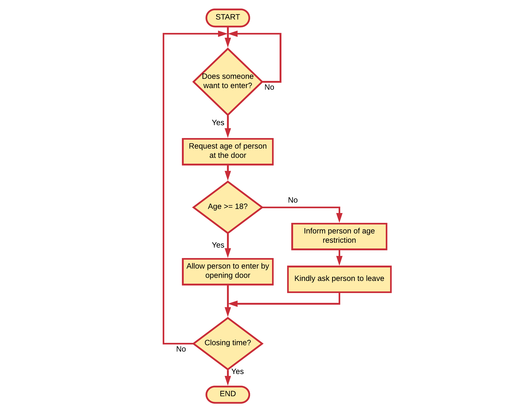

## Flowcharts

Flowcharts are a structured graphical way to document process flow. Flowcharts already exists since 1921 and were introduced by Frank and Lillian Gilbreth in the presentation "Process Charts: First Steps in Finding the One Best Way to do Work". The Gilbreths' tools quickly found their way into industrial engineering curricula. In the early 1930s, an industrial engineer, Allan H. Mogensen began to train business people in the use of some of the tools of industrial engineering.

Flowcharts allow developers to document algorithms, application logic, data flows, ... in a visual manner. Graphical representations have proven to be very useful in the software development world, even to people who don't know how to program.

Consider an example: a disco bar which has a bouncer at the door that checks if the person who wants to enter is over 18. If that person is 18 or older, he/she is allowed to enter. If not, he/she is politely asked to leave. The bouncer's process of elimination can be easily represented using a flowchart as shown below.

### Common used Symbols

A quick overview of the most common used symbols is given below. They will be discussed in more detail later in this chapter.

A **terminal** indicates the start or ending of an application, sub-process, ... It is most often represented using a rounded (fillet) rectangle. They usually contain the word "Start" or "End", or another phrase signaling the start or end of a process.

A basic rectangle is used to represent a **process**. This is an action or operation that changes a value, form, or location of data.

The flow of operation is indicated using a **flowline**. This is a line connecting one symbol with another. While arrowheads are only required if the flow is not the standard top-to-bottom or left-to right, they are almost always added anyways.

When multiple path of execution can be taken based on a condition, an diamond is used to represent a **decision**. The operation is commonly a yes/no question or true/false test.

A **predefined process** shows a named process which is defined somewhere else. It is represented as a rectangle with double-struck vertical edges. The name of the predefiness process is placed inside the inner rectangle bounds.

