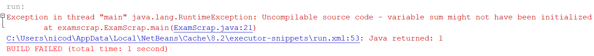

## Declaring a Variable

Before a variable can be used inside an application, it needs be **declared**. Declaring a variable can be thought of as stating to the Java interpreter that is needs to request memory for data and make it accessible using a symbolic variable name. Because the Java interpreter needs to know how much memory to set aside, you as a programmer need to specify what **type of data** the variable will hold.

The type of the variable determines the size and layout of the variable's memory; the range of values that can be stored within that memory; and the set of operations that can be applied to the variable.

Once you provided the type and name, the variable can be used to store data.

Let's take a look at an example where a variable stores the age of a person. In this case we need to define the variable to be of an *integral type*. In Java the data type is `int` (integer) for this, which can store *whole signed numbers*.

```java
public static void main(String[] args) {

    // Declaring a variable of type integer
    // and make it accessible using the symbolic name ageOfPerson
    int ageOfPerson;

    // Assign a value to the variable
    ageOfPerson = 31;

    // The variable name can also be used to retrieve the data
    System.out.println("I am " + ageOfPerson + " years old and I am a teacher at VIVES University College");
}
```

The data referred to by the variable can be changed using the **assignment operator** `=`. This is basically the same as in
math. On the left hand side you have the variable which you want to assign and on the right hand side the value.

When you wish to use the content of the variable, all you need to do is state the symbolic name where you would otherwise
use a value.

This also means that one variable can be used to assign a value to another.

```java
public static void main(String[] args) {
  int numberOfStudents;
  numberOfStudents = 36;

  int numberOfEmailAddresses;
  numberOfEmailAddresses = numberOfStudents;

  System.out.println("We have " + numberOfStudents + " students meaning we also have " + numberOfEmailAddresses + " email addresses");
}
```

Note how the variable needs to be declared (created by stating a type and name) before it is used. The following code is therefore flawed and will not run. `numberOfStudents` and `numberOfEmailAddresses` are used before they are declared.

```java
public static void main(String[] args) {
  numberOfStudents = 36;
  numberOfEmailAddresses = numberOfStudents;

  System.out.println("We have " + numberOfStudents + " students meaning we also have " + numberOfEmailAddresses + " email addresses");

  int numberOfEmailAddresses;
  int numberOfStudents;
}
```


**Declare a variable before using it**

You must declare a variable before it can be used. This is a rule for many programming languages but not for all. Some programming languages will automatically create variables as they are used.


While the code below is working perfectly, you will not often see it being written like this by a more experienced programmer.

```java
public static void main(String[] args) {
  int numberOfStudents;
  numberOfStudents = 36;
}
```

This because when a variable is declared, you can **immediately initialize it** with a value in a single line of code as shown below.

```java
public static void main(String[] args) {
  int numberOfStudents = 36;
}
```

It is important to always initialize a variable before using it. If you use the variable before initializing it, you may create bugs in your program. Java and NetBeans will not even allow the usage of a variable if it is not initialized. This safety net is not provided by all programming languages. For example C++ will allow you to use uninitialized variables. In this case their value is undetermined and often contains garbage data of the previous program that used that same location in memory.

Take for example the code below:

```java
public static void main(String[] args) {
    int sum;
    System.out.println("Sum = " + sum);
}
```

Forcing Java to run this application will result in a crash:

