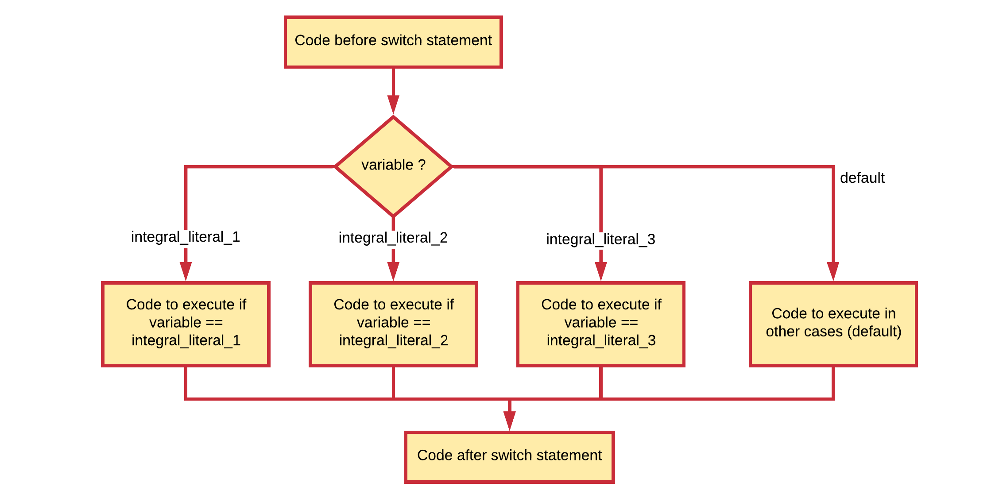

# Making Decisions

The statements inside your source files are **generally executed from top to bottom**, in the order that they appear. Control flow constructs, however, break up the flow of execution by employing **decision making**, enabling your program to **conditionally execute particular blocks of code**. This section describes the decision-making statements `if`, `if-else`, and `switch` supported by the Java programming language.

## Conditions

A computer program must often make **choices** on how to proceed, take for example:

* if the user enters invalid data give him/her a message, otherwise process the data.
* if the ball bounces the edge of the screen, change trajectory, else keep going forward.
* if all the data has been processed, end the program, else continue to the next data item.
* if the player has lives left continue the game, else show a game over screen.

In flowcharts, these decisions are easily identified by the **diamond shape** with the question inside.


Your application will make a choice based on what is called a **condition** (a representation of the question as it were). Usually this is in the form of a mathematical expression using equals, less-than, greater-than, different from, ...

A condition is some **sort of comparison** (or a combination of comparisons) that can be **evaluated** by the compiler or interpreter. After solving all comparisons and combining all the individual parts, the compiler **resolves** it to a **single resulting value** that is `true` or `false` (also keywords in Java). These are actually values that the data type `boolean` can take.

> **DEFINITION** - **Evaluating a condition**
>
> Evaluating a condition is **the process of determining the result of that condition**. The end result of a condition after the evaluation has taken place is always `true` or `false`. The `true` and `false` values can differ from language to language, however internally in memory `false` is most of the time "0" and `true` is "not 0". Generally spoken one can state that the compiler **evaluates the condition to be true or false**.

## Comparison Operators

Comparison operators allow us to **build conditional expressions** using mathematical operators. The table below shows the available comparison operators.

| Operator | Description |
|---|---|
| == | equal to |
| != | not equal to |
| > | greater than |
| >= | greater than or equal to |
| < | less than |
| <= | less than or equal to |

Note how two equality signs `==` are used to test if two values are equal, while a single sign `=` is used for assignment. Using a single sign for a comparison is a mistake often made by beginning programmers.

Since a conditional expression actually produces a single `true` or `false` result, this result can be assigned to a variable of type `boolean`.

Take a look at the code below, which contains some examples of comparison operations:

```java
int a = 4;
int b = 8;
boolean result;
result = (a < b);   // true
result = (a > b);   // false
result = (a <= 4);  // a smaller or equal to 4 - true
result = (b >= 9);  // b bigger or equal to 9 - false
result = (a == b);  // a equal to b - false
result = (a != b);  // a is not equal to b - true
```

The parentheses are optional here but are used to make the code more clear.

While the comparison operators will not often be used in a situation as shown in the code above, they will often be used when making decisions in your program.

## Conditional Operators

As long as the expression only produces a single resulting value (`true` or `false`), conditions can be **combined** using **conditional operators**. This is often necessary when creating more complex conditional expressions.

The next table provides an overview of the available conditional operators in Java.

| Operator | Description |
|---|---|
| && | AND |
| &#124;&#124; | OR |
| ! | NOT |

These work as you know them from the **Boolean algebra**. The `||` (**OR**) operator will return `true` if either of the operands evaluate to `true`. The `&&` (**AND**) operator will return `true` if both operands evaluate to `true`. A logical expression can be negated by placing the `!` (**NOT**) operator in front of it.

Next is the **truth table** for all three conditional operators.

| `A` | `B` | <code>A &#124;&#124; B</code> | `A && B` | `!A` | `!B` |
|---|---|---|---|---|---|
| `false` | `false` | `false` | `false` | `true` | `true` |
| `false` | `true` | `true` | `false` | `true` | `false` |
| `true` | `false` | `true` | `false` | `false` | `true` |
| `true` | `true` | `true` | `true` | `false` | `false` |

In the table above, `A` and `B` are the operands of the conditional operators. When writing a combined expression in code these operand are most often conditional expressions with each containing a comparison operation.

Take for example an expression that checks if `number` is within a range of [0, 100]. This would be coded as:
`boolean isInRange = ((number >= 0) && (number <= 100>));`. This expression can also be written using a less than and greater than comparison, but then the boundaries would be `-1` and `101`.

The code example below checks if a person is a child based on it's `age` (between 0 and 14 years of age).

```java
int age = 16;
boolean isAChild = ((age >= 0) && (age <= 14));      // false
```

While the inner parentheses are optional they do contribute to the readability of the expression.

> **HINT** - **Info::De Morgan's Laws**
>
> In some cases it can be useful to rewrite complex conditions using De Morgan's Laws [https://en.wikipedia.org/wiki/De_Morgan%27s_laws](https://en.wikipedia.org/wiki/De_Morgan%27s_laws). Do take note that shorter not always implies more readable or less complex.

Please be aware that every sub-part of a boolean expression must be a complete boolean expression. Thus if you want to know if `A` is either `10` or `20`, you cannot state `(A == 10 || 20)`. You need to express both operands as full conditional expressions: `(A == 10 || A == 20)`.

> **WARNING** - **Lazy evaluation**
>
> These operators exhibit **"short-circuiting"** behavior, which means that the second operand is evaluated only if needed. This is also called lazy evaluation. So for example in an OR statement, if the first operand is `true`, the outcome must also be `true`. For this reason the second operand is not checked anymore.

## The if statement

The `if` statement is the most basic of all the control flow statements. It tells your program to execute a certain section of code only if a particular condition evaluates to `true`. If the condition evaluates to `false` the execution jumps to the code after the if statement.

The general syntax of an if statement is:

```java
// Code before the if statement

if (condition) {
    // Code inside if statement
    // Executed when condition evaluates to true
}

// Code after the if statement
```

This can be visually represented using the next flowchart.


Take a simple example that tests if the score of the student is below 70%. If that is the case, an encouraging speech is outputted to the terminal.

```java
int studentScore = 30;      // Change this number to test the if statement
//...
System.out.println("Your score is " + studentScore + "%");
if (studentScore < 70) {
  System.out.println("Come on buddy, you will need to work a little harder.");
  System.out.println("You can do it. Still got some time till the exams.");
}
```

If the condition evaluates to `false` (meaning that the score is equal or above 70), control jumps to the end of the if statement.

When the code block consists of **only a single line of code**, the **curly brackets `{}` can be left out**. However, for code readability reasons we strongly advice against it.

```java
int studentScore = 30;      // Change this number to test the if statement
//...
System.out.println("Your score is " + studentScore + "%");
if (studentScore >= 70)
  System.out.println("Good job. Keep at it");
```

## The if-else statement

The if-else statement provides a secondary path of execution when the `if` clause evaluates to `false`. This basically means that in the `true` case something will happen and in `false` case something else will happen.

The general syntax of an if-else statement is:

```java
// Code before the if-else statement

if (condition) {
    // Code inside if body
    // Executed when condition evaluates to true
} else {
    // Code inside else body
    // Executed when condition evaluates to false
}

// Code after the if-else statement
```

This can be visually represented using the next flowchart.


Taking the previous example you could output a "good job" speech when the students score is equal or above 70%.

```java
int studentScore = 30;      // Change this number to test the if-else statement
//...
System.out.println("Your score is " + studentScore + "%");
if (studentScore < 70) {
  System.out.println("Come on buddy, you will need to work a little harder.");
  System.out.println("You can do it. Still got some time till the exams.");
} else {
  System.out.println("Good job. Keep up the good work.");
}
```

## Nesting if-else statements

It is perfectly legal to nest if-else structures inside of each other. Take for example the code below where the message to the user is a bit more personalized based on the gender of the student.

```java
int studentScore = 30;      // Change this number to test the if-else statement
char gender = 'm';          // Change the gender to `f` to test for female
//...
System.out.println("Your score is " + studentScore + "%");
if (studentScore < 70) {
  if (gender == 'm') {
    System.out.println("Come on buddy, you will need to work a little harder.");
  } else {
    System.out.println("Come on miss, you will need to work a little harder.");
  }
  System.out.println("You can do it. Still got some time till the exams.");
} else {
  System.out.println("Good job. Keep up the good work.");
}
```

A nested if-else construct can also be used to create multiple branches (paths of execution) based on different conditions. Take for example the code below that display a more user-friendly message to the student.

```java
int studentScore = 30;      // Change this number to test the if-else statement
//...

// Example of a multi-branch if-else statement
if (studentScore >= 90) {
  System.out.println("Omg, good job. Keep up the work.");
} else {
  if (studentScore >= 70) {
    System.out.println("Some room for improvement but you are on your way.");
  } else {
    if (studentScore >= 50) {
      System.out.println("Ok. But you may want to considering studying a bit more.");
    } else {
      if (studentScore >= 30) {
        System.out.println("Come on buddy, you will need to work a little harder.");
      } else {
        System.out.println("You may want to cancel your holiday vacation for studying.");
      }
    }
  }
}
```

The previous code is **not very clear** and **hard to read**. However, the code can be changed a bit making it much more maintainable and readable. When the body of the branch consists of a single line of code, the curly brackets are optional. Now in many programming languages the whole if-else construct is considered a single statement - an if-else statement.

Now if one were to remove the curly brackets from the else-clauses (except for the last one) this would imply that the previous code can be rewritten as:

```java
int studentScore = 30;      // Change this number to test the if-else statement
//...
System.out.println("Your score is " + studentScore + "%");
if (studentScore >= 90) {
  System.out.println("Omg, good job. Keep up the work.");
} else if (studentScore >= 70) {
  System.out.println("Some room for improvement but you are on your way.");
} else if (studentScore >= 50) {
  System.out.println("Ok. But you may want to considering studying a bit more.");
} else if (studentScore >= 30) {
  System.out.println("Come on buddy, you will need to work a little harder.");
} else {
  System.out.println("You may want to cancel your holiday vacation for studying.");
}
```

This is perfectly legal and is common-practice among developers. The above constructs is actually referred to as an if-elseif-else construct and is a special form of nested if-else statements.

The if-elseif-else statement can be extended with as much elseif statements as required. **Each elseif will need a new condition** that needs to be checked. The conditions are **checked from top to bottom** and the first one that evaluates to `true` is executed, after which control jumps to the end of the if-elseif-else statement.

```java
// Code before the if-elseif-else statement

if (condition_1) {
   // Code to be executed if condition_1 is true
} else if(condition_2) {
   // Code to be executed if condition_1 is false and condition_2 is true
} else if (condition_3) {
   // Code to be executed if condition_1 and condition_2 are false and condition_3 is true
} else {
   // Code to be executed if all conditions evaluate to false
}

// Code after the if-elseif-else statement
```

Note that the else-clause is optional as it is with the if-else statement.

This can be visually represented using the next flowchart.


## The Switch Statement

Take a look at some code that will tell the user what the day of the week is based on its integral value (1 tot 7). First some example code is shown using a nested if-else statement.

```java
int dayOfTheWeek = 3;       // Number from 1 to 7

if (dayOfTheWeek == 1) {
    System.out.println("Today it is Monday today");
} else if (dayOfTheWeek == 2) {
    System.out.println("Today it is Tuesday today");
} else if (dayOfTheWeek == 3) {
    System.out.println("Today it is Wednesday today");
} else if (dayOfTheWeek == 4) {
    System.out.println("Today it is Thursday today");
} else if (dayOfTheWeek == 5) {
    System.out.println("Today it is Friday today");
} else if (dayOfTheWeek == 6) {
    System.out.println("Today it is Saturday today");
} else if (dayOfTheWeek == 7) {
    System.out.println("Today it is Sunday today");
} else {
    System.out.println("Not a valid day of the week");
}
```

When checking a single variable for equality using multiple if-else statements, it can be replaced with another structure called a `switch` structure. The template of the switch structure is shown below. Each case needs a single integral literal value to compare the variable against. If it matches (equals) than the code between the colon `:` and the `break;` statement is executed. The `break` is required for the switch to be stopped when a match is found.

```java
// Code before the switch statement

switch (variable) {
  case integral_literal_1:
    // Code to be executed
    break;
  case integral_literal_2:
    // Code to be executed
    break;
  case integral_literal_3:
    // Code to be executed
    break;
  // ...
  default:
    // Code to be executed in case no match found
}

// Code after the switch statement
```

The **default case is optional**. It's use is the same as the else-clause.

This can be visually represented using the next flowchart. Notice the difference with the if-elseif-else statement where each branch contains a new condition.



Note how the condition for each branch is an automatic equality check. It is not possible to use a switch statement to check for example if a variables value is bigger than a certain value.

Replacing the if-else structure of the day-of-the-week example with a switch statement results in the following code.

```java
int dayOfTheWeek = 3;       // Number from 1 to 7

switch (dayOfTheWeek) {
    case 1:
        System.out.println("Ah ok, than it's Monday today");
        break;
    case 2:
        System.out.println("Ah ok, than it's Tuesday today");
        break;
    case 3:
        System.out.println("Ah ok, than it's Wednesday today");
        break;
    case 4:
        System.out.println("Ah ok, than it's Thursday today");
        break;
    case 5:
        System.out.println("Ah ok, than it's Friday today");
        break;
    case 6:
        System.out.println("Ah ok, than it's Saturday today");
        break;
    case 7:
        System.out.println("Ah ok, than it's Sunday today");
        break;
    default:
        System.out.println("Not a valid day of the week");
}
```

## Which to use when

As a starting programmer you may struggle a bit in the beginning on how to express more complex decision making structures. The choice is not always easy and depends a lot on the problem you are trying to solve. If you have more than 1 option in mind, consider using the one that is more clear and readable.

No general rule exists for when to use which construct. Some programmers don't like the `switch` statement. In most cases it is a case of preference.