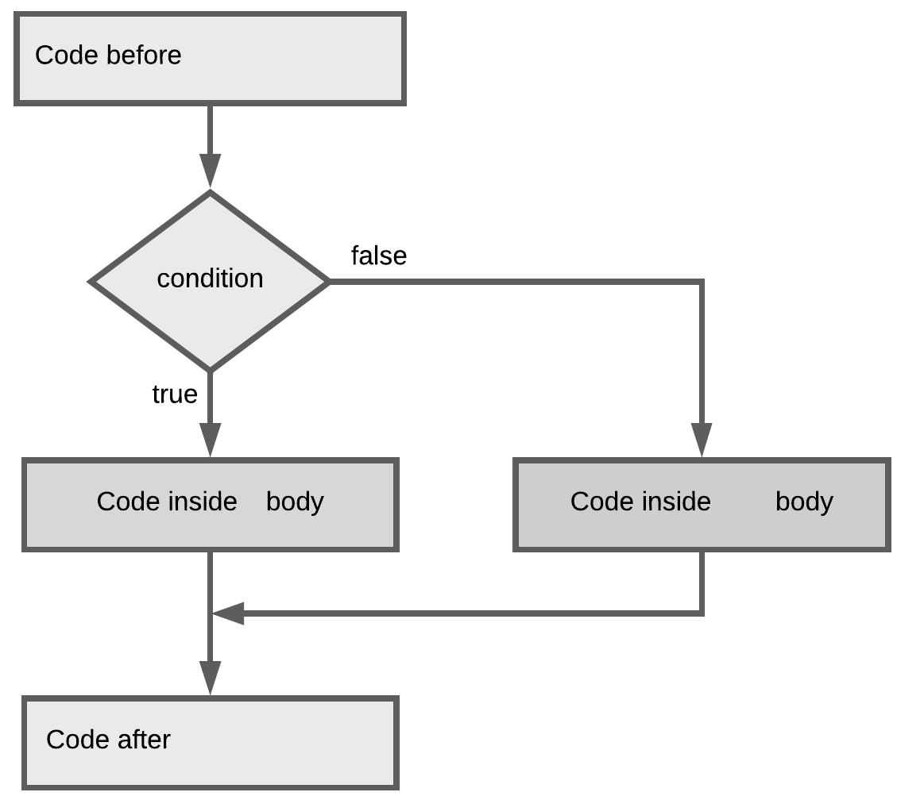

## Chapter 06 - Loop Constructs - Multiple Choice

1. What type of loop should we use to request `10` numbers from the user as input?

    * [ ] A while loop
    * [ ] A for loop
    * [ ] A do while loop
    * [ ] You do not need a loop for this

2. What type of loop is depicted below?

    

    * [ ] A while loop
    * [ ] A for loop
    * [ ] A do while loop
    * [ ] This is not a loop

3. How do we call the part `int i = 0` in the code snippet below?

    ```java
    for (int i = 0; i < 10; i++) {
      System.out.println("Hello");
    }
    ```

    * [ ] The increment step
    * [ ] The initialization
    * [ ] The conditional check
    * [ ] The iteration

4. You wish to generate random numbers until you reach a number that is divisible by 9. What type of loop statement would your require for this?

    * [ ] A do while loop
    * [ ] A for loop
    * [ ] A while loop
    * [ ] You do not need a loop for this

5. What is the output of the following code snippet?

    ```java
    for (int i = 0; i < 10; i+=3) {
      System.out.println(i + " ");
    }
    ```

    * [ ] `0 1 2 3 4 5 6 7 8 9`
    * [ ] `0 3 6 9 12`
    * [ ] `0 3 6 9`
    * [ ] `3 6 9`

6. This is a(n) ...

    ```java
    while (true) {
      // Do something
    }
    ```

    * [ ] endless loop
    * [ ] bug
    * [ ] syntax error
    * [ ] a loop that will never execute

7. To what does the output of this code snippet refer?

    ```java
    for (int i = 1; i < 8; i++) {
      if (i % 7 == 0) {
        System.out.print(" ... Ba");
      } else {
        System.out.print("NaN");
      }
    }
    if (5 * 5 >= 25) {
      System.out.print("tm");
    }
    System.out.println("an");
    ```

    * [ ] Something important that happened in Belgium
    * [ ] A song of *Samson en Gert*
    * [ ] The history of the Internet
    * [ ] A movie

8. What is the last value of `i` that will be outputted to the terminal?

    ```java
    int i = 0;
    do {
        System.out.println("i = " + i);
        i += 5;
    } while (i < 88);
    ```

    * [ ] `0`
    * [ ] `85`
    * [ ] `88`
    * [ ] `90`

9. In which of the situations below could you use a for-each loop?

    * [ ] When you want to print each element from an array to the terminal
    * [ ] When you wish to print each element from an array together with it's index
    * [ ] When you wish to manipulate the values inside an array
    * [ ] When you wish to iterate over multiple arrays

10. Which construct is preferred in the following situation?

    > I wish to read a file line by line and stop at the first line that starts with the word `"The"`.

    * [ ] A for loop
    * [ ] A while loop
    * [ ] A foreach loop (enhanced for loop)
    * [ ] A switch case

11. What is the output of the following piece of code?

    ```java
    int i = 0;
    System.out.println("i = " + i + " before for loop");
    for (; i < 3; i++) {
      System.out.println(i + ": Hello");
    }
    System.out.println("i = " + i + " after for loop");
    ```

    * [ ] Option A:

    ```text
    i = 0 before for loop
    0: Hello
    1: Hello
    2: Hello
    i = 3 after for loop
    ```

    * [ ] Option B:

    ```text
    i = 0 before for loop
    0: Hello
    1: Hello
    2: Hello
    i = 2 after for loop
    ```

    * [ ] Option C:

    ```text
    i = 0 before for loop
    0: Hello
    1: Hello
    2: Hello
    3: Hello
    i = 3 after for loop
    ```

    * [ ] None of the above

12. What is the problem with the code below (you can safely assume that the necessary imports are made)?

    ```java
    public static void main(String[] args) {
      Scanner console = new Scanner(System.in);

      for (int i = 0; i < 5; i++) {
        System.out.print("Please enter number: ");
        int number = console.nextInt();
        sum += number;
      }

      System.out.println("\nTotal = " + sum);
    }
    ```

    * [ ] A variable that was not declared
    * [ ] A syntax error
    * [ ] An uninitialized variable
    * [ ] An incorrect datatype for the variable

13. What construction is depicted below?

    

    * [ ] A for loop
    * [ ] A while loop
    * [ ] An if statement
    * [ ] An if-else statement

14. Take the code construct below as a reference. In what order are the different parts of a for-loop executed/evaluated?

    ```java
    for (<Initialization>; <Condition>; <Increment>) {
      // <Code block>
    }
    ```

    * [ ] Option A

    ```text
    (1) Initialization
    (2) Condition
    (3) Code block
    (4) Increment
    ```

    * [ ] Option B

    ```text
    (1) Initialization
    (2) Code block
    (3) Increment
    (4) Condition
    ```

    * [ ] Option C

    ```text
    (1) Initialization
    (2) Condition
    (3) Increment
    (4) Code block
    ```

    * [ ] Option D

    ```text
    (1) Initialization
    (2) Increment
    (3) Code block
    (4) Condition
    ```