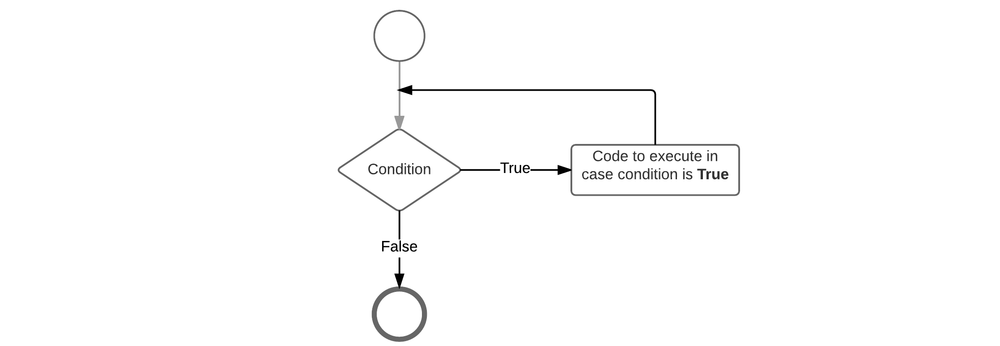
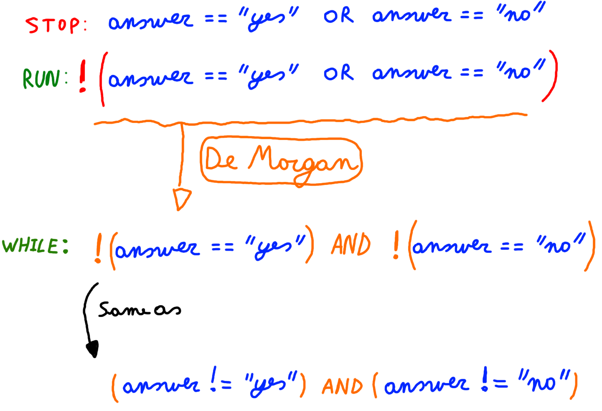

# Chapter 06 - Loop Constructs

In general, statements are executed sequentially: The first statement in a block is executed first, followed by the second, and so on. There may however be situations where you need to execute a block of code several number of times. Programming languages provide various structures that allow you to loop a block of statements.

Java programming language provides the following types of loops to handle looping requirements:

* **for loop**: Execute a code block multiple times and simplify the code that manages the loop variable.
* **while loop**: Repeats a code block while a given condition is true. It tests the condition before executing the body of the loop.
* **do-while loop**: Like a while statement, except that it tests the condition at the end of the loop body.

## The for loop

Basically a for loop is most often used when the number of iterations is pre-determined. A typical example would be a list of items where an actions needs to be applied to each item in the list.

The for loop adheres to the following construction template:

```java
for (initialization ; condition ; increment) {
  // Code block
}
```

* The **initialization** statement is executed only once before the loop mechanism is started.
* The **condition** is checked before each iteration and will determine if the code block is executed or not
* The **increment** expression is invoked after each iteration through the loop. Most often this expression is used to increment or decrement a condition variable.

Each of these can be left empty. For example an endless loop can be written as:

```java
for (;;) {
  /// Do something forever
}
```

Let's see the most simple example possible. A simple for loop that outputs the text `"Hello"` 10 times to the terminal.

```java
for (int i = 0; i < 10; i++) {
  System.out.print("Hello ");
}
```

In the example above the initialization step is used to create a local variable `i` which serves as a simple counter. Next the condition is checked and the text is outputted to the terminal. Next `i` is incremented (1 is added). Before the next iteration the value of `i` is checked in the condition and the loop continues.

The last iteration happens when `i` was incremented to 9. The loop is executed a last time and the value of `i` is incremented a last time to 10. Next the condition is checked but not met. The loop is terminated and execution jumps after the for loop.

Want to see the values of i? Use the following code:

```java
for (int i = 0; i < 10; i++) {
  System.out.println(i + ": Hello");
}
```

This outputs:

```text
0: Hello
1: Hello
2: Hello
3: Hello
4: Hello
5: Hello
6: Hello
7: Hello
8: Hello
9: Hello
```

Important to note is that the variable `i` used here has local scope. This means that it only exists in the for-loop. If you wish to know the last value of `i` you can create a variable before the for-loop and skip the initialization step in the for-loop header. The code below shows an example of this. Do note that you still need to add a semicolon in the for-loop header to separate the initialization from the condition part.

```java
int i = 0;
System.out.println("i = " + i + " before for loop");
for (; i < 10; i++) {
  System.out.println(i + ": Hello");
}
System.out.println("i = " + i + " after for loop");
```

This outputs:

```text
i = 0 before for loop
0: Hello
1: Hello
2: Hello
3: Hello
4: Hello
5: Hello
6: Hello
7: Hello
8: Hello
9: Hello
i = 10 after for loop
```

## The while loop

A while loop statement in the Java programming language repeatedly executes a statement block as long as a given condition is true. The condition is checked before the code block is executed. This means that the code block of the while loop may not even run at all if the condition is not met.

While every while loop can also be written as a for loop that does not mean it should. Complex for loops can often be refactored into less complex while or do-while loops.

The while loop adheres to the following construction template:

```java
while (condition) {
  // Code block
}
```

This can also be translated into the flow chart shown below.



The code below prints out a list of random numbers that are dividable by a certain number. In this case it prints 10 numbers that are dividable by 5.

```java

final int DIVIDER = 5;
final int NUMBERS_TO_FIND = 10;
final int MAX_NUMBER = 10000;

Random randomizer = new Random();

int numbersFound = 0;
while (numbersFound <= NUMBERS_TO_FIND) {
  int currentNumber = randomizer.nextInt(MAX_NUMBER);

  if (currentNumber % DIVIDER == 0) {
    System.out.println(currentNumber + " is dividable by " + DIVIDER);
    numbersFound++;
  }
}
```

## The do-while loop

A do-while loop is used when the code block needs to be executed at least once. After the first iteration a condition is checked which determines if the code block should be executed again or not.

The do-while loop adheres to the following construction template:

```java
do {
  // Code block
} while (condition);
```

Take note that after the closing round bracket a semicolon is required.

The next code examples asks the user to answer 'yes' or 'no' to a question. It keeps asking the user the question until it get's a valid answer.

```java
Scanner console = new Scanner(System.in);

String answer = "";
do {
    System.out.print("Would you like to learn Java ? [yes,no]: ");
    answer = console.nextLine();
} while (!answer.equalsIgnoreCase("yes") && !answer.equalsIgnoreCase("no"));
```

The condition in the while statement above may seem contradictory at the beginning. If you need to model more complex conditions it is sometimes necessary to build them step by step.

The following diagram shows a step by step method for building the condition above.



1. First determine the condition necessary to stop the while loop. In this case that is when the user answers either "yes" or "no".
2. Next invert the whole condition to use it with a while loop. This is actually the necessary condition to keep the while loop running.
3. Next you can simplify the condition by using De Morgan's laws

Note that Strings are actually objects and we cannot use the simple comparison operator `==`. This would actually compare the references and not the content of the objects. More on this later.

## Nesting control structures

Each of the control structures (if, for, while, do-while, switch, ...) discussed in the previous sections can actually be nested. This means that we can place a loop inside an if code block, or an if inside another if.

Let us for example take a look at the code below where we ask the user to input positive and negative integers. By setting the condition of the do-while loop to `number != 0`, we keep asking for more numbers until the user enters `0`. Each number is then added to a `totalPositive` or `totalNegative` based on whether it's greater or less than zero. If the condition for the do-while is not met anymore (user enters `0`), the loop finishes and the results are shown to the user.

```java
Scanner console = new Scanner(System.in);

int totalPositive = 0;
int totalNegative = 0;
int number = 0;

do {
  System.out.print("Please enter a positive or negative integer [0 to stop]: ");
  number = console.nextInt();

  if (number < 0) {
    totalNegative += number;
  } else {
    totalPositive += number;
  }
} while (number != 0);

System.out.println("Total Positive: " + totalPositive);
System.out.println("Total Negative: " + totalNegative);
```

The example above shows how an if-else construct can be nested inside a while loop. While the number of times you can nest a structure inside another is not directly limited it should be kept to a minimum. The deeper structures get nested the more complex your code starts to become.