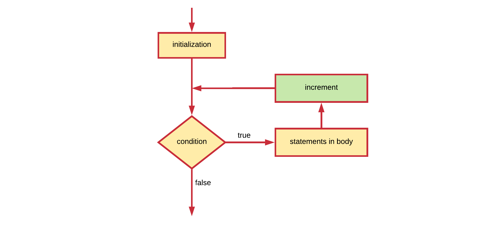
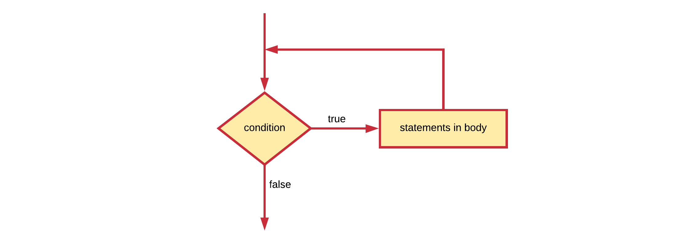

# Chapter 06 - Loop Constructs

In general, statements are executed sequentially: The first statement in a block is executed first, followed by the second, and so on. These statements are also only executed once by default. There may however be situations where you need to execute a block of code several number of times. Programming languages provide various structures that allow you to loop a block of statements.

The Java programming language provides the following types of loops to handle looping requirements:

* a **for loop**: Execute a code block multiple times and simplify the code that manages the loop variable.
* a **while loop**: Repeats a code block while a given condition is `true`. It tests the condition before executing the body of the loop, meaning that it may never execute if the condition is not satisfied from the beginning.
* a **do-while loop**: Like a while loop, except that it tests the condition at the end of the loop body. This effectively means that the body of the loop will execute at least once.

## The for loop

Basically a for loop is most often used when the number of iterations is pre-determined.

Some typical usage examples are:

* execute some code a specific number of times - for example: a countdown timer from 10 to 0.
* iterate a list of items - for example: determine the biggest number in a list

The for loop adheres to the following construction template:

```java
for (initialization ; condition ; increment) {
  // This is called the body of the for loop
  // It contains the statements that need to be executed every iteration
}
```

* The **initialization** statement is executed only once before the loop mechanism is started. It is often used to initialize an iteration variable.
* The **condition** is checked before each iteration and will determine if the code block is executed (in case the condition resolves to `true`) or not (in case the condition resolves to `false`).
* The **increment** statement is invoked after each iteration through the loop. Most often this statement is used to increment or decrement a condition variable.

Below is a flowchart model of a for loop.



Each of these can be left empty. For example an endless loop can be written as:

```java
for (;;) {
  /// Do something forever
}
```

Let's see the most basic example possible. A for loop construct that outputs the text `"Hello World"` 10 times to the terminal.

```java
for (int i = 0; i < 10; i++) {
  System.out.println("Hello World");
}
```

In the example above the initialization step is used to create a local variable `i` which serves as an **iteration counter**. Next the condition is checked and the text is outputted to the terminal. Next `i` is incremented (1 is added). Before the next iteration the value of `i` is checked in the condition and the loop continues.

> **HINT** - **Incrementing**
>
> Note that the *increment* part can also be written `i = i + 1` or `i += 1` but most often the increment operator is used as it is shorter. This also implies that it is perfectly possible to increase the iteration counter by an arbitrary number. For example by 2: `i += 2`. This is perfectly legal.

The last iteration happens when `i` was incremented to 9. The loop is executed a last time and the value of `i` is incremented a last time to 10. Next the condition is checked but not met. The loop is **terminated** and **execution jumps after the for loop**.

Want to see the values of i? Use the following code:

```java
for (int i = 0; i < 10; i++) {
  System.out.println(i + ": Hello World");
}
```

This outputs:

```text
0: Hello World
1: Hello World
2: Hello World
3: Hello World
4: Hello World
5: Hello World
6: Hello World
7: Hello World
8: Hello World
9: Hello World
```

Important to note is that the variable `i` used here has what is called **local scope**. This means that it only exists in the for loop. If you wish to know the last value of `i` you can create a variable before the for loop and skip the initialization step in the for loop header. The code below shows an example of this. Do note that you still need to add a semicolon in the for loop header to separate the initialization from the condition part.

```java
int i = 0;
System.out.println("i = " + i + " before for loop");
for (; i < 10; i++) {
  System.out.println(i + ": Hello World");
}
System.out.println("i = " + i + " after for loop");
```

This outputs:

```text
i = 0 before for loop
0: Hello World
1: Hello World
2: Hello World
3: Hello World
4: Hello World
5: Hello World
6: Hello World
7: Hello World
8: Hello World
9: Hello World
i = 10 after for loop
```

## The while loop

A while loop statement in the Java programming language **repeatedly executes a statement block** as long as a given condition is `true`. The condition is **checked before the code block is executed**. This means that the code block of the while loop may not even run at all if the condition is not met from the beginning.

The while loop adheres to the following construction template:

```java
while (condition) {
  // Code block
}
```

This can also be translated into the flow chart shown below.



Below is an example application that makes the sum of all the integral values the user inputs. It's stops requesting numbers from the user if a `0` is inputted.

```java
public static void main(String[] args) {
    Scanner console = new Scanner(System.in);
    
    System.out.print("Please enter a number to add to sum (0 to quit): ");
    int number = console.nextInt();
    int sum = number;   // Initialize sum with the first number
    
    while (number != 0) {
        System.out.print("Please enter a number to add to sum (0 to quit): ");
        number = console.nextInt();
        sum += number;      // Add number to sum
    }
    
    System.out.println("The sum of all these numbers is " + sum);
}
```

Example output is given below.

```text
Please enter a number to add to sum (0 to quit): 5
Please enter a number to add to sum (0 to quit): 2
Please enter a number to add to sum (0 to quit): -3
Please enter a number to add to sum (0 to quit): 0
The sum of all these numbers is 4
```

If the user inputs `0` as a first number, the body of the while loop is never executed (as the condition evaluates to `false` in that case) and execution jumps directly after the while loop.

## The do while loop

A do while loop is used when the code block (body of the loop) needs to be executed at least once. **After the first iteration a condition is checked** which determines if the code block should be executed again or not.

The do-while loop adheres to the following construction template:

```java
do {
  // Code block
} while (condition);
```

After the closing parentheses `)` a **semicolon** `;` is required.

The matching flowchart for a do while is shown below.


Below is a code example that asks the user to input a strict positive integral value. If the user inputs a number equal or lower than 0, the question is asked again. If the user inputs a correct positive number, the loop is terminated.

```java
    Scanner console = new Scanner(System.in);
    
    int number = 0;
    while (number <= 0) {
        System.out.print("Please enter a positive number: ");
        number = console.nextInt();
    }
    System.out.println("You entered the value " + number);
```

The variable `number` needs to be initialized. By initializing it to `0` or a negative number we make sure that the body of the while loop is executed at least once.

## Nesting control structures

Each of the control structures (if, for, while, do-while, switch, ...) discussed in the previous sections can actually be nested. This means that we can place a loop inside an if code block, or an if inside another if.

Let us for example take a look at the code below where we ask the user to input positive and negative integers. By setting the condition of the do-while loop to `number != 0`, we keep asking for more numbers until the user enters `0`. Each number is then added to a `totalPositive` or `totalNegative` based on whether it's greater or less than zero. If the condition for the do while is not met anymore (user enters `0`), the loop finishes and the results are shown to the user.

```java
Scanner console = new Scanner(System.in);

int totalPositive = 0;
int totalNegative = 0;
int number = 0;

do {
  System.out.print("Please enter a positive or negative integer [0 to stop]: ");
  number = console.nextInt();

  if (number < 0) {
    totalNegative += number;
  } else {
    totalPositive += number;
  }
} while (number != 0);

System.out.println("Total Positive: " + totalPositive);
System.out.println("Total Negative: " + totalNegative);
```

The example above shows how an if else construct can be nested inside a while loop. While the number of times you can nest a structure inside another is not directly limited it should be kept to a minimum. The deeper structures get nested the more complex your code starts to become.

## Which to use when

All for loops can be written as while loops, and vice-versa. Just use whichever loop seems more appropriate to the task at hand. In general, you should use a for loop when you know how many times the loop should run. If you want the loop to break based on a condition other than the number of times it runs, you should use a while loop.