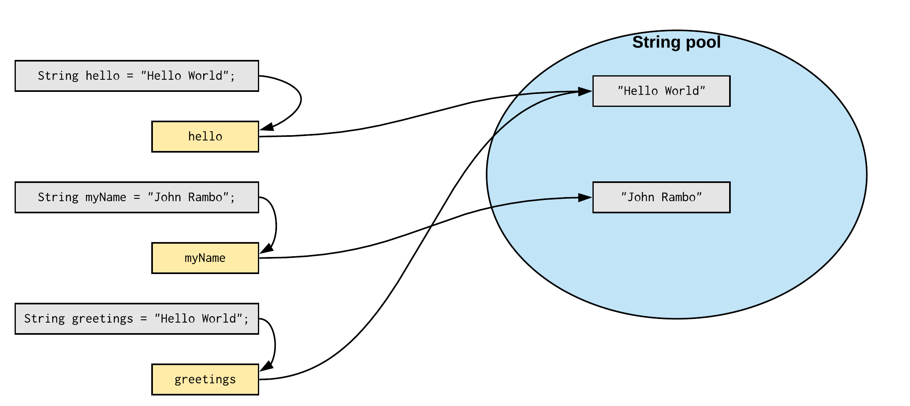
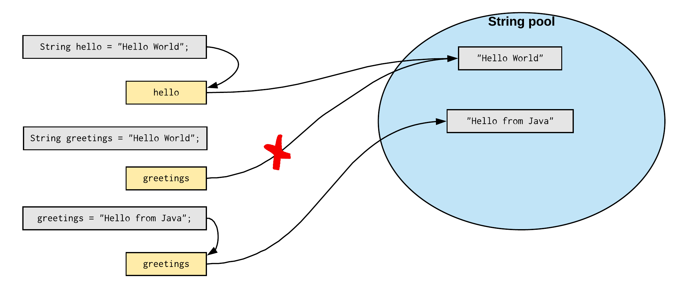

# Strings

`String` is probably the most commonly used data type for variables in Java. It is so popular that you actualle already have been using strings since the beginning of this course. Remember your first statement?

```java
System.out.println("Hello World");
```

Well, this application was outputting the `String` `"Hello World"` to the terminal.

## String is a Class

A keen eye may also have noticed that while `int`, `double` and such data types are not capitalized, `String` is. That is because `String` is actually a **class**, where those other types are not.

Java actually has two categories of data types:

* **Primitive data types**: char, byte, short, int, long, double, float and boolean.
* **Non-primitive data types**: String, ArrayList, Complex, Random, ...

Primitive data types are simple and integrated in the language (they are most of the time keywords in the language itself). Non-primitive data types are actually classes. This means that when we use the String data type we are actually using objects of the class String. The cool thing about non-primitive data types is that we can create our own as we shall see later in this course.

All you need to know at the moment about a class is the following:

* A class is like a blueprint that is used to create objects from that class.
* The name of a class, in this case `String`, **acts just as a data type**. This means that we can create variables of type `String`. Actually the variable points to **an object of that class**.
* A class internally **contains data**, in the case of a `String` this is a sequence of characters.
* A class **has methods**, which are like actions that can be requested from the objects create from the class.

## Creating Strings

There are two options to create strings. The first we have already used, which is direct assignment of a String literal. The second option is using the approach of using the `new` keyword, as we have done already with classes such as `Scanner` and `Random`.

### Using String literals

The most direct way to create a string is to assign a string **literal** to a variable of type `String` as shown in the next code example.

```java
String greetings = "Hello there. What a fascinating world we live in";

// Print the greetings String to the terminal
System.out.println(greetings);
```

When Java encounters a string literal in our code (`"Hello there. What a fascinating world we live in"` in the previous example), it will automatically create an object of the class `String` and place our literal value inside of it.

### Using the new keyword

As with any other class, you can create objects from classes by using the `new` keyword.

```java
String greetings = new String("Hello there. What a fascinating world we live in");

// Print the greetings String to the terminal
System.out.println(greetings);
```

This approach is the **general way of creating objects from classes**, but is rarely seen in cases of strings. This because the previous approach is shorter.

## Strings have methods

Once an object of `String` exists, **actions can be requested from the object**. This is most often referred to as **calling methods** of the object.

To call a method of an object one can use the following syntax:

```java
object.nameOfMethod();
```

So, calling method is stating its name followed by parentheses `()`. However a method can only be called on an object, so this needs to be specified first by stating the name of the object variable followed by the dot `.` operator.

For example to get the number of characters (whitespace include) that make up the `String`, one can call the `length()` method as shown in the next code snippet.

```java
String hello = "Hello";
int numberOfChars = hello.length();   // 5 in this case

System.out.println("The string " + hello + " has " + numberOfChars + " characters");
```

Take a look at the Java API documentation to find out more about the methods that a String has. It can be found at [https://docs.oracle.com/javase/10/docs/api/java/lang/String.html](https://docs.oracle.com/javase/10/docs/api/java/lang/String.html).

As stated before, a String is internally a sequence of characters. This would suggest that each character is accessible separately. And it is, through the `charAt()` method.

The API documentation of `charAt()`  states the following:

```text
public char charAt​(int index)

Returns the char value at the specified index. An index ranges from 0 to length() - 1. The first char value of the sequence is at index 0, the next at index 1, and so on, as for array indexing.

Parameters:
  index - the index of the char value.
Returns:
    the char value at the specified index of this string. The first char value is at index 0.
```

So to print the characters of a String to the terminal separated by a space, a for loop can be used as shown in the next snippet.

```java
String helloWorld = "Hello World from Java!";

for (int i = 0; i < helloWorld.length(); i++) {
  System.out.print(helloWorld.charAt(i) + " ");
}
// Result: H e l l o   W o r l d   f r o m   J a v a !
```

## The Java String pool

Each time you create a String literal, the JVM checks the "string pool" first. If the string already exists in the pool, a reference to the pooled object is returned. If the string doesn't exist in the pool, a new string object is created and placed in the pool. For example:

```java
String hello = "Hello World";
String myName = "John Rambo";
String greetings = "Hello World";
```

In the previous example, only two string objects will be created. Firstly, JVM will not find any string object with the value `"Hello World"` in the string pool, that is why it will create a new object. Again for the second statement, the JVM will not find any string object with the value `"John Rambo"` in the string pool. A new object is created and stored in the variable.

For the third statement the pool is checked again and this time a string with the value "Hello World" is found. The JVM will make the `greetings` variable point to the string that was found.



One of the main reasons for this is saving memory.

## Strings are Immutable

An **object whose internal state cannot be changed after it is created** is known as **an Immutable object**. The String class is such an example. Objects of type String cannot be changed. If you assign a new value to a String variable, actually a new String object is created (of course after the pool is checked if that value is not present).

So for example the following code will result in a string pool as shown in the image following the code.

```java
String hello = "Hello World";

String greetings = "Hello World";
greetings = "Hello from Java";
```



If one thinks about it, it's quite logical that String objects are immutable. Otherwise the string pool would not be practical if other variables would be able to modify your objects.

> **INFO** - **String Interning**
> 
> The string pool is the JVM's particular implementation of the concept of string interning. In computer science, string interning is a method of storing only one copy of each distinct string value, which must be immutable. Interning strings makes some string processing tasks more time- or space-efficient at the cost of requiring more time when the string is created or interned. The distinct values are stored in a string intern pool.

## Comparing Strings

Since String are not primitive types in Java, but actually objects, **they cannot be compared using the equality operator** `==`. Actually in this case you are comparing references and not the actual content of the objects. More on this later.

To compare strings you need to use the `equals()` method as shown below.

```java
Scanner terminal = new Scanner(System.in);

System.out.print("Please enter your firstname: ");
String name = terminal.next();

if (name.equals("Jesus")) {
    System.out.println("Really? Is that you again Jesus?");
} else {
    System.out.println("Hi " + name);
}
```

Feel free to change the example and test it with the equality operator.