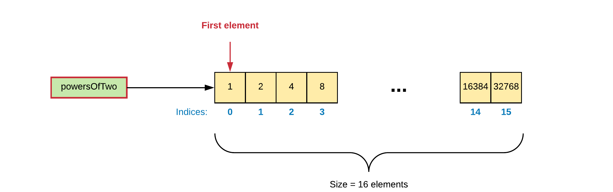

## Chapter 08 - Arrays - Challenges

### Powers of Two

Create an array called `powersOfTwo` that stores 16 integers. Use a for loop to initialize the values of the array with the powers of `2` as shown in the example below.



> **HINT** - **Powers of Two**
>
> To calculate the 5th power of two, you can multiple the 4th power of two with `2`.

Print out the resulting list. An example is shown here:

```text
Below is a list of the powers of from 0 till 15.
0: 1
1: 2
2: 4
3: 8
4: 16
5: 32
6: 64
7: 128
8: 256
9: 512
10: 1024
11: 2048
12: 4096
13: 8192
14: 16384
15: 32768
```

Can you explain the last negative number if you increase the array to `32` numbers?

### Frequency Table of Random Numbers

Generate 1000 random numbers between `0` and `20`. Do not store the numbers themselves that were generated. Instead create a frequency table to store the number of times each value was generated.

For example:

| Index | Counter |
| --- | --- |
| 0 | 7 |
| 1 | 11 |
| ... | ...

Meaning value `0` was generated 7 times out of 1000 and value `1` was generated 11 times out of a 1000.

Print the full frequency table after generating the 1000 numbers.

What did you expect as outcome ? Try increasing the number of values you generate.