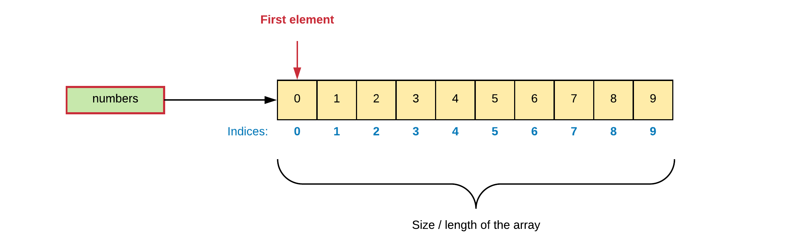

# Chapter 08 - Arrays

An array is a **data structure** consisting of a **collection of elements**, each identified by at least one array **index** or **key**. An array is stored so that the **position of each element can be computed from its index** by a mathematical formula. The simplest type of data structure is a linear array, also called **one-dimensional array**.

> **INFO** - **Zero-based indexing**
>
> When information is stored in an array, individual elements are selected by an index that is usually a non-negative scalar integer. An index maps the array to the stored information. Most programming languages use **zero-based indexing** (index starts at 0). This leads to simpler implementation where the index refers to an offset from the starting position of an array, so the first element has an offset of zero.

For example, an array of ten 32-bit (4 bytes) integer variables, with indices 0 through 9, may be stored as 10 words at memory addresses 2000, 2004, 2008, ... 2036, so that the element with index `i` has the address `2000 + 4 × i`. The memory address of the first element of an array is called first address or foundation address.

Arrays are among the oldest and most important data structures, and are used by almost every program. They are also used to implement many other data structures, such as **lists** and **strings**. They effectively **exploit the addressing logic of computers**. In most modern computers and many external storage devices, the memory is a one-dimensional array of words, whose indices are their addresses.

Arrays are useful mostly because the element indices can be computed at run time. Among other things, this feature allows a single iterative statement to process arbitrarily many elements of an array. For that reason, the elements of an array data structure are **required to have the same size** and **should use the same data representation**.

Arrays are often used to implement tables, especially lookup tables; the word **table** is sometimes used as a synonym of array.

> **INFO** - **Lookup Tables**
>
> In computer science, a lookup table is an array that replaces runtime computation with a simpler array indexing operation. The savings in terms of processing time can be significant, since retrieving a value from memory is often faster than undergoing an "expensive" computation or input/output operation. The tables may be precalculated and stored in static program storage, calculated (or "pre-fetched") as part of a program's initialization phase.

Because the mathematical concept of a matrix can be represented as a two-dimensional grid, two-dimensional arrays are also sometimes called matrices.

## One-Dimensional Arrays

An array is a **container object** that holds a **fixed number of values** of a **single type**. The length of an array is established when the array is created. After creation, its length is fixed.

### Creating 1D arrays

A one-dimensional array is created using the following syntax template:

```java
<type>[] <variable_name> = new <type>[<size>];
```

where

* `<type>` can be either a primitive (`int`, `double`, ...) or non-primitive (class) datatype.
* `<variable_name>` is the name of the variable that represents the array.
* `<size>` is a positive integral value indicating how many elements the array consists of.

Notice the square brackets `[]` that declare this variable to be an array of elements of the given type.

> **INFO** - **C++ style**
>
> It is also possible to create an array using the C++ syntax `<type> <variable_name>[];` where the square brackets are placed after the variable name. This style comes from the C/C++ language and was adopted in Java to accommodate C/C++ programmers. However placing the brackets with the type is the preferred way for Java programmers.

The example code below shows how to declare and create an array of 10 integers:

```java
// Creating an array someNumbers with 10 elements of type integer.
int[] someNumbers = new int[10];
```

> **INFO** - **Arrays are created using `new`**
>
> **An array is actually an object** so the actual creation needs to be done using the `new` operator, at which stage the length/size of the array also needs to be specified.

A visualization of the array may look something like this:


Each item in an array is called an **element**, and each element is accessed by its numerical index. As shown in the preceding visualization, numbering begins with 0 (this is called **zero-indexed**). The 9th element, for example, would therefore be accessed at index 8.

Of course the previous statement can be split up into the declaration and creation of the array as shown in the next code snippet.

```java
int someNumbers[];          // Declaring an array variable someNumbers
someNumbers = new int[10];  // Creating an array of 10 elements and storing the reference in someNumbers
```

### Accessing Elements

Array elements can be accessed using the **index operator** `[]`, the element index and the array variable. The syntax is shown in the following code snippet:

```java
<variable_name>[<index>];
```

This syntax can both be used for **assign a value** to it as **accessing its current value**.

Take the code example that follows. It creates an array `numbers` of 10 integers, where the elements are assigned the iterator value of the for loop.

```java
// Creating an array numbers with 10 elements of type integer.
int[] numbers = new int[10];

// Initialize the elements with the values 0 to 9
for (int i = 0; i < 10; i++) {
    // Assign the current value of i to the element at index i
    numbers[i] = i;
}
```

This would result in the following array:



The following example stores 5 integers requested from the user. Once all numbers are inputted the total and average are reported back to the user.

```java
Scanner console = new Scanner(System.in);
int[] numbers = new int[5];   // Creating an array of 5 integers

int sum = 0;    // Variable to hold the sum of the values of the user
for (int i = 0; i < 5; i++) {
  System.out.print("Please enter an integral number: ");
  
  // Store the user supplied number in the array
  numbers[i] = console.nextInt();
  sum += numbers[i];    // Use the value at index i
}

System.out.println("\nYou entered the following numbers:");
for (int i = 0; i < 5; i++) {
  System.out.print(numbers[i] + " ");
}
System.out.println("\n\nTotal sum = " + sum + " and the average = " + sum/5.0);
```

From the code above it can be seen that the array elements can be accessed by using the square brackets `[]` with the index specified between them.

An example output might be:

```text
Please enter an integral number: 1
Please enter an integral number: 22
Please enter an integral number: 10
Please enter an integral number: 33
Please enter an integral number: 14

You entered the following numbers:
1 22 10 33 14

Total sum = 80 and the average = 16.0
```

### Initialization

While its perfectly legal to initialize an array using a for loop, it can also be accomplished using the following syntax:

```java
<type>[] <variable_name> = {
    <comma_separated_list_of_values>
};
```

This can be useful if the values cannot be calculated and are limited in number.

An example:

```java
int[] anArray = {
    25, 66, 876,
    54645, 0, -10,
    12, 914, 88, 545645
};
```

Here the length of the array is determined by the number of values provided between the curly braces `{}`.

## The length of an Array

As mentioned before, the arrays created in Java are no primitive types. They can hold primitive types, but the array itself is an object. Objects have data and methods. One of the most used data members of an array is its `length`. By using it's length in the for loop condition, our code becomes cleaner and less prone to errors.

So the earlier example:

```java
// Creating an array numbers with 10 elements of type integer.
int[] numbers = new int[10];

// Initialize the elements with the values 0 to 9
for (int i = 0; i < 10; i++) {
    // Assign the current value of i to the element at index i
    numbers[i] = i;
}
```

can be refactor to:

```java
// Creating an array numbers with 10 elements of type integer.
int[] numbers = new int[10];

// Initialize the elements with the values 0 to 9
for (int i = 0; i < numbers.length; i++) {
    // Assign the current value of i to the element at index i
    numbers[i] = i;
}
```

Which makes it easier to change. If we now increase the array to `20` elements, the for loop can remain untouched.

> **WARNING** - **Length is not a method**
>
> Do note that `length` is actually a data member of an array and not a method. That is why we do not add parentheses after `length`. This is important distinction to make.

## Foreach Loop

Iterating over an array or collection is often uglier than it needs to be. Consider the following example, which contains an array of five integers and calculates the average:

```java
int myList[] = {1, 5, 43, 2, 0};

int sum = 0;
for (int i = 0; i < myList.length; i++) {
  sum += myList[i];
}

System.out.println("Average = " + sum/5.0);
```

The iteration variable `i` is just clutter. Furthermore, it is an opportunity for error. The iteration variable occurs four times in each loop: that is three chances to get it wrong. The foreach construct gets rid of the clutter and the opportunity for error. The foreach construct is a loop that iterates over a list/array and loops for each element inside of it. It follows the syntax shown next:

```java
for (<type> <name_of_local_variable> : <name_of_array>) {
    // Here you can use <name_of_local_variable> which refers
    // to the current element of the iteration
}
```

Here is how the previous code example looks like with the foreach construct:

```java
int myList[] = {1, 5, 43, 2, 0};

int sum = 0;
for (int value : myList) {
    sum += value;
}
System.out.println("Average = " + sum/5.0);
```

When you see the colon `:` read it as "in". The loop above reads as **"for each int value in myList"**. As can be seen from the code, the foreach makes the code a lot cleaner. It preserves all of the type safety, while removing the remaining clutter. A huge advantage is that you do not need to declare the iteration variable. The compiler does this for you behind your back, but you need not concern yourself with it.

> **INFO** - **Enhanced For Loop**
>
> The foreach loop is also known as the enhanced for loop in the world of programming.

### Limitations of foreach loop

So when should you use the for-each loop? Any time you can. It can make your code a lot more cleaner. Unfortunately, it cannot be used everywhere.

Consider the situations listed below where a for-each loop cannot be used.

**A foreach loop cannot be used if you wish to modify the array itself.** The local variable used with the foreach construct is a copy of the actual element in the array, so you are only changing the copy.

```java
for (int val : values) {
    // Only changes the local `val` variable and not the actual array element
    val = val * 2;
}
```

This also means that a foreach cannot be used to initialize an array or collection.

**Foreach loops do not keep track of an iteration variable.** This means it is not possible to use an array index inside the foreach loop.

**Foreach only iterates forward over the array in single steps.**

```java
int values[] = {1, 5, 43, 2, 0};

// Impossible to do with a for-each
for (int i = values.length-1; i > 0; i--) {
    System.out.print(values[i] + " ");
}
```

**For-each loops are not useable when one must iterate over multiple collections/arrays at the same time.**

```java
int temperatures1[] = { 23, 14, 144, 23, 44 };
int temperatures2[] = { 23, 22, 144, 33, 44 };

// Not possible to do with a for-each loop
for (int i = 0; i < temperatures1.length; i++) {
    if (temperatures1[i] != temperatures2[i]) {
        System.out.println("Temperatures differ");
    }
}
```

These shortcomings were known by the designers, who made a conscious decision to go with a clean, simple construct that would cover the great majority of cases.

## Summary

A short summary on arrays in Java:

* A Java array variable can also be declared like other variables with [] after the data type.
* The variables in the array are ordered and each have an index beginning from 0.
* The size of an array must be known when it is created. It cannot be changed after creation.
* The size of an array must be specified by an integral value and not long or short.
* Since arrays are objects in Java, we can find their length using member length. This is different from C/C++ where we find length using sizeof.
