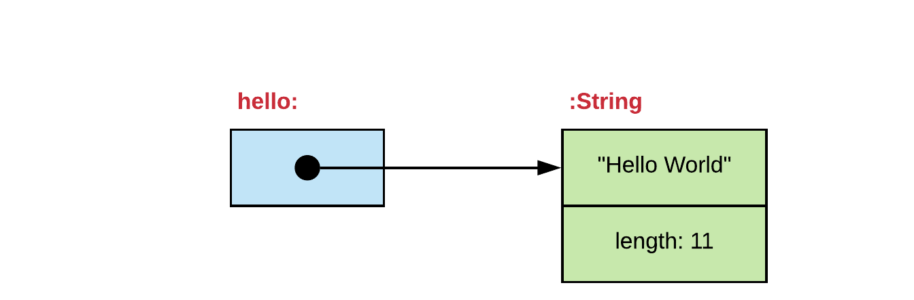
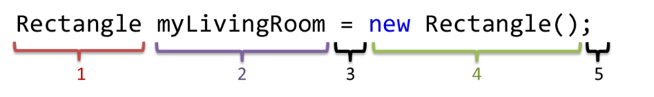

## Chapter 10 - All About Objects - Multiple Choice

1. What is the actual content of the variable generator?

    ```java
    Random generator = new Random();
    ```

    * [ ] `null`
    * [ ] An instance of the class `Random`
    * [ ] A reference to the class `Random`
    * [ ] A reference to an instance of the class `Random`

2. How do we call the properties that objects have?

    * [ ] Actions
    * [ ] Attributes
    * [ ] Classes
    * [ ] Behaviors

3. What is the most correct definition of an object oriented application?

    * [ ] A collection of instances where references to objects are kept
    * [ ] An application that makes use of classes
    * [ ] An application that does not make use of primitive datatypes
    * [ ] A collection of objects that communicate by sending messages to each other

4. What is stored in the variable `hello`?

    

    * [ ] A `String` object
    * [ ] A reference to an object of the class `String`
    * [ ] The text `"Hello World"`
    * [ ] An instance of the class `String`

5. What are the correct names of the different parts of the following statement.

    

    * [ ] Option A

    ```text
    1 = variable name
    2 = type
    3 = assignment operator
    4 = class instance
    5 = terminator
    ```

    * [ ] Option B

    ```text
    1 = type
    2 = variable name
    3 = assignment operator
    4 = class instance
    5 = terminator
    ```

    * [ ] Option C

    ```text
    1 = type
    2 = class instance
    3 = assignment operator
    4 = variable name
    5 = terminator
    ```

    * [ ] Option D

    ```text
    1 = class instance
    2 = variable name
    3 = assignment operator
    4 = type
    5 = terminator
    ```
