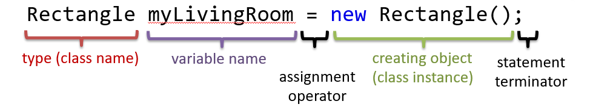
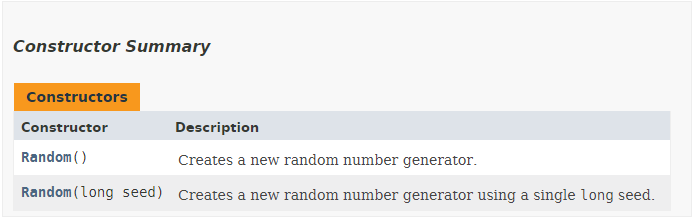

# Chapter 10 - All About Objects

<!-- TODO: Descent intro -->

## Creating and Using Objects

Objects are created based on a blueprint, called a **class**. The objects of a class are also called **instances** of that class. When objects are created, distinct entities are instantiated, meaning that **each object contains its own copy of data**. This means that if you change the data of one object, it will not affect the data of another object.

<!-- Caution needed when using reference types -->

Creating objects (instances of a class) in Java is done using the `new` keyword. The `new` keyword is then followed by a call to a **constructor** method. The constructor is a special method that **initializes** the new object. The constructor has the **same name as the class**.

To be able to use the object, it needs to be accessible through a variable. For this reason the result of the `new` operator (a **reference** to the object) is stored in a variable.

Take a look at the example below that creates a new instance of the `Random` class. An object of the Random class can be used to generate a stream of pseudorandom numbers.

```java
// Creating an instance of Random and storing its reference
// inside a variable called generator
Random generator = new Random();
```
The first part `Random generator` is actually the same syntax as used with a variable of a primitive type such as `int` or `double`. You first specify the type, in this case it is the **name of the class** instead of the primitive type, and next you choose a **name for your variable**.

Similar to initializing a primitive variable, you can also split the **declaration** and **initialization** in two lines. However most often you will see this being done using a single line of code.

Next comes the assignment using the assignment operator `=`. The next part consists of the `new` operator followed by the **call to a constructor** of the class, which returns a **reference to an object** of the class.



## Calling Methods on an Object

Objects store data but they also have a **behavioral part**. This means that **objects can perform actions** that are defined for that class. The actions that an object can perform are called the `methods` of the object or class. For example a class `Radio` could have methods `turnOff()`, `turnOn()`, `changeFrequency()`, `setVolume()`, ...

In the example above the objects of the `Random` class have methods such as `nextInt()`, `nextDouble()`, `nextBoolean()`, `setSeed()`, ... More information can be found at [https://docs.oracle.com/javase/10/docs/api/java/util/Random.html](https://docs.oracle.com/javase/10/docs/api/java/util/Random.html).

To **call a method**, its **name** needs to be specified, followed by **parentheses** `()`. However, one can not just call a methods name without supplying the context, aka the **object** on which the methods needs to be called. This is accomplished by first supplying a reference to an object (for example by using the variable that holds it), followed by the dot operator `.`, followed by the method call.

```java
// Creating an instance of Random and storing its reference
// inside a variable called generator
Random generator = new Random();

for (int i = 0; i < 10; i++) {
  // Calling the nextInt() method on our generator
  int nextInt = generator.nextInt();
  System.out.print(nextInt + " ");
}
```

Which will output 10 random values:

```text
-893203787 -631057884 962594845 302033178 354864798 581392031 -744751238 -996150297 -442377590 226976444 
```

While maybe unknowingly, you have already been calling methods for a while. Printing information to the terminal is achieved by calling the `print()` or `println()` method.

```java
System.out.println("Println() is a method");
```

Methods often take information, use that information to manipulate the object the method is called on, and sometimes also output a result. So actually a method can considered to be a small process system on its own. It has a state (that of the object), it takes inputs and it can generate an output. The inputs to the method are called it's **arguments**. The output is called the **return value**.

Consider the example below where the `nextInt()` method takes in the upper bound as an **argument** of type `int`. In other words, **outside information** is provided to the method, so it can act upon external data.

```java
// Creating an instance of Random and storing its reference
// inside a variable called generator
Random generator = new Random();

for (int i = 0; i < 10; i++) {
  // Calling the nextInt() method on our generator
  // By supplying extra information via arguments,
  // the method can use external data to adjust its behaviour
  int nextInt = generator.nextInt(100);
  System.out.print(nextInt + " ");
}
```

Which will output 10 random values below `100`:

```text
73 96 92 48 58 2 96 73 21 11
```

> **HINT** - **Available Classes and Methods**
>
> How does one know which classes are available from Java and what methods the objects of these classes have? Simple, google or the Java API documentation [https://docs.oracle.com/javase/10/docs/api/index.html](https://docs.oracle.com/javase/10/docs/api/index.html).

The random numbers are actually generated based what is a called a *seed*. When you use the same seed again, you get the same random numbers. To set the seed of the generator object you can call the `setSeed(long seed)` method.

Run the following code example multiple times and you will see the effect. Try changing the seed and run it another couple of times.

```java
// Creating an instance of Random and storing its reference
// inside a variable called generator
Random generator = new Random();

// Set the seed of the generator by calling the setSeed(int) method
generator.setSeed(1337);

System.out.print("Random numbers with SEED = " + 1337 + ":");
for (int i = 0; i < 10; i++) {
  // Calling the nextInt() method on our generator
  // By supplying extra information via arguments,
  // the method can use external data to adjust its behaviour
  System.out.print(" " + generator.nextInt(150));
}
```

Using the seed shown above the output will be:

```text
Random numbers with SEED = 1337: 121 144 59 22 9 148 53 4 127 117
```

This can be useful if you wish to reproduce the same output more than once. A common seed is the current time.

> **VIDEO** - **Random Number - Numberphile**
>
> Want to know more about random numbers, then checkout this Numberphile video: [https://www.youtube.com/watch?v=SxP30euw3-0](https://www.youtube.com/watch?v=SxP30euw3-0).

You may or may not have noticed that the Random class has more than one constructor (a method with the same name of the class used to initialize the object). The API docs show the different constructors that a class contains:



If you take a look at the second constructor `Random(long seed)`, it states that it *creates a new random number generator using a single long seed.*. So in other words the previous code example can be replaced by the code below (the method call `setSeed()` is removed).

```java
// Creating an instance of Random and storing its reference
// inside a variable called generator
// This time the seed is provided as an argument to the constructor
Random generator = new Random(1337);

System.out.print("Random numbers with SEED = " + 1337 + ":");
for (int i = 0; i < 10; i++) {
  // Calling the nextInt() method on our generator
  // By supplying extra information via arguments,
  // the method can use external data to adjust its behaviour
  System.out.print(" " + generator.nextInt(150));
}
```

While the previous code does exactly the same, it demonstrates that some classes posses multiple constructors, allowing us - as the user of the class - to select the constructor that suits our needs best. Always take a look at the documentation to see which constructors are available.

Some classes only have constructors that have arguments. This means that an object cannot be created without outside information.