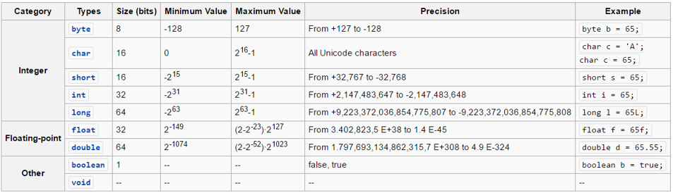

# Chapter 11 - Creating our own Classes

Creating custom classes is one of the main responsibilities of an object oriented programmer. As stated before, an application is a collection of objects that interact with each other. These objects are created based on a class developed by a programmer. If we wish to implement some functionality that is not yet available in the language or it is not exactly what we need, we are required to build it ourselves.

<!-- Luckily even if a class is not readily available for us, we will be able to reuse other classes which contain a partial functionality of the class we which to create. -->

It's natural to think of **objects as collections of other objects**. Think about a television which contains a tuner, a screen, a power supply, an embedded system, ... We say that a television object is **composed** of these other objects. Luckily this same concept is available to us in an object oriented programming language. We can also create objects by bundling other objects. This has the big advantage that we can use objects from classes that someone else made or are part of the language libraries. This saves us a lot of time and effort. This sort of code reuse is one of the major advantages of object oriented languages.

## UML Class Diagrams

When creating an application it can often be useful to put some diagrams on paper on how you are going to take on the problem. One of the most used diagrams in the world of object oriented programming is the UML (Unified Modeling Language) class diagram.

UML is a general-purpose, modeling language in the field of software engineering, that is intended to provide a standard way to visualize the design of a system.

A class diagram is a static diagram that describes the attributes and methods of a class and the also the relationships between the different classes in an application. Class diagrams are widely used in the modeling of object oriented systems because they are the only UML diagrams, which can be mapped directly with object-oriented languages.

While methods can be made private, often these are omitted from the UML diagram. This is often the case because most programmers find them cluttering the class diagram and they are often created as needed and not important for the outside user.

When modeling software it's normal that not all details are available from the start. For example the type of the attributes should also be documented in the UML diagram, as are the arguments and return types of the methods. However sometimes those details haven't been decided yet. In that case we just leave them out and add them later.

As an example take a look at the UML class diagram of a Hotel Management System below.


<!-- Another example would be nice. Maybe something with IoT -->

Even if your are not an experienced programmer yet, you should be able to understand the concept of the application (not the details, only the general idea) just by looking at the diagram. If that is the case, its usefulness has just been proven.

## Creating a Class

When creating custom classes in Java it is convention to place the whole class and nothing but the class inside its own Java file. In NetBeans this can be achieved by traversing to `File => New File => Java => Java Class`.

Consider a class that represents a simple lightbulb in your house. The class is called `LightBulb` because the convention in Java for class names is that they should be named using **Pascal Case**.

> **INFO** - **Pascal Case and camel Case**
>
> Pascal case is a subset of Camel Case where the first letter is capitalized. That is, userAccount is a camel case and UserAccount is a Pascal case. In Java the convention is that methods names are camel cased while class names are Pascal cased. It is easy to remember. Pascal is a proper noun so capitalize the first letter, while camel is a common noun, so you do not capitalize the first letter.

<!-- How to break these? -->

> **INFO** - **snake_case**
>
> Snake case (or snake_case) is the practice of writing compound words or phrases in which the elements are separated with one underscore character `_` and no spaces, with each element's initial letter usually lowercased within the compound and the first letter either upper or lower case - as in "foo_bar" and "Hello_world".

```java
package javalightbulbapplication;

public class LightBulb {

}
```

The first line of code states the name of the package to which the class belongs. This allows a programmer to bundle classes together that logically belong together.

> **INFO** - **Packages**
>
> A Java package organizes Java classes into namespaces, providing a unique namespace for each type it contains. Classes in the same package can access each other's package-private and protected members. Java packages can be stored in compressed files called JAR files, allowing classes to be downloaded faster as groups rather than individually. A package allows a developer to group classes (and interfaces) together. These classes will all be related in some way – they might all have to do with a specific application or perform a specific set of tasks. Programmers also typically use packages to organize classes belonging to the same category or providing similar functionality.

Notice the `public` keyword which is called an **access modifier**. An access modifier is a special Java keyword that states **who can access the specified resource**. Access modifiers can be applied to classes, attributes and methods. Java allows a programmer to choose from the following access modifiers when declaring a class:

* The **default Java access modifier**, which is declared **by not writing any access modifier at all**. This means that class can only be used by other resources included in the same package. This is why it is also often referred to as package access.
* `public`, meaning that any other resource can make use of this class.

### Creating Objects

To create objects from the `LightBulb` class one just needs to follow the object creation syntax:

```java
<ClassName> <variable_name> = new <ClassName>();
```

With this a new object will be created of the class and a reference to it will be stored inside of the variable.

Consider the example shown below for the `LightBulb` class. Here a new instance of the class is requested using the `new` keyword and a reference to it is stored inside of a variable called `kitchen`.

```java
public static void main(String[] args) {
  // Creating a LightBulb object and storing its reference inside a variable
  LightBulb kitchen = new LightBulb();
}
```

Notice the similarity again with creating an object of the class `Random` or `Scanner`.

For the moment this is all the functionality that LightBulb has. Not much use for us like this.

### UML Class Diagram of LightBulb

In its current state the `LightBulb` class can be visualized using the class diagram shown below.


The class shape in a class diagram consists of a rectangle with three rows. The top row contains the **name of the class**, the middle row contains the **attributes of the class** (the data of the objects), and the bottom section expresses the **methods and/or constructors** (the behavior) that the class has. In a class diagram, classes and subclasses are grouped together to show the relationship between objects of these classes.

## Attributes

Attributes hold the information and properties required by the object. They define the **data** that the object is holding or the state that it is in. Attributes are very similar to the variables that we already know. That is why we often also refer to attributes as **instance variables**, meaning variables of a class instance (aka object).

Just as variables, attributes can be of any primitive types or they can contain references to other objects. They also need a name which allows us to use refer to them inside the methods of the objects.

Remember that Java knows the following primitive types:



Different from a normal local variable, an attribute also requires an **access modifier** to specify who can access the attribute. This can be any of the following:

* `public`: anyone can access the attribute - depicted with a plus sign `+` in UML.
* The default Java access modifier, which is declared by not writing any access modifier at all. This means that attribute can only be used by other classes included in the same package. This is why it is also often referred to as package access. There is no equivalent sign in UML for this (leave empty).
* `protected`: only the class itself or classes derived from this class can access the attributes - depicted with a hashtag `#` in UML. More on this later.
* `private`: only the class itself can access the attribute - depicted with a minus sign `-` in UML.

This leads to the following syntax template for adding attributes to a class:

```java
class <ClassName> {
  // Attributes of the class
  <access_modifier> <data_type> <attribute_name> = <init_value>;
}
```

Notice how the access modifier is placed before the declaration of the instance variable.

Consider the example below of a class Point that holds the two coordinate values of a point in a 2D space.

```java
class Point {
  // Both x and y are attributes of the class Point
  public double x = 0;
  public double y = 0;
}
```

As can be seen from the previous code snippet, the declaration of attributes is very similar to the declaration of local variables. They just need to be placed inside the curly braces of the class they belong to.

It is also perfectly legal to initialize instance variables when declaring them. This can also be done inside the constructor as will be seen later on.

Instance variables are initialized by Java to default values:

* whole numbers (`integer`, `long`, `char`, ...) default to `0`
* real numbers (`float` and `double`) default to `0.0`
* `boolean` values default to `false`
* object references default to `null`

> **WARNING** - **Initialize Attributes**
>
> While Java makes sure that all variables and instance variables are initialized, it is most of the time a good idea to do it yourself. That way you will always think about which is a sane default value for each attribute. On top of that, it is a good habit as not every programming language will initialize variables for you, take C++ for example. Do always at least make sure to **initialize object references** as calling methods on `null` will crash your application.

Public attributes can be accessed from outside of the object using the member operator `.`. This means that one can create a Point object and access the `x` and `y` variables as shown in the following code snippet.

```java
Point center = new Point();
System.out.println("[" + center.x + ", " + center.y + "]");
center.x = 15.66;
center.y = -3.12;
System.out.println("[" + center.x + ", " + center.y + "]");
```

Which outputs:

```text
[0.0, 0.0]
[15.66, -3.12]
```

The previous example shows that the values of attributes can both be retrieved and changed from outside of the class if they are `public`.

### UML Class Diagram of Point

In its current state the `Point` class can be visualized using the class diagram shown below.


The second row of the class rectangle is this time populated with a list of attributes. Both attributes are `public` so they are preceded with a plus sign `+`.