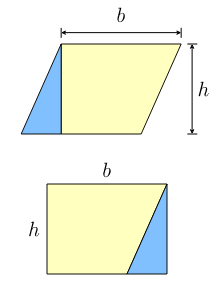

## Chapter 12 - Methods - Challenges

### A Parallelogram

Create a class that stores the base and height of a parallelogram.



Add two methods to the class. One to determine the area and one to determine the circumference of the parallelogram.

Make a small main program to show that the implementation works.

### Circle Properties

Write a `Circle` class that holds the radius of a circle. Also provide methods to calculate the **area**, **circumference** and diameter of the circle.

Make sure all the data types are `double`.

Next create a small main application that allows the user to input the radius of a circle. Output all the properties of that circle after the user inputted the radius.

> **HINT** - **Pi**
>
> You can create a variable to hold an approximation to the value of pi. However, Java can supply a more accurate version of PI. Can you find on the Internet how to access/use this value?

Once this all works alter the `Circle` class method `setRadius()` so it does not allow the user to provide a negative radius. A good option here might be to use the absolute value of that radius. So in other words, take the absolute value of the provided argument and assign that result to the attribute of Circle.

### ArraySorter

Create a class called `ArraySorter` that can sort a pre-filled array of integers. Start from the code shown below for your main application.

```java
public static void main(String[] args) {
  // Create array of 10 random numbers
  Random generator = new Random();
  int[] values = new int[10];
  for (int i = 0; i < values.length; i++) {
    values[i] = generator.nextInt(20);
  }

  System.out.println("Original array:");
  for (int i = 0; i < values.length; i++) {
    System.out.print(values[i] + " ");
  }

  // Choose sorting here
  ArraySorter sorter = new ArraySorter();
  sorter.selectionSort(values);

  System.out.println("\n\nSorted array:");
  for (int i = 0; i < values.length; i++) {
    System.out.print(values[i] + " ");
  }
}
```

Create a method called `selectionSort()` that takes in an array of integers. Sort the array in ascending order using the selection sort algorithm. Search the Internet for "selection sort". You will find enough information and examples. Do no copy / paste code, try to implement it for yourself.

The YouTube video `Selection Sort | GeeksforGeeks` gives a nice overview of the selection sorting algorithm: [https://www.youtube.com/watch?v=xWBP4lzkoyM](https://www.youtube.com/watch?v=xWBP4lzkoyM)

Once this is operational, extend the class with a method called `insertionSort()` and implement the insertion sort algorithm. You can use the website [https://www.geeksforgeeks.org/insertion-sort/](https://www.geeksforgeeks.org/insertion-sort/) for more information on insertion sort or again the YouTube video `Insertion Sort | GeeksforGeeks` which can be found at [https://www.youtube.com/watch?v=OGzPmgsI-pQ](https://www.youtube.com/watch?v=OGzPmgsI-pQ).

Want to have some nice background music while programming, than also checkout [https://www.youtube.com/watch?v=kPRA0W1kECg](https://www.youtube.com/watch?v=kPRA0W1kECg).