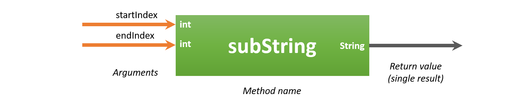

# Methods

Methods allow us to **group blocks of code** together and **separate** them from the rest of our code. Using the name of the method we can then ask the compiler/interpreter to execute the code inside of it. This is also known as **calling the method**. Why would we want to do this? Several reasons:

* It **makes our code more clear** to the reader/developer of it, if we name the methods correctly and clearly
* It allows us to call the method from different places, so actually we **reuse parts of our code**. **Code duplication is bad** and easily leads to bugs and what is called spaghetti code (a mess of code).

The fun thing about programming is that a lot of libraries are already available for us packed with things we can use. Take for example the `Scanner` and `String` classes we have been using for some time. On the other hand we, as programmers, can also create our own methods. This allows us to make our code more maintainable and reusable.

Ideally a method should **do only one thing**, for example:

* display an array
* calculate the area of a shape
* determine the minimal of two numbers
* make the sum of an array of numbers
* ...

A method can be though of as a building block of your application that performs some sort of processing.

* It can take input data to use inside the method via arguments
* It can produce an output value which the called of the method can use


## General Form of a Method

The general structure of a method in Java looks like:

```java
<access_modifier> <return_data_type> nameOfTheMethod(<list_of_parameters>) {
   // Code inside method (this is called the body)
   // return <value> or do not return a value in which case the <return_data_type> is void
}
```

* **access_modifier** - It defines the access type of the method (`public`, `protected` or `private`) and it defaults to package access if you specify none;
  
  * `public`: everyone can use the method - depicted with a plus sign `+` in UML.
  * none specified - package access, meaning only other classes in the same package can call the method - there is no equivalent sign in UML for this (leave empty).
  * `protected`: only classes that inherit from this class can use the method - depicted with a hashtag `#` in UML. More on this later.
  * `private`: the method can only be used inside the class itself - depicted with a minus sign `-` in UML. Most often private methods are excluded from the UML class diagram as they are part of the inner workings of the class.

* **return_data_type** - A method **may or may not return a value** (a single result value of the method). This can be any of the data types used for variables (e.g. `int`, `double`, `char`, references to objects such as `String` and any other types, even arrays such as for example `int[]`). If no value is returned, the *return_data_type* should be set to `void`.

* **nameOfTheMethod** - This is the name of the method. Make it **clear and informative**. Methods should always **start with a lower case letter** and use **camel casing** (an uppercase letter for each following word).

* **list_of_parameters** - Arguments (also called parameters) are **similar to the variables** we have been using.
  * They allow the code that is calling the method to pass data to the method. The arguments can then be used as variables and their usage is **contained to the method itself**.
  * The different arguments in the parameter list are separated from each other using a comma `,`. Both a type and a name need to be specified for every parameter.
  * Arguments are optional, methods may require zero arguments.
  * The argument variables only exist within the scope of the method itself (between the curly braces).

* The parenthesis `()` **are mandatory** even if no arguments are defined.

* **The method body** - The part from the starting curly brace `{` till the closing curly brace `}` is called the body of the method. You should place the code statements that execute the task of the method between these two curly braces.

* The name of the method and the parameter list are together called the **signature** of the method.

Remember the `main` method where most of our code is placed. Let us take a look at it.

```java
public static void main(String[] args) {
    // TODO code application logic here
}
```

The name of this method is `main` and it is `public`. It also takes an array of Strings named `args` as argument. These are actually parameters that you can pass to the method when you start your application. Notice that the main method does not return a value and therefore has its return type set to `void`. The `static` keyword you can ignore for the time being.

The main method is what is called the **entry point** of your application. It is the first method that is executed when you start your application.

> **INFO** - **Command Arguments**
>
> An example of arguments that are passed to an application can be seen in the command `git clone https://github.com/BioBoost/object-oriented-programming-using-java`. Here `git` is the name of the application. `clone` and `https://github.com/BioBoost/object-oriented-programming-using-java` are two arguments that are passed to the application so it can act upon this data.

## Calling methods

Calling a method is not that hard. Actually you have already called a couple of methods without realizing it. To call a method you need to state it's name, supply the correct arguments and place parentheses around those arguments. Last but not least you need to place a semicolon `;` at the end.

Important to note is that **methods are most of the time called on objects**. This means that an action is requested from that object.

### The println method

Let us take a look at the `println` method you have been calling for some time.

```java
System.out.println("Hello and welcome to Java");
```

The actual name of the method here is `println`. The use of `System.out` is not important for the moment. The `println` method takes a single argument, namely a String that will be printed to the terminal. This is information that is passed when the method is called. To be able to print something to the terminal, the `println` must know what to print.

### The substring method of String

Take a look at a more complicated example of method of the class `String` called `substring`. The following information has been grabbed from the official Java API [https://docs.oracle.com/javase/10/docs/api/java/lang/String.html](https://docs.oracle.com/javase/10/docs/api/java/lang/String.html):

```text
public String substring(int beginIndex, int endIndex)

Returns a new string that is a substring of this string. The substring begins at the specified beginIndex and extends to the character at index endIndex - 1. Thus the length of the substring is endIndex-beginIndex.

Examples:
 "hamburger".substring(4, 8) returns "urge"
 "smiles".substring(1, 5) returns "mile"

Parameters:
  beginIndex - the beginning index, inclusive.
  endIndex - the ending index, exclusive.

Returns:
  the specified substring.
```

A graphical representation of this method is shown below. The method can extract a piece of String from a larger String based on the start and end positions you provide the method. The method is called on an object of type `String`, in other words, the method belongs to the class `String`. Also note from the description of the method above that the method is `public` is therefor be used from outside of the `String` class.

It takes two pieces of information as arguments (input data):

* `beginIndex` (of type `int`) that provides the starting point from where the extraction should start
* `endIndex` (of type `int`) that provides the ending point from where the extraction should stop



The result of the method is again a value of type `String` that contains a part of the full string.

To call the method we first need to create an object of type `String`. Next we need to provide the input data (arguments) required by the method to perform it's job. Last we need to save the result that the method returns. This is again a `String` reference.

```java
public static void main(String[] args) {
  // We need a string object
  String helloWorld = "Hello World!";

  // Next we call the substring method on the String object and save the
  // result inside another String
  String hello = helloWorld.substring(0, 5);

  // Now we can use the result from the method
  System.out.println(hello);
}
```

which will output:

```text
Hello
```

### The nextInt method of Scanner

Another example is the Scanner method `nextInt()`. An example is shown below.

```java
Scanner console = new Scanner(System.in);

System.out.print("Please enter a number: ");
int number = console.nextInt();
```

The `nextInt()` method does not take any arguments, however you do need to place the empty parentheses behind its name. It does however return a value of type `int`. This can be assigned to a variable so it can be used later in our code.

### Java API

A lot of information about all the methods that are available in Java can be found at the API website of Oracle: [https://docs.oracle.com/javase/10/docs/api/](https://docs.oracle.com/javase/10/docs/api/). Try to look up some information on the `Scanner` class and the methods that it has available.

## Creating our own Methods

A method should be kept **as small as possible** to **do a single task**. Often it is stated that a perfect method has no more than 5 lines of code. The shorter the method the easier it will be to understand what it is doing. However, as a beginning programmer this will be hard to achieve.

A method will most often use some sort of input data, do some processing on it and return a result based on it's findings. The input data is often supplied using arguments passed to the method when it is called.


As stated before, arguments are very similar to a variable you create inside your main. They require both a **type** and a **name**. If you wish your method to take multiple arguments, you can separate them using a comma `,`. Important to note is that every argument needs a type, even if multiple arguments have the same type.

### Where to place your own methods

For the moment there are two places where custom methods can be placed:

* Inside the classes you created such as `LightBulb` and `Point`.
* Inside the application class where `main` resides. More on this later

All methods need to be placed between the curly braces `{}` of the class itself. Make sure not to place methods inside the body of other methods. Some examples are shown below.

```java
public class Demo {
  public void someMethod() {
    // This is ok!
  }
}
```

Is does not matter if you place methods before or after the attributes. The order of the methods has no influence. You can place them in any order inside the class body.

**Example below is wrong**, the method is inside the body of another method.

```java
public class DemoApplication {
  public void someMethod() {
    public void anotherMethod() {
      // This is NOT OK!
    }
  }
}
```

### Naming your Methods

Giving your methods a **clear name** is very important. Methods that have names like *doSomething*, *process*, *count*, ... have no meaning at all. A method should always have a name that **says exactly what it is doing**. Do not be afraid of longer method names (do however be sensible about it).

There are some rules that are followed by all Java programmers concerning naming things. For methods the **rules** are:

* always start with a lowercase letter
* don't place spaces, underscores or other special characters between words
* start each consecutive word after the first with a capital letter (this is called **camel casing**)

Some good examples are (each is preceded with a variable containing a reference to an object):

* numberList.determineSum()
* square.calculateArea()
* circle.getRadius()
* player.isAlive()
* ...

Method names should also **reflect the result that they generate**. For example `isAlive()` suggests that it returns a `boolean`, `getRadius()` suggests that it returns a `double`. That does however not mean that you should name methods as `getRadiusAsDouble()`. Bad idea.