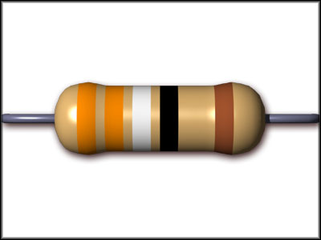

## Chapter 13 - Constructors - Challenges

### A resistor model

Create a class that simulates the behavior of a resistor. You should be able to only set the resistance once through a constructor of the class. This means that the resistance cannot change after an object of the Resistor class has been created.



You should supply methods to set the current that passes through the resistor. In this case the resulting voltage is calculated using `U = I x R`.

It should also be possible to change the voltage that is applied across the resistor. In that case the resulting current through the resistor should be calculated using `I = U / R`.

You should make sure that the created objects are in a valid state at all times. This means if the current changes, the voltage should also change and vice versa.

Make sure to choose floating point values (`double`) for all attributes of the resistor class.

Make sure that the following main code works:

```java
public static void main(String[] args) {
  Resistor resistor = new Resistor(1000);

  resistor.setVoltage(1);
  System.out.println("Current = " + resistor.getCurrent() + " A");
  // Current = 0.001 A
}
```