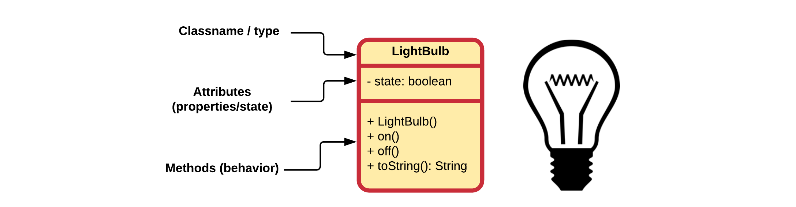
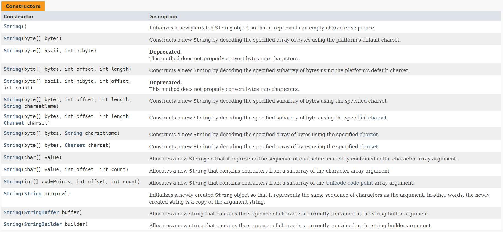

# Chapter 13 - Constructors

In object-oriented programming, a constructor is a special type of method called to create an object. It prepares the new object for use, often accepting arguments that the constructor uses to set required member variables. Constructors are special methods that belong to classes and **take care of the creation of objects of that class**. They are **responsible for the initialization** of the newly created objects and they make sure that the freshly created objects are left in a stable and readily usable state.

A constructor resembles an instance method, but it differs from a method in that it has **no explicit return type, not even void**. In Java constructors have the **exact same name as the declaring class**. They have the task of initializing the object's data members. A properly written constructor leaves the resulting object in a **valid and usable state**.

Most languages **allow overloading** the constructor in that there can be more than one constructor for a class, with differing parameters. Java is one of those languages.

## A default constructor

When a programmer does not define his/her own constructor(s), Java creates one for us, called a **default constructor**. This constructor is not called the default constructor because it is created by default for us, but because **it does not take any arguments**. This constructor is called by default in many situations (from which it gets it name) as will be seen later in this course.

> **WARNING** - **Default Constructor**
>
> Important to know is that once you create your own constructor for a class, you lose the default constructor created by Java. This means that if you wish your class to have a default constructor (one that takes no arguments), you should add one yourself. However, more on this later.

In UML class diagrams the constructors are also added to the list of methods. Constructors are most of the time placed on top in the method list. This because these are the first methods you will need when making use of the class. Also notice the plus sign `+` in front of the constructor. This means that constructor is also `public`.



### Creating new Objects

When creating new objects (instances) from classes in Java you need a couple of things:

* Most of the time you need a place to store the reference to the new object in the form of a variable
* The `new` keyword to indicate to Java that you wish to create a new object from a certain class
* The type of the variable (which is in most cases the name of the class)
* The name of the constructor that needs to be called to initialize the new object.


As mentioned before a class can have multiple constructors. Take for example the `String` class from Java [https://docs.oracle.com/javase/10/docs/api/java/lang/String.html](https://docs.oracle.com/javase/10/docs/api/java/lang/String.html).



These give the freedom to the user of the class to tailor the initialization of the new objects to his/her needs. Do note that the constructors do not differ in name but do differ in the arguments that they take. Either the number of arguments or the types need to be different so Java can determine which constructor you are actually requesting.

## Custom Constructor

When defining a constructor you should first determine what information is minimally required to initialize a new object of the class.

Let us take a look at a class `Player` that has an attribute `nickname` of type `String`. Because a player object is considered invalid if it has no nickname, a constructor is added that takes the nickname as an argument. A player also has a `score`. However if a player object is created, the score is initialized to `0`. There is no need to take this value in as an argument.

```java
public class Player {
  // Attributes
  private String nickname;
  private int score = 0;

  // Constructor with arguments
  public Player(String nickname) {
    this.nickname = nickname;
  }
}
```

When creating Player objects the developer is required to provide a nickname for the Player object as is shown below:

```java
Player lebowski = new Player("The Big Lebowski");
```

## The Default Constructor

The default constructor is a special constructor that **takes no arguments**. It initializes the object in a default state.

If you do not provide a constructor for a class, Java will automatically create a default constructor that has no parameters. This default constructor is called if you specify the new keyword without passing parameters. For example:

```java
Rectangle pyramidBase = new Rectangle();
```

**If you explicitly declare any constructors for a class, Java does not create a default constructor for the class**. As a result, if you declare a constructor that accepts arguments and still want to have a default constructor (with no arguments), you must explicitly declare a default constructor for the class.

Taking the previous Player example the code will not compile in the current state because we added a constructor to the class and thereby lost the default (no-argument) constructor:

```java
Player guest = new Player();
```

So to fix this we can add a default constructor to the class that for example generates a random nickname if none is provided:

```java
public class Player {
  // Attributes
  private String nickname;
  private int score = 0;

  // Constructor with arguments
  public Player(String nickname) {
    this.nickname = nickname;
  }

  // Default constructor
  public Player() {
    Random rand = new Random();
    nickname = "guest_" + rand.nextInt();
  }
}
```

This would allow us to create objects using the default constructor.

## Constructor Overloading

Constructor overloading is a technique in Java in which a **class can have any number of constructors** that differ in parameter lists. The compiler differentiates these constructors by taking into account the number of parameters in the list and their type.

Let us for example take a `Point` class as an example:

```java
public class Point {
  // Private properties (attributes)
  private double x;
  private double y;

  // Constructor with arguments
  public Point(double x, double y) {
    this.x = x;
    this.y = y;
  }

  // Default constructor (without arguments)
  public Point() {
    x = 0;
    y = 0;
  }
}
```

Note how the constructors differ in the arguments they take. Java must be able to differentiate between the constructors in order to be able to select the correct constructor.

Do note that the names of the arguments has no meaning for the compiler to differentiate between different constructors, only the types and number of arguments count. This means that adding the following constructors to a class will fail:

```java
public class Rectangle {
  // ...

  public Rectangle(int width, int height) {
    // ....
  }

  public Rectangle(int x, int y) {
    // ....
  }
}
```

Both constructors look the same for Java. They both take two arguments, each of type `int` and thats it.

## Constructor Reuse

As lazy programmers we are always looking for ways to reuse even the smallest parts of code. This makes our code cleaner and more maintainable and on top of that it makes our life nicer.

Java allows us even to reuse constructors from our classes. In other words, you can call another constructor inside a constructor just by using the `this` keyword as it were a method - not just a method but a constructor method. There are however two **limitations**:

* `this()` can only be called **inside another constructor**
* it needs to be the **first statement inside the constructor** calling `this()`

Take for example the Point class from before:

```java
public class Point {
  // Private properties (attributes)
  private double x;
  private double y;

  // Constructor with arguments
  public Point(double x, double y) {
    this.x = x;
    this.y = y;
  }

  // Default constructor (without arguments)
  public Point() {
    x = 0;
    y = 0;
  }
}
```

This can be refactored so the default constructor uses the other constructor:

```java
public class Point {
  // Private properties (attributes)
  private double x;
  private double y;

  // Constructor with arguments
  public Point(double x, double y) {
    this.x = x;
    this.y = y;
  }

  // Default constructor (without arguments)
  public Point() {
    this(0, 0);
  }
}
```

While the gain is small here, it does make our code cleaner.

Another example from the Oracle website:

```java
public class Rectangle {
    private int x, y;
    private int width, height;

    public Rectangle() {
        this(0, 0, 1, 1);
    }
    public Rectangle(int width, int height) {
        this(0, 0, width, height);
    }
    public Rectangle(int x, int y, int width, int height) {
        this.x = x;
        this.y = y;
        this.width = width;
        this.height = height;
    }
    // ...
}
```

The `Rectangle` class contains a set of constructors. Each constructor initializes some or all of the rectangle's member variables. The constructors provide a default value for any member variable whose initial value is not provided by an argument. For example, the no-argument constructor creates a 1x1 Rectangle at coordinates `0,0`. The two-argument constructor calls the four-argument constructor, passing in the `width` and `height` but always using the `0,0` coordinates. The compiler determines which constructor to call, based on the number and the type of arguments provided when creating a new object of the class.

```java
Rectangle base = new Rectangle();                // 1x1 at [0, 0]
Rectangle top = new Rectangle(50, 50);           // 50x50 at [0, 0]
Rectangle left = new Rectangle(20, 20, 66, 66);  // 66x66 at [20, 20]
```

Note that there is no constructor available for creating a rectangle of 1x1 at a given location. This would require a constructor:

```java
    public Rectangle(int x, int x) {
        // Implementation
    }
```

This would not be possible as Java would not be able to differentiate between the two constructors that take in two integers:

```java
Rectangle top = new Rectangle(50, 50);           // 50x50 at [0, 0] or 1x1 at [50, 50] ??????
```

## A Copy Constructor

A copy constructor is a constructor that takes in an object of the same class. It uses this object to make a copy of its data into the object being initialized.

A copy constructor is used to:

* create a copy of an already existing object
* initialize the new object from another one of the same type.

The syntax for a copy constructor is quite straight forward:

```java
public <classname>(<classname> original) {
  // copy each attribute via other constructors or setters
}
```

Since the copy constructor is part of the same class as the original object is instantiated of, it also has direct access to the private attributes.

Take the previous `Point` class as an example:

```java
public class Point {
  // Private properties (attributes)
  private double x;
  private double y;

  // Constructor with arguments
  public Point(double x, double y) {
    this.x = x;
    this.y = y;
  }

  // Default constructor (without arguments)
  public Point() {
    this(0, 0);
  }

  // Copy constructor
  public Point(Point original) {
    this(original.x, original.y);
  }
}
```

The example code below shows the difference between copying the reference to a `Point` object using `=` and creating an actual copy of the object in a separate instance using the copy constructor.

```java
public static void main(String[] args) {
  // Creating an object of type Point
  Point original = new Point(123, 23);
  System.out.println("Original: " + original);

  // This actually just creates a second
  // reference to the same object
  Point secondReference = original;
  System.out.println("Reference copy: " + secondReference);

  // Now let us make a real copy using the
  // copy constructor of Point
  Point copy = new Point(original);
  System.out.println("Real copy: " + copy);
}
```

Which would output something similar to:

```text
Original: Point@368239c8
Reference copy: Point@368239c8
Real copy: Point@9e89d68
```