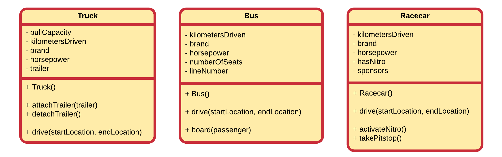

# Chapter 16 - Inheritance

Code reuse is probable one of the most powerful features of an object oriented programming language. While most programming languages provide functions / procedures which provide a low-level construct for code reuse, object oriented programming languages take this an important step further. OOP languages allow us to define classes and create relations between these classes, facilitating not only code reuse but also better overall design.

Inheritance is one of the main pillars of an object-oriented programming language and provides a clean way of reusing functionality. It allows a class to inherit both the attributes and methods of another class. Common data and functionality is structured inside a base class (also called superclass) from which the more specific classes inherit (called subclasses or derived classes) properties and behavior.

> **WARNING** - **Copy paste is not reuse**
>
> For all you copy-paste fanatics out there, copying code from one place to another is not considered code reuse. If the original code is ever extended, changed or corrected, chances are that you will forget to alter one of the copies.

As with most in an OOP language, the solution revolves around the class. Instead of creating classes from scratch we can use existing ones, extend them or embed them within our classes. The main advantages of this approach is that:

* we reuse code that has been tested and debugged
* code is not duplicated
* classes can be kept small and thus more manageable

There are actually three ways to accomplish this and two have already been discussed in this course.

The first approach is to **create objects of existing classes** and use these within our code. These classes can be pre-made, part of a library or even the ones we create.

The second approach is to create and embed objects of the already existing class inside the class you are developing. This is called **composition** as the new class is composed of objects of existing classes.

The third approach is to create a new class as a subtype of an existing class. You literally take the form of an existing class and extend it, and this without modifying the code of the existing class. This is called **Inheritance**.

These three approaches are important cornerstones of an object oriented programming language.

## Introducing Inheritance

Inheritance allows a class to inherit (get) the properties and methods of another class. In other words, the **subclass** inherits the state and behavior from the **base class**. The subclass is also called the **derived class** while the base class is also known as the **super-class**. The derived classes can add their own additional attributes and methods. These additional attributes and methods differentiate the derived classes from the base class.

A super-class can have any number of subclasses. In Java a subclass can have only one superclass.

## Vehicle Example

Consider a first example that models the classes `Truck`, `Racecar` and `Bus`. Each have a number of attributes and some methods. Below is a partial UML class diagram of the classes modeled without the use of inheritance. Each class has the full functionality implemented into the class itself.

When taking a look at this example it is pretty obvious that the design includes a lot of duplication. This can be solved by creating a **superclass** `Vehicle` that contains all the common attributes and methods of these classes.

> **INFO** - **Inheritance in UML class diagram**
>
> In a UML class diagram inheritance is depicted using a solid line and a hollow arrow attached at the side of the superclass.

While not documented inside the UML class diagrams, the subclasses `Truck`, `Racecar` and `Bus` also contain the attributes and methods of `Vehicle`.

Some attributes (such as the `trailer` of a `Truck`) and methods (such as `board(passenger)` of `Bus`) cannot be generalized to the `Vehicle` class. They are specific to the subclasses. This is perfectly valid when implementing inheritance.

By placing the **common functionality and data** inside a **superclass** a cleaner design is realized that also encourages code reuse.