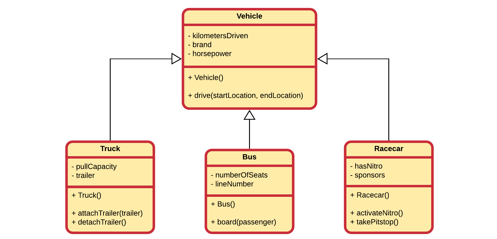
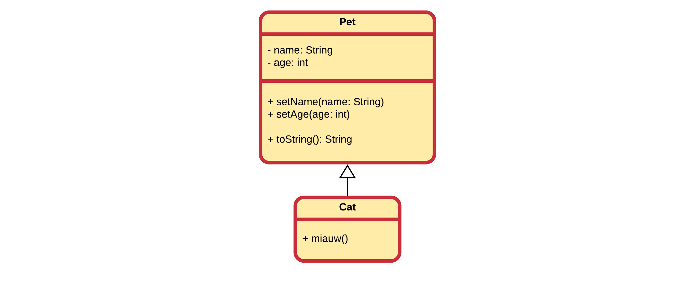
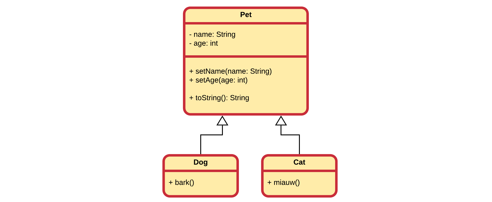
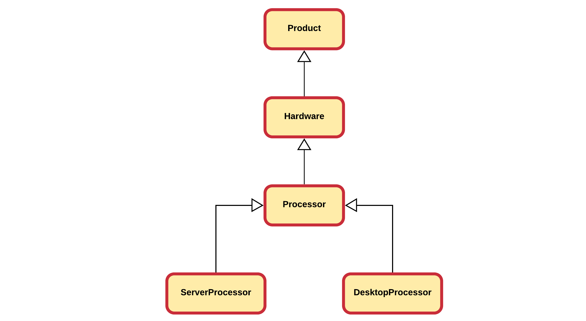

# Chapter 16 - Inheritance

Code reuse is probable one of the most powerful features of an object oriented programming language. While most programming languages provide functions / procedures which provide a low-level construct for code reuse, object oriented programming languages take this an important step further. OOP languages allow us to define classes and create relations between these classes, facilitating not only code reuse but also better overall design.

Inheritance is one of the main pillars of an object-oriented programming language and provides a clean way of reusing functionality. It allows a class to inherit both the attributes and methods of another class. Common data and functionality is structured inside a base class (also called superclass) from which the more specific classes inherit (called subclasses or derived classes) properties and behavior.

> **WARNING** - **Copy paste is not reuse**
>
> For all you copy-paste fanatics out there, copying code from one place to another is not considered code reuse. If the original code is ever extended, changed or corrected, chances are that you will forget to alter one of the copies.

As with most in an OOP language, the solution revolves around the class. Instead of creating classes from scratch we can use existing ones, extend them or embed them within our classes. The main advantages of this approach is that:

* we reuse code that has been tested and debugged
* code is not duplicated
* classes can be kept small and thus more manageable

There are actually three ways to accomplish this and two have already been discussed in this course.

The first approach is to **create objects of existing classes** and use these within our code. These classes can be pre-made, part of a library or even the ones we create.

The second approach is to create and embed objects of the already existing class inside the class you are developing. This is called **composition** as the new class is composed of objects of existing classes.

The third approach is to create a new class as a subtype of an existing class. You literally take the form of an existing class and extend it, and this without modifying the code of the existing class. This is called **Inheritance**.

These three approaches are important cornerstones of an object oriented programming language.

## Introducing Inheritance

Inheritance allows a class to inherit (get) the properties and methods of another class. In other words, the **subclass** inherits the state and behavior from the **base class**. The subclass is also called the **derived class** while the base class is also known as the **super-class**. The derived classes can add their own additional attributes and methods. These additional attributes and methods differentiate the derived classes from the base class.

A super-class can have any number of subclasses. In Java a subclass can have only one superclass.

## Vehicle Example

Consider a first example that models the classes `Truck`, `Racecar` and `Bus`. Each have a number of attributes and some methods. Below is a partial UML class diagram of the classes modeled without the use of inheritance. Each class has the full functionality implemented into the class itself.


When taking a look at this example it is pretty obvious that the design includes a lot of duplication. This can be solved by creating a **superclass** `Vehicle` that contains all the common attributes and methods of these classes.



> **INFO** - **Inheritance in UML class diagram**
>
> In a UML class diagram inheritance is depicted using a solid line and a hollow arrow attached at the side of the superclass.

While not documented inside the UML class diagrams, the subclasses `Truck`, `Racecar` and `Bus` also contain the attributes and methods of `Vehicle`.

Some attributes (such as the `trailer` of a `Truck`) and methods (such as `board(passenger)` of `Bus`) cannot be generalized to the `Vehicle` class. They are specific to the subclasses. This is perfectly valid when implementing inheritance.

By placing the **common functionality and data** inside a **superclass** a cleaner design is realized that also encourages code reuse.

## Computer Store Example

Let us revise the following application that is being build for an online computer web shop. A beginning developer has modeled some of the items that his client wants to sell online. However he has come to the conclusion that his design needs to be refactored.


In a first iteration the most common attributes are extracted to a superclass. A good name might be `Product`. Since it is a store that sells products, it seems a logical choice. When selecting attributes from the subclasses to be placed inside `Product`, we must ask our self the question if that attribute is a logical property of a general computer store product. If not, then something is wrong or our models are wrong.


### Code always changes

Something to remember is that code evolves. It changes over time as things get added, removed or refactored. Static code will eventually become outdated and die. On top of that your boss, client, teacher, ... will never tell you the whole story. Once they get the first prototype, and they like it, there will always be a "would it be possible to add ..." moment. That is also why it is also more fun to program based on methodologies such as SCRUM and Agile as they take the fact of change into account.

So let us take the computer store example. Our developer needs help again as his client asked him to also add games to the list of products to sell. The overeager developer created a new class `Game` that inherits from the `Product` class. At first sight nothing seems wrong with it.


First of all it needs to be noted that adding a new product class was really easy as a lot of the functionality and properties are inherited from the `Product` base class.

Now taking a closer look at the classes, something can be noticed. Does a game have a `model` or a `brand`? In real life: no. Games have a `publisher` and `developers`. Than why does it have a model and brand in the application?

Actually the class `Product` is not entirely accurate after games came into play. While each computer hardware product does have a model and brand, software and games do not. Basically we need to add a class `Hardware` which inherits from the `Product` class. Then our hardware products can inherit from `Hardware` and implicitly also from `Product`, while `Game` directly inherits from `Product`.


## Is-a Relationships

The superclass and subclass have an **"is-a"** relationship between them. Take the basic example of pets shown below.


Here we can for example state that a `Cat` is-a `Pet`, a `Bunny` is-a `Pet` and a `Dog` is-a `Pet`.

If you cannot logically state that 'subclass' is-a 'superclass' than you made a mistake to make 'subclass' inherit from 'superclass'. An example of this would be the case when you would create a subclass `Mosquito` from `Pet` because `Mosquito` also has color, favorite food and an age. This may seem DRY but it is illogical. You can't state that `Mosquito` is-a `Pet`.

If we needed to model both a `Bus` class and a `Car` class it makes perfect sense to create a `Vehicle` class and make both `Bus` and `Car` inherit from them. It's perfectly valid to state that

* a `Bus` is a `Vehicle`
* a `Car` is a `Vehicle`

However it would of been illogical to make `Bus` inherit from `Car` or vice versa as it would not have been logical to state that:

* a Bus is a Car
* a Car is a Bus

A `ChoppingCart` should not inherit from `Vehicle` because it has wheels.

## Inheritance in Java

To implement inheritance in Java all you need is a base class and a subclass. The subclass needs to **extend** the base class and this can be accomplished by using the `extends` keyword as shown below in the code template.

```java
public class <subclass> extends <baseclass> {
  // Implementation
}
```

Note that *extending* the base class is exactly what we are doing when implementing inheritance. We take a general class and add something to it: data, behavior or both.

Depending on the context and strategy, inheritance can also be though of as **generalization**, where functionality of subclasses is extracted and placed inside a more generalized super class.

### Pets

Below is an example of a class `Cat` that inherits from a class `Pet`, a baseclass for all sorts of possible pets. A `Pet` has an `age` and a `name`. Each class inheriting from `Pet` will also have these properties.



A matching implementation in Java is shown below for the class `Pet`

```java
public class Pet {

  public Pet() {
    this("unknown", 0);     // Call another constructor
  }

  public Pet(String name, int age) {
    this.name = name;
    this.age = age;
  }

  @Override
  public String toString() {
    return "The pet " + name + " has an age of "
      + age + " years.";
  }

  private String name = "unknown";
  private int age = 0;
}
```

The implementation of the class `Cat` is a bit similar if we wish to have similar constructors for a `Cat`. The big difference is that a `Cat` can make a specific noise, namely `Miauw`.

```java
public class Cat extends Pet {
  // The Cat class inherits from the Pet class

  public Cat() {
    this("Moesti", 0);  // Call other constructor of Cat
  }

  public Cat(String name, int age) {
    super(name, age);   // Call specific constructor of Pet
  }

  public void miauw() {
    System.out.println("Miauw, miauw ...");
  }
}
```

Note that we can call a constructor from inside another constructor in the same class using the `this` keyword. One can also call a specific constructor of the baseclass by using the keyword `super`. Otherwise the default constructor of the base class will be called.

Note that when using `super` or `this` to call another constructor, it needs to be the first statement inside that constructor. No other initialization or statements can come before it.

A small demo app could be:

```java
public static void main(String[] args) {
  Pet pet = new Pet("Jenni", 11);
  Cat cat = new Cat("Oscar", 3);

  System.out.println(pet);
  System.out.println(cat);

  cat.miauw();
}
```

Which would output:

```text
The pet Jenni has an age of 11 years.
The pet Oscar has an age of 3 years.
Miauw, miauw ...
```

Adding a `Dog` class is not all that difficult. Just `extend` the `Pet` class, add constructors and a method to allow the `Dog` to bark.



This would result in the following implementation in Java:

```java
public class Dog extends Pet {
  // The Dog class inherits from the Pet class

  public Dog() {
    this("Fiddo", 0);     // Call another constructor
  }

  public Dog(String name, int age) {
    super(name, age);   // Call specific constructor of Pet
  }

  public void bark() {
    System.out.println("Woef, woef woef");
  }
}
```

Extending the main application to test the `Dog` class could result in:

```java
public static void main(String[] args) {
  Pet pet = new Pet("Jenni", 11);
  Cat cat = new Cat("Oscar", 3);
  Dog dog = new Dog("Sam", 2);

  System.out.println(pet);
  System.out.println(cat);
  System.out.println(dog);

  cat.miauw();
  dog.bark();
}
```

Which would output:

```text
The pet Jenni has an age of 11 years.
The pet Oscar has an age of 3 years.
The pet Sam has an age of 2 years.
Miauw, miauw ...
Woef, woef woef
```

Note that while `Dog` is-a `Pet` and `Cat` is-a `Pet`, we cannot ask the `Cat` to `bark()` or the `Dog` to `miauw()`.

## Accessibility

Attributes and methods are declared with an **access specifier** such as `private`, `protected` or `public`. These allow the developer to determine who can access the class, attributes or methods.

When inheriting from a base class it is important to understand that you **cannot access the private attributes or methods of the base class** inside your subclass.

Let's take a look at our Pet example.


In the `Pet` class we declared `name` and `age` to be `private` (as it should), but that also means that the `Cat` and `Dog` classes cannot access these attributes, even while they did inherit them.

This means that the following implementation of a `Dog` barking would not be feasible as `name` would not be accessible from the subclass `Dog`:

```java
public class Dog extends Pet {
  // The Dog class inherits from the Pet class

  // ...

  public void bark() {
    System.out.println(name + " goes woef, woef woef");
  }
}
```

To fix this, two options are available:

* the attributes `name` and `age` could be made `protected` instead of `private`, meaning that they cannot be accessed from outside of the `Pet` class, except from classes inheriting from `Pet`.
* adding getters and/or setters for the attributes of the base this.

The first approach would replace the `private` access modifier with the `protected` modifier as shown below:

```java
public class Pet {

  public Pet() {
    this("unknown", 0);     // Call another constructor
  }

  public Pet(String name, int age) {
    this.name = name;
    this.age = age;
  }

  @Override
  public String toString() {
    return "The pet " + name + " has an age of "
      + age + " years.";
  }

  // Protected = accessible by current class
  // and classes inheriting from it
  protected String name = "unknown";
  protected int age = 0;
}
```

In most cases the second approach takes preference. Because otherwise the subclass could misuse the attributes. Guarding attributes using getters and setters is most often the preferred approach.

```java
public class Pet {

  public Pet() {
    this("unknown", 0);     // Call another constructor
  }

  public Pet(String name, int age) {
    this.name = name;
    this.age = age;
  }

  public String getName() {
    return name;
  }

  public int getAge() {
    return age;
  }

  @Override
  public String toString() {
    return "The pet " + name + " has an age of "
      + age + " years.";
  }

  private String name = "unknown";
  private int age = 0;
}
```

Let's take another example: consider a class `SpaceObject` with a subclass `Planet`. Than we also create a class `Space` which is composed of several `Planet`s. As shown below, `protected` attributes and methods are noted using the `#` symbol in UML.


In the example the `size` of a SpaceObject can only be accessed by `SpaceObject` itself, not even by the subclass `Planet`. However `origin` is accessible by both `SpaceObject` and all of its subclasses (such as `Planet`). However not accessible from outside. `MAX_SIZE` is a `final` and `static` class variable which is made `public` and so accessible by all. However as it is `final` it can only be read and not written.

Let's make an overview

| Attribute of SpaceObject | Accessible by Planet? | Accessible by Space? |
|----|----|----|
|size|NO|NO|
|origin|YES|NO|
|MAX_SIZE|YES|YES|

The same rules apply for access modifiers of methods.

With all this in mind we could change the implementation of `bark()` with:

```java
public class Dog extends Pet {
  // The Dog class inherits from the Pet class

  // ...

  public void bark() {
    System.out.println(getName() + " goes woef, woef woef");
  }
}
```

and for our class `Cat`:

```java
public class Cat extends Pet {
  // The Cat class inherits from the Pet class

  // ...

  public void miauw() {
    System.out.println(getName() + " goes miauw, miauw ...");
  }
}
```

Which would result in the output:

```text
The pet Jenni has an age of 11 years.
The pet Oscar has an age of 3 years.
The pet Sam has an age of 2 years.
Oscar goes miauw, miauw ...
Sam goes woef, woef woef
```

## Constructors and inheritance

When creating objects, Java will not only call the constructor of the type you are creating but it will **implicitly call a constructor of each base class**. Let's take a look at the inheritance hierarchy below.



When for example creating an object of type `ServerProcessor`, the constructor of `ServerProcessor` will implicitly call the constructor of `Processor` which will call the constructor of `Hardware` which will call the constructor of `Product`. These calls are provided by default by Java and are done before anything else. That means that the rest of you constructor code will be executed after the constructor call to the base class.

This basically means that the `Product` will be constructed first, next the `Hardware`, after which the `Processor` and last the `ServerProcessor`. This is a bit logical as you can only initialize the specific data of `Hardware` after the data of `Product` has been initialized.

There is however a catch to this whole construction system.

Remember that if you do not define a constructor in Java, it will provide you with a **default constructor** for a class. However once you create a constructor yourself Java will not provide this default constructor anymore. That means if you create a single constructor that takes arguments, your class will not have a default constructor anymore.

Let us take a look at a simplified version of the previous `Pet` class:

```java
public class Pet {

  public Pet(String name, int age) {
    this.name = name;
    this.age = age;
  }

  private String name = "unknown";
  private int age = 0;
}
```

The implementation above defines a single constructor taking a `name` and an `age`. This means that we can only construct objects using that constructor an **NOT** as follows:

```java
// This fails because Pet has no default constructor !!
Pet bunny = new Pet();
```

Now take a subclass `Bunny` of `Pet` as defined below. As can be seen a single constructor is provided.

```java
public class Bunny extends Pet {
    private boolean livesInside;

    public Bunny(String name, int age, boolean livesInside) {
        // Initialization
    }
}
```

The implementation of `Bunny` will actually not work because Java will add an implicit call to the default constructor of `Pet` as the first line of code in the `Bunny` class. In other words, currently no default constructor exists for the base class `Pet`, resulting in an application that will fail.

This can be fixed using two approaches:

* **add a default constructor to the base class**. This is however not always possible or even advisable as you may not have access to the implementation of the base class or it might not make sense to add a default constructor.
* **add an explicit call to the correct constructor of the base class**. This can be achieved by using the keyword `super` which can be called as a method `super()` to indicate that a base class constructor needs to be called first.

The second approach mostly takes the preference. Important to note here is that this call to the base class constructor has to happen **before anything** else in the constructor. This means that `super()` will be the first line of code inside your constructor in this case.

Let us apply this knowledge to the `Bunny` class.

```java
public class Bunny extends Pet {
    private boolean livesInside;

    public Bunny(String name, int age, boolean livesInside) {
        super(name, age);    // Call correct base class constructor FIRST !!!!

        // Rest of initialization for Bunny
        this.livesInside = livesInside;
    }
}
```

To summarize:

* Java provides a default constructor if you provide no constructor(s). This is the one that takes no arguments.
* With inheritance each constructor is called from bottom to top but actually executed from top to bottom.
* If no default constructor exists for the base class you will need to add one or call another constructor explicitly as the first line of code in the current class constructor using  `super()` and provide the required arguments.