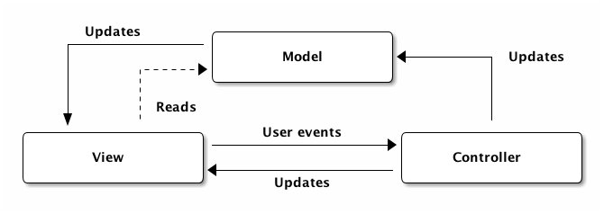

# Chapter 20 - Starting with JavaFX

In this chapter we will take a look at how to build a basic GUI application using JavaFX. In particular we will be using the FXML approach instead of the code behind approach. This because the FXML approach gives a cleaner GUI from business logic separation by applying the MVC (Model-View-Controller) pattern. FXML can also be easily designed using Scene Builder, which is a Drag n Drop UI designer for JavaFX applications.

This chapter will focus on the concepts and required components to build a decent JavaFX application and not on how to design a graphical user interface. The last is left to the reader and his/her creativity. A good source of information is the Internet and YouTube where many tutorials can be found on building astonishing JavaFX GUI applications.

<!-- Maybe next year we should first start with a simple hello world in JavaFX code behind -->

## JavaFX Application Structure

In general, a JavaFX application will have three major components namely a **Stage**, **Scenes** and **Nodes** as shown in the following diagram.


The `Stage` is the main container which is usually a window with a border and the typical minimize, maximize and close buttons. Inside the `Stage` you place a `Scene` contains the actual JavaFX nodes (components) like `AnchorPane`, `TextBox`, `Button`, etc. are added.

A scene graph is a tree-like data structure (hierarchical) representing the contents of a scene. In contrast, a node is a visual/graphical object of a scene graph.

The diagram below shows an abstract example of a scene and its scene graph.


The JavaFX Scene Graph API makes graphical user interfaces easier to create, especially when complex visual effects and transformations are involved. A scene graph is a tree data structure, most commonly found in graphical applications and libraries such as vector editing tools, 3D libraries, and video games. The JavaFX scene graph is a retained mode API, meaning that it maintains an internal model of all graphical objects in your application. At any given time, it knows what objects to display, what areas of the screen need repainting, and how to render it all in the most efficient manner. Instead of invoking primitive drawing methods directly, you instead use the scene graph API and let the system automatically handle the rendering details. This approach significantly reduces the amount of code that is needed in your application.

A single element in a scene graph is called a **node**. Each node has an

* **ID:** Each node in the scene graph can be given a unique id. This id is much like the "id" attribute of an HTML tag in that it is up to the designer and developer to ensure that the id is unique within the scene graph. The ID can be used to find a node within the scene graph, or within a subtree of the scene graph. The id can also be used identify nodes for applying styles.
* **Style class:** The style class can be used to style the node from CSS. The id and styleClass variables are used in CSS style sheets to identify nodes to which styles should be applied.
* **Bounding volume:** Every node has a geometric shape and it is positioned in a coordinate system. The size and the position of the node are collectively knows as its bound. The bound of a node are defined in terms of a bounding rectangular box that closes the entire geometry of the node.

A node may include:

* **Geometrical (Graphical) objects (2D and 3D)** such as Circle, Rectangle, Polygon, etc.
* **UI Controls** such as Button, Checkbox, Choice Box, Text Area, etc.
* **Containers** (Layout Panes) such as Border Pane, Grid Pane, Flow Pane, etc.
* **Media elements** such as Audio, Video and Image Objects.

The `Node` class represents a node in JavaFX. This class is the super class of all other above mentioned types of nodes.

## FXML

FXML is a scriptable, XML-based markup language for constructing Java object graphs. It provides a convenient alternative to constructing such graphs in procedural code, and is ideally suited to defining the user interface of a JavaFX application, since the hierarchical structure of an XML document closely parallels the structure of the JavaFX scene graph.

A designer can code in FXML or use **JavaFX Scene Builder** to interactively design the graphical user interface (GUI). Scene Builder generates FXML markup that can be ported to an IDE where a developer can add the business logic.

To create a new JavaFX FXML application, launch Visual Studio Code, press `CTRL - SHIFT - P` and select `Maven: Generate from Maven ArcheType`. Next select `More ...`. Now type in `JavaFX` to filter and select `javafx` from `org.codehaus.mojo.archetypes` as a starter template. This will generate a simple *Hello World* application.

Hit `CTRL - F5` to launch the app without debugging, or `F5` to launch it with debugging enabled.

<!-- Check it in NetBeans - Add as a note: To create a new JavaFX FXML application, launch NetBeans and select `File => New Project => JavaFX => JavaFX FXML Application`. -->

### Model View Controller

If you take a look at a newly created JavaFX FXML application you will notice multiple files were created.


This structure follows a design pattern called the **Model-View-Controller pattern**, a well known pattern in the world of web development.

Perhaps the most well known pattern, also the one that many will get wrong and implement in an even worse way. The MVC pattern arose as a solution to keep 3 concerns separate from each other:

* visuals (View)
* data (Model)
* and logic (Controller).

The pattern is easy to understand but hard to implement given that its generic description: a triangle where all parts can communicate with each other. Problem is, the links between some parts may be passive, for example some claim the View may only read the Model but do not update it directly, where as others claim data flows equally both ways.

The following diagram presents one of the many ways in which this pattern may be implemented; the dotted lines represent passive links.



From a Model View Controller (MVC) perspective:

* the FXML file that contains the description of the user interface is the view;
* the controller is a Java class which is declared as the controller for the FXML file;
* the model consists of domain objects, defined on the Java side, that you connect to the view through the controller.

### Structure of a JavaFX FXML application

As depicted in the next figure, the user interface of an FXML application is defined inside an FXML document and all the logic to handle input events is written inside a controller class.


The execution of the program begins with the `Main` class, which invokes the FXML loader. The FXML loader parses the FXML document, instantiates the nodes specified in the document, and builds the scene graph.

After building the scene graph, the FXML loader instantiates the controller class, injects the fields defined in the controller class with objects instantiated from the FXML document and then calls the controller’s `initialize()` method.

All this is done with a limited amount of code:

```java
public class MainApp extends Application {
  @Override
  public void start(Stage stage) throws Exception {
    Parent root = FXMLLoader.load(getClass().getResource("/fxml/Scene.fxml"));
    Scene scene = new Scene(root);
    scene.getStylesheets().add("/styles/Styles.css");
    stage.setTitle("JavaFX and Maven");
    stage.setScene(scene);
    stage.show();
  }

  public static void main(String[] args) {
    launch(args);
  }
}
```

## Event Handling

In JavaFX applications, events are notifications that something has happened. As a user clicks a button, presses a key, moves a mouse, or performs other actions, events are dispatched. Registered event handlers within the application receive the event and provide a response.

Take a simple player login form where a player is asked to provide a nickname and press a button to start the game when ready.


If you haven't done so already, make sure to install **Gluon Scene Builder**. This will make it a lot easier to make a nice graphical user interface. If you already create a JavaFX app using VSCode, all you need to do now is select `File => Import => FXML ...` inside of Scene Builder and select the FXML file of your new project.

> **WARNING** - **New FXML File**
>
> When creating a new FXML file inside of Scene Builder, make sure to bind it to the correct controller class. This can be accomplished be selecting the `Document => Controller` panel on the left and setting the correct controller class. If this incorrect, the graphical view will not be loaded.

<!-- When creating a new FXML file from Scene Builder and importing it afterwards into a JavaFX application you may need to change the name of loaded file inside the `start()` method where the FXML file is loaded. You will also need to specify the name of the controller inside the FXML file root node. -->

### A Button Handler

The idea is to create a Player instance when the user presses the button and output the instance as a string to the terminal. A simple Player class implementation could be:

```java
package gamelogic;

public class Player {
    private String nickname;
    private int points = 0;

    public Player(String nickname) {
        this.nickname = nickname;
    }

    @Override
    public String toString() {
        return "Player " + nickname + " has " + points + " points.";
    }
}
```

For this we first need to register a button handler for the `createPlayer` button, where `createPlayer` is the id of the button. This is achieved my opening the FXML file in Scene Builder, selecting the button and setting the method name at `Code => On Action` in the Inspector panel as shown below. Take for example a handler name `createPlayerHandler`. In the same panel you can set the id of the Node.


> **WARNING** - **The CSS id**
>
> Take note that the *Properties* panel also has an id below the *JavaFX CSS* section. This is however not the id of the component, but rather the id off the CSS style to bind it to. 

Next a method with that exact name needs to be created inside the Controller. It should also take an event as an argument, which is of type `ActionEvent`. This object can later be used to identify the control that triggered the event. The `@FXML` is mandatory for private members for the automatic binding with the view to work. It is optional for public members.

```java
public class WalkThePlankController implements Initializable {
    @FXML
    private void createPlayerHandler(ActionEvent event) {
        System.out.println("Clicked the create player button");
    }

    @Override
    public void initialize(URL url, ResourceBundle rb) {
    }    
}
```

### Retrieving Data from the View

To be able to instantiate a Player object, the nickname that the user provided in the `TextField` needs to be retrieved first.

For this we first need a reference to the actual `TextField` object that is automatically created by the FXML loader. This can be achieved by adding a private `TextField` attribute to the controller with the same name as the id of the `TextField` node in the FXML file. Since it is private, an `@FXML` annotation should be added before it. Then the reference can be used to retrieve the String entered by the user using the method `getText()`.

```java
public class WalkThePlankController implements Initializable {
    @FXML private TextField nickname;

    @FXML
    private void createPlayerHandler(ActionEvent event) {
        String playerNickname = nickname.getText();
        System.out.println("Nickname = " + playerNickname);
    }

    @Override
    public void initialize(URL url, ResourceBundle rb) {
    }    
}
```

To create a Player object we need to add an attribute of type Player to the controller and instantiate it once the user presses the button as shown below.

```java
public class WalkThePlankController implements Initializable {
    private Player player;

    @FXML private TextField nickname;

    @FXML
    private void createPlayerHandler(ActionEvent event) {
        String playerNickname = nickname.getText();
        player = new Player(playerNickname);
        System.out.println("Created new player: " + player);
    }

    @Override
    public void initialize(URL url, ResourceBundle rb) {
    }    
}
```

### Registering an Event Handler from Code

It is also possible to register an event handler from inside your Java code using what is called an inner class implementation of EventHandler:

```java
public class WalkThePlankController implements Initializable {

    private Player player;

    @FXML private TextField nickname;
    @FXML private Button createPlayer;

    @Override
    public void initialize(URL url, ResourceBundle rb) {
        createPlayer.setOnAction(new EventHandler<ActionEvent>() {
            @Override
            public void handle(ActionEvent event) {
              String playerNickname = nickname.getText();
              player = new Player(playerNickname);
              System.out.println("Created new player: " + player);
            }
        });
    }    
}
```

The actual implementation of the handler itself is exactly the same. However some notes can be made:

* First a reference to the `createPlayer` is required to be able to register the event handler
* The event handler can be registered by calling the method `setOnAction()` inside the `initialize()` method (which kind of functions as a constructor here).
* The name of the `handle()` method cannot be chosen as before. Here it is imposed by the `EventHandler` interface

Luckily most of this can be automatically generated by VSCode. We will come back to these types of constructions later on in this course.

## Cascading Style Sheets

Never has styling a Java UI been easier than with JavaFX and **Cascading Style Sheets (CSS)**. Going from one theme to another, or customizing the look of just one control, can all be done through CSS.

### CSS and the JavaFX Scene Graph

JavaFX Cascading Style Sheets (CSS) is based on the W3C CSS version 2.1 with some additions from current work on version 3. JavaFX CSS also has some extensions to CSS in support of specific JavaFX features. The goal for JavaFX CSS is to allow web developers already familiar with CSS for HTML to use CSS to customize and develop themes for JavaFX controls and scene‑graph objects in a natural way.

To the extent possible, JavaFX CSS follows the W3C standards; however, with few exceptions, JavaFX property names have been prefixed with a vendor extension of `-fx-`. Even if these properties seem to be compatible with standard HTML CSS, JavaFX CSS processing assumes that the property values make use of JavaFX CSS extensions.

CSS styles are applied to nodes in the JavaFX scene‑graph in a way similar to the way CSS styles are applied to elements in the HTML DOM. Styles are first applied to the parent, then to its children. The code is written such that only those branches of the scene‑graph that might need CSS reapplied are visited. A node is styled after it is added to the scene graph. Styles are reapplied when there is a change to the node's pseudo‑class state, style‑class, id, inline style, or parent, or stylesheets are added to or removed from the scene. Note that the Node must be in the scene‑graph for CSS to be applied. The Node does not have to be shown, but must have a non‑null value for its sceneProperty.

During a normal scene‑graph pulse, CSS styles are applied before the scene‑graph is laid out and painted.

CSS selectors are used to match styles to scene‑graph nodes. The relationship of a Node to a CSS selector is as follows:

Each node in the scene‑graph has a styleClass property. Note that a node may have more than one style‑class. A Node's styleClass is analogous to the class="..." attribute that can appear on HTML elements.

Each node in the scene‑graph has an id. This is analogous to the `id="..."` attribute that can appear in HTML elements.

JavaFX CSS also supports pseudo‑classes, but does not implement the full range of pseudo‑classes.

More information can be found at [https://docs.oracle.com/javafx/2/api/javafx/scene/doc-files/cssref.html](https://docs.oracle.com/javafx/2/api/javafx/scene/doc-files/cssref.html).

### Creating a CSS file

To add a stylesheet to your application start by creating a `.css` file inside the `resources => styles` directory inside your application. Name it as you wish.

The actual styling is left as an exercise to the reader of this course. A Dark themed example is shown below which can be used to test. Credits go out to [http://code.makery.ch/library/javafx-8-tutorial/part4/](http://code.makery.ch/library/javafx-8-tutorial/part4/).

```css
.background {
    -fx-background-color: #1d1d1d;
}

Label {
    -fx-font-size: 11pt;
    -fx-font-family: "Segoe UI Semibold";
    -fx-text-fill: white;
    -fx-opacity: 0.6;
}

MenuBar {
    -fx-background-color: derive(#1d1d1d,20%);
}

MenuBar .label {
    -fx-font-size: 14pt;
    -fx-font-family: "Segoe UI Light";
    -fx-text-fill: white;
    -fx-opacity: 0.9;
}

/*Menu dropdown*/
.context-menu {
    -fx-background-color: derive(#1d1d1d,50%);
}

TextField {
    -fx-font-size: 12pt;
    -fx-font-family: "Segoe UI Semibold";
}

Button {
    -fx-padding: 5 22 5 22;   
    -fx-border-color: #e2e2e2;
    -fx-border-width: 2;
    -fx-background-radius: 0;
    -fx-background-color: #1d1d1d;
    -fx-font-family: "Segoe UI", Helvetica, Arial, sans-serif;
    -fx-font-size: 11pt;
    -fx-text-fill: #d8d8d8;
    -fx-background-insets: 0 0 0 0, 0, 1, 2;
}

Button:hover {
    -fx-background-color: #3a3a3a;
}

Button:pressed, Button:default:hover:pressed {
  -fx-background-color: white;
  -fx-text-fill: #1d1d1d;
}

Button:focused {
    -fx-border-color: white, white;
    -fx-border-width: 1, 1;
    -fx-border-style: solid, segments(1, 1);
    -fx-border-radius: 0, 0;
    -fx-border-insets: 1 1 1 1, 0;
}

Button:default {
    -fx-background-color: -fx-focus-color;
    -fx-text-fill: #ffffff;
}

Button:default:hover {
    -fx-background-color: derive(-fx-focus-color,30%);
}
```

You can select the correct stylesheet from Scene Builder. Just select the top container node, `AnchorPane` for example, and set the stylesheet via `Properties => JavaFX CSS => Stylesheets` and press the plus sign `+`.

You can disable the standard stylesheet that was being loaded by removing the line below from the `start()` method inside the `MainApp.java` file:

```java
scene.getStylesheets().add("/styles/Styles.css");   // Remove this if setting CSS file from SB
```

## Layout Panes

