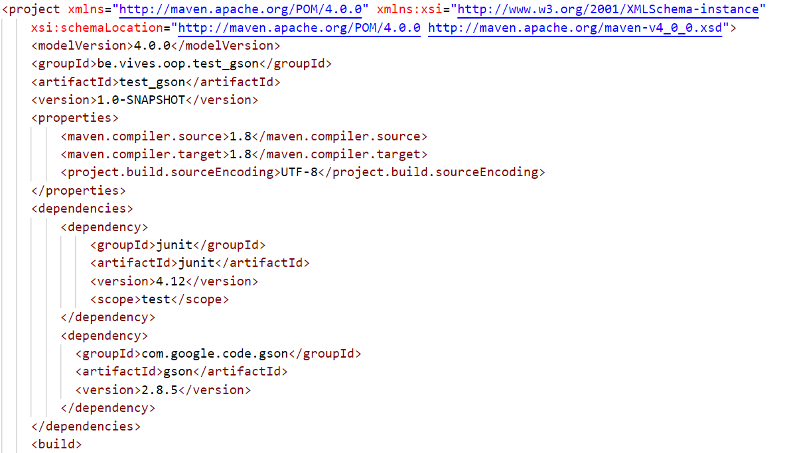

# Chapter 31 - Hands on GSON

Gson is a Java library that can be used to convert Java Objects into their JSON representation. It can also be used to convert a JSON string to an equivalent Java object. Gson can work with arbitrary Java objects including pre-existing objects that you do not have source-code of.

There are a few open-source projects that can convert Java objects to JSON. However, most of them require that you place Java annotations in your classes; something that you can not do if you do not have access to the source-code. Most also do not fully support the use of Java Generics. Gson considers both of these as very important design goals.

Gson Goals:

* Provide simple `toJson()` and `fromJson()` methods to convert Java objects to JSON and vice-versa
* Allow pre-existing unmodifiable objects to be converted to and from JSON
* Extensive support of Java Generics
* Allow custom representations for objects
* Support arbitrarily complex objects (with deep inheritance hierarchies and extensive use of generic types)

## Adding Gson as a Dependency

Start by creating a simple Java Maven Application (no JavaFX application). Call it for example `JavaGsonExample`.

You starter code should be looking familiar from the first part of this course:

```java
public class JavaGsonExample {
    // ...
    public static void main(String[] args) {
        // TODO code application logic here
    }
}
```

### Adding the Library as a dependency

Before we can start using Google's Gson library we need to add the library as a dependency to our project. Navigate to [https://github.com/google/gson](https://github.com/google/gson) and scroll down to the `Download Maven` section.

Add the following dependency to your `pom.xml` file inside your project.

```xml
<dependency>
  <groupId>com.google.code.gson</groupId>
  <artifactId>gson</artifactId>
  <version>2.8.5</version>
</dependency>
```

End result:



## Step 2 - Simple Object Serialization

Gson can easily serialize and deserialize objects to and from json.

Serialization is the process of translating data structures or object state into a format that can be stored (for example, in a file or memory buffer) or transmitted (for example, across a network connection link) and reconstructed later (possibly in a different computer environment). When the resulting series of bits is reread according to the serialization format, it can be used to create a semantically identical clone of the original object. This process of serializing an object is also called **marshalling** an object. The opposite operation, extracting a data structure from a series of bytes, is deserialization (which is also called **unmarshalling**).

Some things to know about Gson serialization:

* You can not serialize objects with circular references since that will result in infinite recursion.
* It is perfectly fine (and recommended) to use private fields.
* There is no need to use any annotations to indicate an attribute is to be included for serialization and deserialization. All fields in the current class (and from all super classes) are included by default.
* If an attribute is marked transient, (by default) it is ignored and not included in the JSON serialization or deserialization.
* While serializing, a null attribute is omitted from the output.
* While deserializing, a missing entry in JSON results in setting the corresponding attribute in the object to its default value: null for object types, zero for numeric types, and false for booleans.
* If an attribute is synthetic, it is ignored and not included in JSON serialization or deserialization.
* Fields corresponding to the outer classes in inner classes, anonymous classes, and local classes are ignored and not included in serialization or deserialization.

### A Motorcycle class

Let us create a Motorcycle class with the following characteristics:

* a brand: `String` - for example "Kawasaki"
* a model: `String` - for example "VN800"
* a year of manufacturing: `int` - for example 1997
* a price: `double` - for example 5000

We create a simple class with a constructor that takes the first three attributes as arguments. The `price` is considered optional as we do not always know the price of the model.

```java
public class Motorcycle {

  private String brand;
  private String model;
  private int yearOfManufacturing;
  private double price;

  public Motorcycle(String brand, String model, int yearOfManufacturing) {
    this.brand = brand;
    this.model = model;
    this.yearOfManufacturing = yearOfManufacturing;
    this.price = 0;
  }

  public void setPrice(double price) {
    this.price = price;
  }

  @Override
  public String toString() {
    String output = brand + " " + model + " [" + yearOfManufacturing
      + "]: ";

    if (price > 0) {
      output += price + "eur";
    } else {
      output += "price unknown";
    }

    return output;
  }
}
```

Let us implement a small test application in main:

```java
public class JavaGsonExample {
    public static void main(String[] args) {
        Motorcycle myZx = new Motorcycle("Kawasaki", "ZX6R", 2006);

        Motorcycle myVulcan = new Motorcycle("Kawasaki", "VN800", 1997);
        myVulcan.setPrice(3500);

        System.out.println(myZx);
        System.out.println(myVulcan);
    }
}
```

This should output:

```text
Kawasaki ZX6R [2006]: price unknown
Kawasaki VN800 [1997]: 3500.0eur
```

Now we know our class works.

### Serialization of a Motorcycle

Let us serialize both these motorcycles using gson and see what the result is. For this you can start from the example on the Github UserGuide page of the Gson library [https://github.com/google/gson/blob/master/UserGuide.md#TOC-Object-Examples](https://github.com/google/gson/blob/master/UserGuide.md#TOC-Object-Examples).

Below is the part of the example that is of importance to us. `BagOfPrimitives` is the name of the class of the object that is being serialized.

```java
// Serialization
BagOfPrimitives obj = new BagOfPrimitives();
Gson gson = new Gson();
String json = gson.toJson(obj);  
```

So all we need to do is create an object of the class `Gson` and call the method `toJson()` with an instance of the object we want to serialize.

For example:

```java
public class JavaGsonExample {
    public static void main(String[] args) {
        Motorcycle myZx = new Motorcycle("Kawasaki", "ZX6R", 2006);

        Motorcycle myVulcan = new Motorcycle("Kawasaki", "VN800", 1997);
        myVulcan.setPrice(3500);

        System.out.println(myZx);
        System.out.println(myVulcan);

        // Serialization
        Gson gson = new Gson();
        String zxJson = gson.toJson(myZx);  
        String vulcanJson = gson.toJson(myVulcan);

        System.out.println("Json of ZX: " + zxJson);
        System.out.println("Json of Vulcan: " + vulcanJson);
    }
}
```

The result of this is:

```text
Kawasaki ZX6R [2006]: price unknown
Kawasaki VN800 [1997]: 3500.0eur
Json of ZX: {"brand":"Kawasaki","model":"ZX6R","yearOfManufacturing":2006,"price":0.0}
Json of Vulcan: {"brand":"Kawasaki","model":"VN800","yearOfManufacturing":1997,"price":3500.0}
```

## Deserialization of a Motorcycle

To deserialize a `Motorcycle` object from a json we start by creating our own json. For this we will need to adhere to the resulting json format outputted by the previous example.

```json
{"brand":"Honda","model":"CBR600RR","yearOfManufacturing":2007,"price":5990.0}
```

or one without a price:

```json
{"brand":"Ducati","model":"Monster 600","yearOfManufacturing":1995}
```

When you copy paste these json strings in NetBeans, they will automatically be escaped.

### Deserializing the json

Again we start with the example given on the GitHub UserGuide.

```java
// Deserialization
BagOfPrimitives obj2 = gson.fromJson(json, BagOfPrimitives.class);
```

Again we need an object of the class `Gson`. This time we need to call the method `fromJson()` and pass two arguments. First the json String and secondly the name of the class. The second argument is given by following the class with `.class`, for example `Motorcycle.class`.

Let us try it out:

```java
public class JavaGsonExample {
    public static void main(String[] args) {
        // ....

        // Deserialization
        System.out.println("Deserialization of some Motorcycles");
        String hondaJson = "{\"brand\":\"Honda\",\"model\":\"CBR600RR\",\"yearOfManufacturing\":2007,\"price\":5990.0}";
        String ducatiJson = "{\"brand\":\"Ducati\",\"model\":\"Monster 600\",\"yearOfManufacturing\":1995}";

        Motorcycle honda = gson.fromJson(hondaJson, Motorcycle.class);
        Motorcycle ducati = gson.fromJson(ducatiJson, Motorcycle.class);

        System.out.println(honda);
        System.out.println(ducati);
    }
}
```

Resulting in:

```text
Deserialization of some Motorcycles
Honda CBR600RR [2007]: 5990.0eur
Ducati Monster 600 [1995]: price unknown
```

## Composition

But what if we included a reference to an object of another class? Take for example a class `Engine` that contains the specific engine specs.

```java
public class Engine {
  private int capacity;
  private double maxPower;

  public Engine(int capacity, double maxPower) {
    this.capacity = capacity;
    this.maxPower = maxPower;
  }

  @Override
  public String toString() {
    return maxPower + "kW @ " + capacity + "cc";
  }
}
```

Of course we also need to adjust our `Motorcycle` class a bit to take this `Engine` class in account.

```java
public class Motorcycle {

  private String brand;
  private String model;
  private int yearOfManufacturing;
  private double price;
  private Engine engine;

  public Motorcycle(String brand, String model, int yearOfManufacturing, Engine engine) {
    this.brand = brand;
    this.model = model;
    this.yearOfManufacturing = yearOfManufacturing;
    this.price = 0;
    this.engine = engine;
  }

  public void setPrice(double price) {
    this.price = price;
  }

  @Override
  public String toString() {
    String output = brand + " " + model + " [" + yearOfManufacturing
      + "] (" + engine + "): ";

    if (price > 0) {
      output += price + "eur";
    } else {
      output += "price unknown";
    }

    return output;
  }
}
```

### A new Main

Since we changed quite a bit we'll start over with a new main (you can also comment out the previous code so not to lose it).

The `Motorcycle` constructors requires us to pass it an `Engine` object, so we will need to create this before we create a new `Motorcycle`. Once that is done we can just serialize and deserialize and we did before.

```java
public class JavaGsonExample {
    public static void main(String[] args) {
        Engine vTwin800 = new Engine(800, 40.8);
        Motorcycle vulcan800 = new Motorcycle("Kawasaki", "VN800A", 1996, vTwin800);
        System.out.println("Original vulcan 800: " + vulcan800);

        // Serialization
        Gson gson = new Gson();
        String vulcanJson = gson.toJson(vulcan800);
        System.out.println("Json: " + vulcanJson);

        // Deserialization
        String ducatiJson = "{\"brand\":\"Ducati\",\"model\":\"Monster 600\","
                + "\"yearOfManufacturing\":1995,\"price\":0.0,"
                + "\"engine\":{\"capacity\":583,\"maxPower\":38.7}}";
        Motorcycle ducati = gson.fromJson(ducatiJson, Motorcycle.class);
        System.out.println(ducati);
    }
}
```

which results in:

```text
Original vulcan 800: Kawasaki VN800A [1996] (40.8kW @ 800cc): price unknown
Json: {"brand":"Kawasaki","model":"VN800A","yearOfManufacturing":1996,"price":0.0,"engine":{"capacity":800,"maxPower":40.8}}
Ducati Monster 600 [1995] (38.7kW @ 583cc): price unknown
```