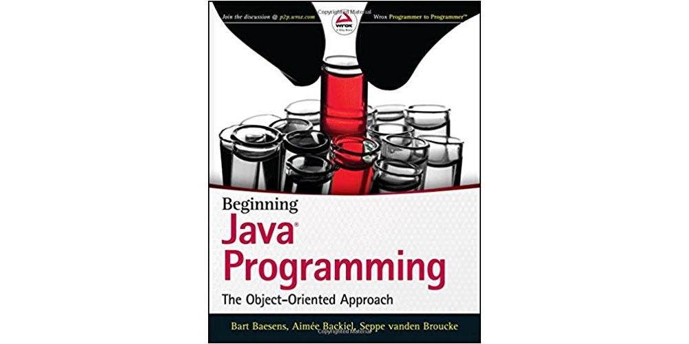

# Object Oriented Programming using Java

Welcome to the course Object Oriented Programming (OOP). In this course we will try to learn to become good or better OOP programmers. While the language used for the examples is Java, any or most other OOP programming languages can be used in combination with this course.

Most of the material used in this course is created by Nico De Witte. However some paragraphs, definitions, examples, images, ... may be copied from other online sources. In that case a reference can be found in the Sources chapter or as a footnote.

Check out my github repos: [https://github.com/BioBoost](https://github.com/BioBoost).

## Requirements

To follow along you will at least need to install Java and an IDE like NetBeans. You can find a tutorial for the installation of NetBeans in the [Software Installation Guide @ https://vives.gitbook.io/software-installation-guide/](https://vives.gitbook.io/software-installation-guide/).

## About this course

This course is not about learning to use all sorts of tools or fancy integrated development environments (IDEs). It's also not about learning to manage projects or design methodologies.

The main focus lies in learning to think in an object oriented way and in the meantime learn some object oriented languages. While learning all these great things about objects we are not responsible for the fact that you might learn a thing or two about tools and project management.

### Books

Most of the ideas, knowledge and understanding is achieved by reading books. It can only be encouraged to read books and broaden your horizon. Challenge yourself and others with your newly acquired knowledge.

But don't only become book-smart. Also become do-smart. Make exercises, solve problems, create programs, beat challenges, test new things, ...

**Beginning Java Programming: The Object-Oriented Approach** is written by Bart Baesens, Aimee Backiel and Seppe vanden Broucke. It provides readers a decent education on Java so they can apply their new skills in the real world. The book discusses the fundamentals of Java programming language. The book places an emphasis on OOP principles, and is geared for those who want to use Java in an applied environment while learning Java.

**The Object-Oriented Thought Process** is written by Matt Weisfeld specifically for students. It provides a solutions-oriented approach to object-oriented programming. You will learn to understand the proper uses of inheritance and composition, the difference between aggregation and association, and the important distinction between interfaces and implementations.

### Theory

While all you need to know for the exam is in this course, not all you should know is in here. **It is extremely preferable to take notes in the lessons.** And of course you are also encouraged to search the Internet and books for extra knowledge.

Feel free to ask questions in the lessons, via email or via Slack @ [https://eo-ict-vives.slack.com](https://eo-ict-vives.slack.com).

### LABs, assignments and tests

The LABs are there to practice what you have learned in the lessons. You will get some assignments through the semester on which you will be graded.

This course also contains extra exercises to practice your OOP skills in Java.

There may be occasions for tests but these will mostly be announced.

### ECTS

For the exact details on the LABs, exams and tests you should take a look at the ECTS fiche of this course which can be found via [http://onderwijsaanbod.vives-noord.be/syllabi/n/B3N001N.htm](http://onderwijsaanbod.vives-noord.be/syllabi/n/B3N001N.htm) for OOP1 and via [http://onderwijsaanbod.vives-noord.be/syllabi/n/B3N005N.htm](http://onderwijsaanbod.vives-noord.be/syllabi/n/B3N005N.htm) for OOP2.

## Extra practice

While this course does contain a lot of exercises and things to try, you are encouraged to find extra practice or inspiration on the Internet. A good source is [https://www.sololearn.com/](https://www.sololearn.com/). SoloLearn has a large collection of FREE code learning content, from beginner to pro! Choose from thousands of programming topics to learn coding. They also host a heap of challenges. While most solutions are also available they have not been checked and approved by the teacher of this course. Be critical about the solutions and try to apply the things you have learned in this course.
