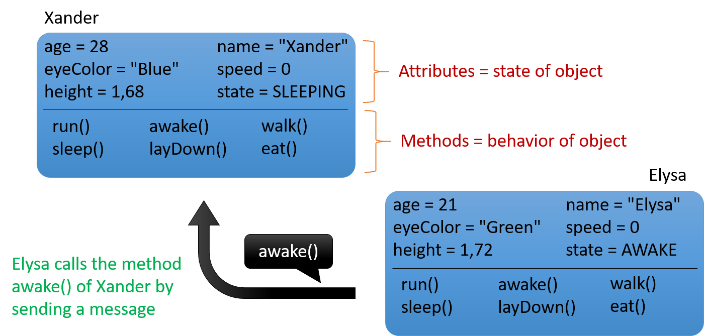
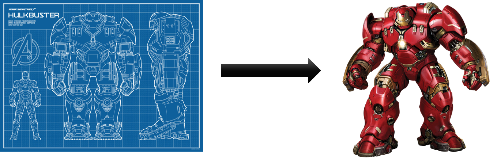
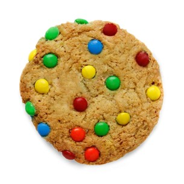
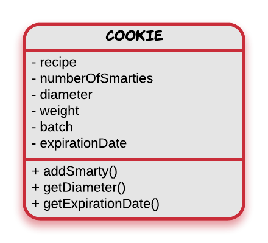
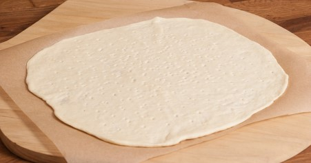
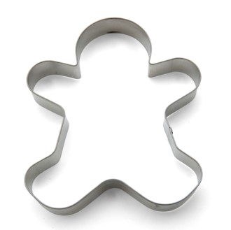

<!-- toc -->

# All About Objects

This chapter will teach you the basics of the Object Oriented Programming.

## Object Oriented Thinking

Object Oriented Programming (OOP) has been around since the early 1960s but it gained only decent momentum since the 1990s. The emergence of the Internet for business and entertainment lies mainly at the base of this popularity gain of OOP.

While this course will teach you the basics of Java and C++ it's main focus will be object oriented concepts and the thought process behind object oriented design of software. If you understand the mechanics behind the object oriented world you will be able to apply it to any OOP language. Concepts stay more consistent over time and evolve at a slower rate. Technologies and programming languages on the other hand evolve quite rapidly. By the time you finish your studies the tools you have learned to use may have become deprecated.

### It's all about objects

What is an object ?

Sounds like a complex question, but the answer is actually really simple. Humans already tend to thinks in terms of objects, without taking to much effort. Students already know about objects, even if they won't realize it.

If you are reading this in a public room, than take a look around you. Try to focus on a person in the room and identify some properties of this person. Some examples could be his/her:

* name
* age
* eye color
* gender
* state (sleeping, walking, ...)
* height
* ...

These properties are often referred to as the **attributes** of an object. They define the data that the object is holding or the state that it is in.

What actions can that person perform ? He/she can:

* walk
* sleep
* talk
* eat
* stand up
* ...

These are called the **methods** of an object. They define the possible behavior of an object.

This leads to a more formal definition of an object:

> #### Definition::Object
>
>  An object is an entity that contains both **data** (*attributes*) and **behavior** (*methods*).

### Talking objects

Most objects will only become useful if they can interact with other objects. Take for example a chair in the middle of a room full of people. The chair is pretty useless until someone decides to sit on it.

Interaction between objects in a software program is accomplished by an object sending a **message** to another. Of course it is part of your job as a programmer to determine which objects send messages to each other and when. In an object oriented programming language sending a message from one object to another is accomplished by **calling a method** of an object.

Take a look at the following example. It defines two people (objects): Xander and Elysa. Both have their own state (attributes or data) and have certain actions that they can perform (run, sleep, eat, ...). The diagram shows that Elysa is sending a message to (calling the awake() method) to Xander who is asleep.

While the diagram above is no official standard it does however places a base for the UML standard that will later be used in this course. Note how attributes and methods are separated. It also shows some programming basics such as the parentheses after a name of a method or the naming conventions of the attributes. More on all of this later.

> #### Assignment::Samsung Smart TV
>
>  Search for the specs of a smart TV on the website of an Internet vendor (for example CoolBlue). Can you identify the attributes and methods of the TV?

> #### Assignment::A Pidgey Pokemon
>
>  Take a look at the screenshot below of a Pokemon game. Can you identify the attributes and actions of Pidgey ?

### Quick summary

* Objects are the building blocks of an OO program
* A program is basically a collection of objects
* An object is an entity that contains both data and behavior
  * **Data** represents the state of the object and is represented by **attributes** of the object
  * **Behavior** represents what the object can do in the form of **methods**
* Objects interact with each other by sending messages
  * In the form of method calls

## Objects and Classes

Object do not just sprout from memory when needed. They are created based on a sort of blueprint.

From this point on this blueprint will be called a **class**, while the objects that are created based on this particular class are called it's **instances**. So basically a class is *defined* and instances of this class called objects are created from it.

Not all object oriented programming languages follow this concept. For example prototype-based languages, a style of object-oriented languages, remove the distinction between classes and instances. In these languages existing objects are used a prototype to create more objects or subtypes of that particular object.

Lets use the idea of "fruit" as one example. A "fruit" object would represent the properties and functionality of fruit in general. A "banana" object would be cloned from the "fruit" object, and would also be extended to include general properties specific to bananas. Each individual "banana" object would be cloned from the generic "banana" object.

The first prototype-oriented programming language was Self, developed by David Ungar and Randall Smith in the mid-1980s to research topics in object-oriented language design. Since the late 1990s, the classless paradigm has grown increasingly popular.Some current prototype-oriented languages are JavaScript (and other ECMAScript implementations, JScript and Flash's ActionScript 1.0), Lua, Cecil, NewtonScript, Io, Ioke, MOO, REBOL, Lisaac and AHk.

### Defining Classes

Let's take a look at how a class can be defined to create a simple model of a cookie.

A graphical representation can be created using UML (Unified Modeling Language) class diagrams. UML is a general-purpose, modeling language in the field of software engineering, that is intended to provide a standard way to visualize the design of a system.

Below an example is shown of a class diagram of a Cookie. Do take note that some things are still missing from the diagram but these will be added gradually as the course progresses.

Notice how the UML class diagram is separated into three distinct parts:

* The top part: the name of the class
* The middle part: the attributes of the class
* The bottom part: the methods of the class

#### Baking Cookies

Metaphorically you can compare creating objects with baking cookies.

The dough we use is basically the computer memory we have at our disposal.

The template for our cookie is the class we define.

The resulting cookies are the instances of our class called objects.

