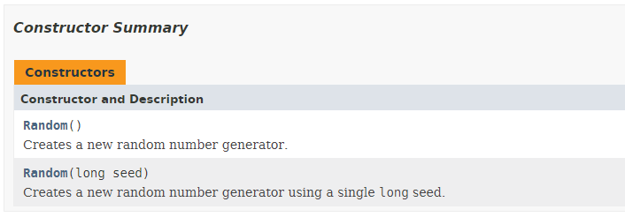

## The Random class

An object of the Random class can be used to generate a stream of pseudorandom numbers. Information about the different methods available can be found at [https://docs.oracle.com/javase/8/docs/api/java/util/Random.html](https://docs.oracle.com/javase/8/docs/api/java/util/Random.html).

Let us create an object of the class Random and output some random numbers.

```java
final int MAX = 150;
Random generator = new Random();

System.out.print("Random numbers:");
for (int i = 0; i < 10; i++) {
  System.out.print(" " + generator.nextInt(MAX));
}
```

So `generator` is the name of our variable that holds a reference to an object of the class `Random`. The variable can then be used to call method of that particular instance like for example the method `nextInt(int bound)` that can take an argument of type `int` to pass the maximum bound you would like to generate. The method needs to be called on an instance of the class `Random`, using the dot `.` operator, so on the object which `generator` is referencing.

The random numbers are actually generated based what is a called a *seed*. When you use the same seed again, you get the same random numbers. To set the seed of the generator object you can call the `setSeed(long seed)` method.

Run the following code example multiple times and you will see the effect. Try changing the seed and run it another couple of times.

```java
final int MAX = 150;
final long SEED = 1337;
Random generator = new Random();
generator.setSeed(SEED);

System.out.print("Random numbers with SEED = " + SEED + ":");
for (int i = 0; i < 10; i++) {
  System.out.print(" " + generator.nextInt(MAX));
}
```

Using the seed shown above the output will be:

```text
Random numbers with SEED = 1337: 121 144 59 22 9 148 53 4 127 117
```

This can be useful if you wish to reproduce the same output more than once.

You may or may not have noticed that the Random class has more than one constructor (a method with the same name of the class used to initialize the object). The API docs show the different constructors that a class contains:



If you take a look at the second constructor `Random(long seed)`, it states that it *creates a new random number generator using a single long seed.*. So in other words the previous code example can be replaced by the code below (the method call `setSeed()` is removed).

```java
final int MAX = 150;
final long SEED = 1337;
Random generator = new Random(SEED);

System.out.print("Random numbers with SEED = " + SEED + ":");
for (int i = 0; i < 10; i++) {
  System.out.print(" " + generator.nextInt(MAX));
}
```

While the previous code does exactly the same, it demonstrates that some classes posses multiple constructors, allowing us - as the user of the class - to select the constructor that suits our needs best. Always take a look at the documentation to see which constructors are available.

Some classes only have constructors that have arguments. This means that an object cannot be created without outside information.
