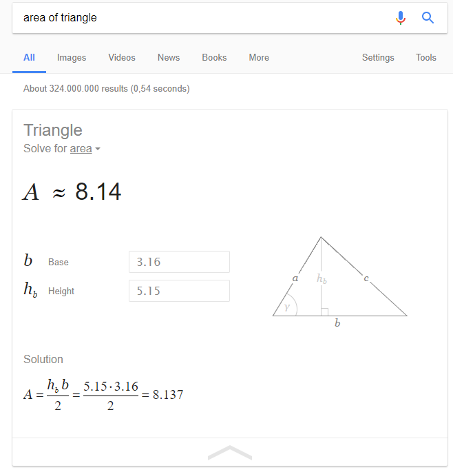

# Week 2

## Assignment - Guessing Game

For this assignment there are a few basic requirements. For the rest you can show some creative behavior.

Create a guessing game where a number is generated randomly and the user needs to guess it. Search the Internet on how to generate a random number in Java. When a user inputs his/her guess, the game should state if it is too high or too low. Keep some sort of score for the user.

At the beginning of the game make sure to give some instructions to the player on how it works. At the end of a round ask the user if he/she wishes to play again. Display the number of guesses a player needed to guess the number and also display his/her score.

Make sure to track the best score of the player throughout his/her different rounds and display it when the player stops playing.

Some extras:
* You could ask the user's name to make the game more personal.
* You could create a report with an overview of the scores of the player for each round. The simplest solution here would me to create a String and append the results to it each round.

Don't forget to add a markdown report to the project.

## Assignment - Decimal to Hex convertor

Create a Java program that converts a decimal number (0 till 255) to hexadecimal number (0x00 to 0xFF).

Java has no native support for hexadecimal notation so you will need to create a String for the hexadecimal number.

Example:
```text
This program can convert decimal numbers from 0 to 255 to a hexadecimal notation.

Please input your decimal number (0 to 255): 288
Sorry, cannot convert negative numbers or numbers greater than 255.
Please input your decimal number (0 to 255): 16

The number 16 in decimal notation is represented as 0x10 in hexadecimal notation.

Thank you for using our software.
```

## Assignment - Shape Area Calculator

Create a program that can calculate the area of at least 3 different shapes. Let the user choose which shape.

You can use google to check your results.



Also make sure the user cannot enter negative numbers.

Example:
```text
This program calculates the area of different shapes.

For which shape would you like to calculate the area?
1. Triangle
2. Square
3. Rectangle
4. Circle
5. Exit program
Your choice: 1

To calculate the area of a triangle we need the base width and the height of the triangle.
Please enter the width of the base: 3.16
Please enter the height of the triangle: -5.15
Cannot use negative numbers.
Please enter the height of the triangle: 5.15

The total area of a triangle is 8.137
```
