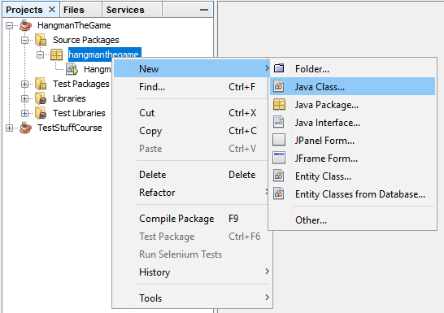

# Week 7

In the classroom we created the game **Hangman**. The final code of the game is presented below.

This weeks assignments will encompass extending this existing code with some nice extra functionality.

[include](code/HangmanTheGame/src/hangmanthegame/HangmanTheGame.java)

Try to place separate functionality into separate methods if possible.

## Assignment - Stats and Layout

As a first assignment you are encouraged to make the game code yours. Do not add any extra functionality yet but change it a little. Some examples may be:
* Change how the stats are displayed
* Refactor the welcome message

## Assignment - Final score

Determine your own way to calculate a final score. You should be able to output a single value based on the efforts of the user. This score should of course be 0 if the user lost the game. Do make sure to make an integer of your high score. No floating point scores.

Some parameters that may be included are:
* The time it took the user to reach a result
* The length of the secret

To measure the time the user played you could use the code below. It measures the number of milliseconds it took between `start` and `end`.
```java
long start = System.nanoTime();
// Do something
long end = System.nanoTime();
System.out.println("Took: " + ((end - start) / 1000000) + "ms");
```
Source: [https://stackoverflow.com/questions/6317750/how-to-measure-the-a-time-span-in-seconds-using-system-currenttimemillis](https://stackoverflow.com/questions/6317750/how-to-measure-the-a-time-span-in-seconds-using-system-currenttimemillis).

## Assignment - Read the Player name

Read the players name before starting the game. This will later be used to save the high score.

## Assignment - High Scores

For this final part you need to save the highscores of the game to a file and load them when the game is started. You should also display a top 3 list of scores when a player finishes a game (loses or wins). Scores are only tracked if they are larger than 0.

To keep track of the high scores I created two classes for you to use. The first is a class `HighScore` which holds a `playerName` and `score`.

To import this class into your project you need to right-click on your `hangmanthegame` (or whatever it is called) source package as shown below. Next select `New => Java Class` and name it exactly `HighScore`.

;

Now you can place the code below inside the file, replacing the class (make sure not to replace the package statement at the top):

[include](code/ListOfHighScores/src/listofhighscores/HighScore.java)

Next add a second class called `HighScoreList`. Make sure to match the name exactly. Past in the code below:

[include](code/ListOfHighScores/src/listofhighscores/HighScoreList.java)

The `HighScoreList` keeps track of an `ArrayList` of `HighScore` objects. You can add scores, you can print a list and you can save them to a file. The file is automatically loaded if it exists when the `HighScoreList` object is created.

Some example code is shown here:

[include](code/ListOfHighScores/src/listofhighscores/ListOfHighScores.java)

```java
// Creating a list to hold highscores
// Automatically loads highscores.txt if it exists
HighScoreList scores = new HighScoreList();

// You can clear the scores
scores.clearAllScores();

// You can add scores
scores.addHighScore(new HighScore("Marki the Sixth", 2878));
scores.addHighScore(new HighScore("Mary Polu", 125));

// Negative scores or 0-scores are ignored
scores.addHighScore(new HighScore("Jane", 0));

// You can save the scores to a file
scores.saveToFile();

// You can print the scores directly to the screen        
System.out.println("Scores:");
System.out.println(scores);

// Or you can get an arraylist of scores and print a custom layout
// or for example a top 10
ArrayList<HighScore> scoreList = scores.getHighScores();
System.out.println("Top 10 scores:");
int i = 0;
while (i < scoreList.size() && i < 10) {
    HighScore score = scoreList.get(i);
    System.out.println((i+1) + " => " + score.getPlayerName() + " has a score of " + score.getScore());
    i++;
}
```
