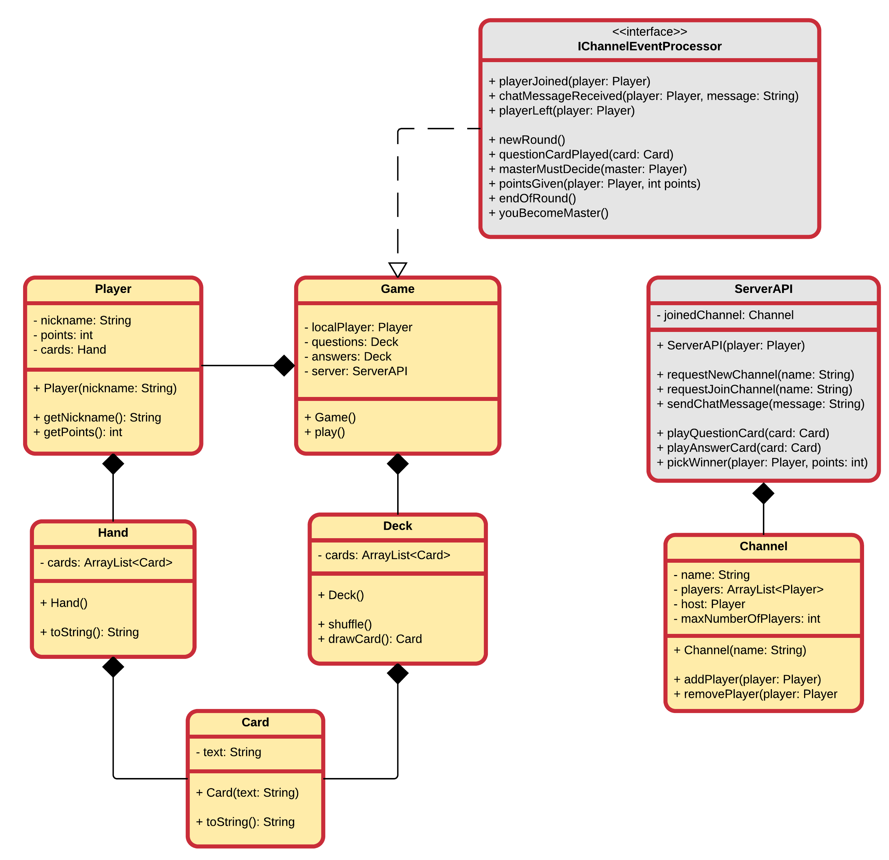

# Week 8 - Cards Against Teachers

For this assignment we will be creating a multiplayer version of "Cards Against Humanity".

## Basic Rules

To start the game, each player draws ten white cards.

According to the rule book provided with the game, the person who most recently pooped (a form of primitive randomization) begins as the "Card Czar" (or "Card Tsar") and plays a black card, face up. The Card Czar then reads the question or fill-in-the-blanks phrase on the black card out loud.

The other players answer the question or fill in the blanks by each passing one white card (or however many required by the black card), face down, to the Card Czar.

The Card Czar shuffles all of the answers and shares each card combination with the group. For full effect, the Card Czar should usually re-read the black card before presenting each answer. The Card Czar then picks the funniest play, and whoever submitted it gets one "Awesome Point".

After the round, a new player becomes the Card Czar, and everyone draws back up to 10 white cards.

The part of speech of a white card is a noun or gerund, including both single words and phrase constructions. Black cards are either fill-in-the-blank statements or questions. Both white and black cards break these rules on rare occasions.

The rules do not state how to win the game—the object being simply to have fun.

The rules in Cards Against Humanity are flexible and can be altered with the many house rules (which are listed in the rules) that players can incorporate (e.g. winning cards are chosen democratically, ability to trade points for cards, points given by ranks, etc.). The official rules include additional provisions for gambling previously won "Awesome Points" for the right to play additional white cards during a round.

## The basic idea

The basic idea is that the **player** starts the client application and needs to login using a **nickname**.

Then some welcome message and rules are displayed.

The player needs to join a **channel** before an actual game can be played. An existing channel can be **joined** or the player can **create a new channel**.

Next the player gets a terminal window where he/she can use **commands** to instruct the application to do things. Some examples:

* list channels: print a list of the available channels that can be joined
* join <channelname>: try to join an existing channel
* host <channelname>: request to create a channel and join if granted
* say <message>: send a chat message to the players in the current channel
* start: start the game in the channel (only if channel host)
* list players: list the players inside the channel
* play <card>: play a card (black or white depending on the phase of the round)
* leave: leave the channel and go back to the main terminal
* exit: exit the game (also leave channel if connected)

All communication with the server is handled via the class `ServerAPI` which is provided to you step by step.

The actual game logic, channel setup, player listing, ... will be handled server side. The client application can send requests and will be informed of the actual outcome via an interface `IChannelEventProcessor`.

The game will be event driven so all actions will be based on messages coming from the different clients and the server. The server will inform the clients of changes using the interface `IChannelEventProcessor`. You game class needs to implement the provided methods and will be able to take action based on these events.

A basic class diagram is shown below:



## Possible Expansions

* Themes for Cards
* Loadable cards (from file or something)
* Playing sounds
* Graphical User Interface using JavaFX
* Extra commands:
 * kick <player>: kick a player (only if host)

## Phase 1 - Starting easy

The idea is that all clients should be able to play together (or at least the ones of your group). This might not be possible in the long term. But the least we should do it try.

Because of this we need to make some agreements. Those agreements are the current version of the class diagram shown earlier.

It looks complicated but we will start with the basic classes and work our way down to the hard stuff.

Phase 1 consists of creating the following classes and functionalities:
1. Create a `Game` class. In the constructor you should ask the user for a `nickname` (best to create a private method for this). Make sure that the user provides a nickname that contains only a single word:
 * 'GodzillaTheThird': OK
 * 'mister_bombastique': OK
 * 'player999': OK
 * 'Tha Bomb': NOT OK
 * 'Your Momma Is Kewl': NOT OK
2. Create an object of Game inside main.
3. Create a Player class with a constructor that takes a `nickname`. The nickname should be stored as an attribute and be accessible via a method. You do not need to implement the points yet. These are only needed later on.
4. Refactor the `Game` class a bit to create a `Player` and use the nickname provided by the user. Store the player as an attribute in the Game class.

## Phase 2 - A Command Parser

Next we need to able to provide commands to the game. Since we are using a terminal we need some sort of parser that checks the users input versus known commands.

A full line can be read from the Scanner by calling the `nextLine()` method.

A command parser can be created using String methods such as `indexOf()` and `split()`. With `indexOf()` you can for example detect the first space ` ` inside a string. If the result is '<0' then there is not space and the command is a single word. In the other case the command has extra arguments.

The command itself can then be retrieved by taking a substring like this:
```java
int indexOfFirstSpace = fullLine.indexOf(" ");
// ....
String command = fullLine.substring(0, indexOfFirstSpace);
String arguments = fullLine.substring(indexOfFirstSpace+1, fullLine.length());
```

1. Create a play method inside Game that loops as long as the user does not type `exit` as a command.
2. Add the chat command `say <message>`. For now you can try to detect the chat command and print out a simple text to the terminal adding the nickname of the player in front of the message:
```text
> say Hello Everyone. How are you doing?
[Nico]: Hello Everyone. How are you doing?
```
3. Create a `help` command that displays a list of possible commands and the expected parameters of that command.
4. Make the command parser a bit more fool proof. Display a message when a user types in a an unknown command. Also display the same info as with the `help` command
5. Create the `host` command which calls a method that asks the user the following information to host a channel (for the moment you do not actually have to store/use that information yet):
 * a name for the channel
 * max number of players

## Phase 3 - Create a Channel class

A channel is a hosted game room where one of the players is the admin of that room (called the host). For the moment all the game rooms are public and everyone can join (as long as the maximum number of players is not reached).

1. Create a `Channel` class with a constructor that takes a name for the channel, a host player and a max number of players.
2. Store all this data in attributes of the channel class as we will need it later on.
3. Also add an `ArrayList` of players.
4. Create a method to add a player and a method to remove a player.
5. Add a method that can set the host of the channel to a player.

Test your code by creating a channel when the user issues a `host` command.
