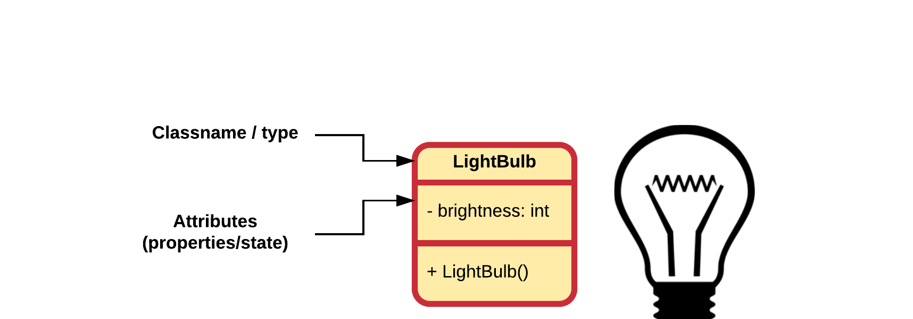

## Attributes

Attributes hold the information and properties required by the object. They define the **data** that the object is holding or the state that it is in. Attributes are very similar to the variables that we already know. That is why we often also refer to attributes as **instance variables**, meaning variables of a class instance (aka object).

Just as variables, attributes can be of any primitive types or they can contain references to other objects. They also need a name which allows us to use refer to them inside the methods of the objects.

Remember that Java knows the following primitive types:


Different from a normal local variable, an attribute also requires an access modifier to specify who can access the attribute. This can be any of the following:
* `public`: anyone can access the attribute.
* `protected`: only the class itself or classes derived from this class can access the attributes. More on this later.
* The default Java access modifier, which is declared by not writing any access modifier at all. This means that attribute can only be used by other classes included in the same package. This is why it is also often referred to as package access.
* `private`: only the class itself can access the attribute.

Below is a simple example of a class called `Demo` which has four attributes. Notice how the access modifier is placed before the declaration of the instance variable.

```java
public class Demo {
  // Attributes (instance variables) of the class
  private String aSimpleString;
  public int maxNumberOfPlayers;
  public Random generator;

  // You can also initialize values
  protected ArrayList<String> messages = new ArrayList();
  private int health = 0;
  private String username = "guest";
}
```

It is also perfectly legal to initialize instance variables when declaring them. This can also be done inside the constructor as we will see later on.

Instance variables are initialized by Java to default values:
* whole numbers (`integer`, `long`, `char`, ...) default to `0`
* real numbers (`float` and `double`) default to `0.0`
* `boolean` values default to `false`
* object references default to `null`

> #### Alert::Initialize Attributes
>
> While Java makes sure that all variables and instance variables are initialized, it is most of the time a good idea to do it yourself. That way you will always think about which is a sane default value for each attribute. On top of that, it is a good habit as not every programming language will initialize variables for you, take C++ for example.

Do always at least make sure to **initialize object references** as calling methods on `null` will crash your application.

### Access Modifiers - Data Hiding

While perfectly legal, in most cases it is considered blasphemy to make attributes `public` unless they are `final`.

> #### Info: Final (instance) variables
>
> Remember that final variables can only be assigned once, that is initialized. Once they are assigned a value, it cannot be changed anymore.

Why would one not make everything public and allow the user of the class access to everything? Because objects should NOT be able to directly change attributes of other objects. This is basically a necessity for two reasons: to **protect the user of the class** from himself and to **protect the class from the user**. *Things that are hidden cannot be misused*.

Restricting access to attributes and certain methods is called **data hiding**. The attributes of a class should always be made private. A user of your class should never be able to change the inner properties directly from outside the class. If you allow users access to the inner workings of your objects they will misuse it. **Declaring an attribute as public breaks data hiding.**

Then how can one than change the state of objects? Simple, by regulating the access to the state of the object using methods. This allows the developer of the class to place safeguards where needed.

Take for example a class `Rectangle` which has a `width` and a `height` attribute. If these were public, there would be nothing to stop us from assigning negative values to these attributes. This would be illogical. In many cases this can introduce bugs that the developer of the class never saw coming. By adding methods to set these attributes, the values can be checked for sanity.

### LightBulb Attributes

Let us consider a modern lightbulb which can be turned on, turned off or even dimmed. With that in mind one can identify the state of the lightbulb to be an integer value between 0 and 255, where 0 is off and 255 is full on.

Knowing this the LightBulb class can be extended by adding an attribute `brightness` of type integer. Keeping the *data hiding* principle in mind, the access modifier is chosen to be `private.` This results to the code shown below. From now on the name of the package will be omitted to save place.

```java
public class LightBulb {
  // Attributes (instance variables) of the class
  private int brightness = 0;
}
```

Note that we also initialize the brightness value to `0`, even while Java will do the same for us. This makes our code more clear to other programmers.

The actual usability of our lightbulbs has not yet changed much as the brightness attribute is kept private, meaning it cannot be access from outside of the class. You can try the following code below but it will not be executable.

```java
public static void main(String[] args) {
  // Creating a LightBulb object and storing its reference inside a variable
  LightBulb kitchen = new LightBulb();

  // This will fail as the brightness attribute is set to be private
  kitchen.brightness = 15;
}
```

The brightness property is actually a good example of where it could go wrong if we were to make the attributes public. Imagine for example that the brightness actually controls hardware that allows the brightness to be set of a real-world bulb. Now what would stop us from adding this to our code:

```java
kitchen.brightness = 600;
```

If no hardware limitation is at hand it might actually blow up the lamp. That is why you should never allow a user of your class to directly manipulate the attributes of an object. Or what if your were developing some software for a pace maker ...

### UML Class Diagram of LightBulb

UML class diagrams also display the datatype of the attributes. While we use the names of the data types available in Java, this is not actually necessary for a UML class diagram. Some applications are modelled partly before the actual programming language is chosen. In this case general types such as `text`, `integer`, `boolean`, ... are often used. Most programming languages do have some form of these available.

In a class diagram the type of a(n) (instance) variable is displayed after the name of the variable and delimited using a colon `:` as can be seen in the diagram below, which depicts the current state of the `LightBulb` class.



Notice that the `private` access modifier is depicted using a minus sign `-` in UML.
