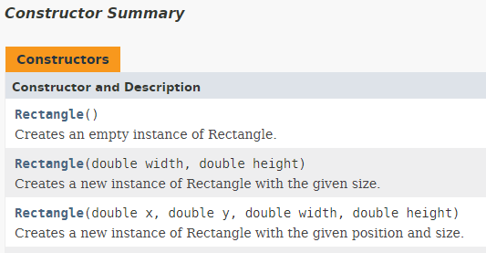

## Constructors

In object-oriented programming, a constructor is a special type of method called to create an object. It prepares the new object for use, often accepting arguments that the constructor uses to set required member variables.

A constructor resembles an instance method, but it differs from a method in that it has **no explicit return type**. In Java constructors have the **exact same name as the declaring class**. They have the task of initializing the object's data members. A properly written constructor leaves the resulting object in a **valid state**.

Most languages **allow overloading** the constructor in that there can be more than one constructor for a class, with differing parameters. Java is one of those languages.

Constructors are most of the time placed on top in the method list of the UML class diagram. This because these are the first methods you will need when making use of the class.

### Creating new Objects

When creating new objects (instances) from classes in Java you need a couple of things:
* Most of the time you need a reference to new object in the form of a variable
* The `new` keyword to indicate to Java that you wish to create a new object from a certain class
* The type of the variable (which is in most cases the name of the class)
* The name of the constructor that needs to be called to initialize the new object.


As mentioned before a class can have multiple constructors. Take for example the `Rectangle` class from JavaFX [https://docs.oracle.com/javase/8/javafx/api/javafx/scene/shape/Rectangle.html](https://docs.oracle.com/javase/8/javafx/api/javafx/scene/shape/Rectangle.html).



These give the freedom to the user of the class to tailor the initialization of the new objects to his/her needs. Do note that the constructors do not differ in name but do differ in the arguments that they take. Either the number of arguments or the types need to be different so Java can determine which constructor you are actually requesting. More on this later.

### Custom Constructor

When defining a constructor you should first determine what information is minimally required to initialize a new object of the class.

Let us take a look at a class `Player` that has an attribute `nickname` of type `String`. Because a player object is considered invalid if it has no nickname, a constructor is added that takes the nickname as an argument.

```java
public class Player {
  // Attributes
  private String nickname;

  // Constructor with arguments
  public Player(String nickname) {
    this.nickname = nickname;
  }
}
```

When creating Player objects the developer is required to provide a nickname for the Player object as is shown below:

```java
Player lebowski = new Player("The Big Lebowski");
```

### The Default Constructor

The default constructor is a special constructor that takes no arguments. It initializes the object in a default state.

If you do not provide a constructor for a class, Java will automatically create a default constructor that has no parameters. This default constructor is called if you specify the new keyword without passing parameters. For example:

```java
Rectangle livingRoom = new Rectangle();
```

**If you explicitly declare any constructors for a class, Java does not create a default constructor for the class**. As a result, if you declare a constructor that accepts arguments and still want to have a default constructor (with no arguments), you must explicitly declare a default constructor for the class.

Taking the previous Player example the code will not compile in the current state because we added a constructor to the class and thereby lost the default (no-argument) constructor:

```java
Player guest = new Player();
```

So to fix this we can add a default constructor to the class that for example generates a random nickname if none is provided:

```java
public class Player {
  // Attributes
  private String nickname;

  // Constructor with arguments
  public Player(String nickname) {
    this.nickname = nickname;
  }

  // Default constructor
  public Player() {
    Random rand = new Random();
    nickname = "guest_" + rand.nextInt();
  }
}
```

This would allow us to create objects using the default constructor.

### Constructor Overloading

Constructor overloading is a technique in Java in which a **class can have any number of constructors** that differ in parameter lists. The compiler differentiates these constructors by taking into account the number of parameters in the list and their type.

Let us for example take a Complex number class as an example:

```java
public class Complex {
  // Private properties (attributes)
  private int real;
  private int imaginary;

  // Constructor with arguments
  public Complex(int imaginary, int real) {
    this.imaginary = imaginary;
    this.real = real;
  }

  // Default constructor (without arguments)
  public Complex() {
    imaginary = 0;
    real = 0;
  }
}
```

Note how the constructors differ in the arguments they take. Java must be able to differentiate between the constructors in order to be able to select the correct constructor.

Do note that the names of the arguments has no meaning for the compiler to differentiate between different constructors, only the types and number of arguments count. This means that adding the following constructors to a class will fail:

```java
public class Rectangle {
  // ...

  public Rectangle(int width, int height) {
    // ....
  }

  public Rectangle(int x, int y) {
    // ....
  }
}
```

Both constructors look the same for Java. They both take two arguments, each of type `int` and thats it.

### Constructor Reuse

As lazy programmer we are always looking for ways to reuse even the smallest parts of code. This makes our code cleaner and more maintainable and on top of that it makes our life nicer.

Java allows us even to reuse constructors from our classes. In other words, you can call another constructor inside a constructor just by using the `this` keyword as it were a method - not just a method but a constructor method. There are however two **limitations**:
* `this()` can only be called **inside another constructor**
* it needs to be the **first statement inside the constructor** calling `this()`

Take for example the Complex class from before:

```java
public class Complex {
  // Private properties (attributes)
  private int real;
  private int imaginary;

  // Constructor with arguments
  public Complex(int imaginary, int real) {
    this.imaginary = imaginary;
    this.real = real;
  }

  // Default constructor (without arguments)
  public Complex() {
    imaginary = 0;
    real = 0;
  }
}
```

This can be refactored to the following:

```java
public class Complex {
  // Private properties (attributes)
  private int real;
  private int imaginary;

  // Constructor with arguments
  public Complex(int imaginary, int real) {
    this.imaginary = imaginary;
    this.real = real;
  }

  // Default constructor (without arguments)
  public Complex() {
    this(0, 0);
  }
}
```

While the gain is small here, it does make our code cleaner.

Another example from the Oracle website:

```java
public class Rectangle {
    private int x, y;
    private int width, height;

    public Rectangle() {
        this(0, 0, 1, 1);
    }
    public Rectangle(int width, int height) {
        this(0, 0, width, height);
    }
    public Rectangle(int x, int y, int width, int height) {
        this.x = x;
        this.y = y;
        this.width = width;
        this.height = height;
    }
    // ...
}
```
The `Rectangle` class contains a set of constructors. Each constructor initializes some or all of the rectangle's member variables. The constructors provide a default value for any member variable whose initial value is not provided by an argument. For example, the no-argument constructor creates a 1x1 Rectangle at coordinates `0,0`. The two-argument constructor calls the four-argument constructor, passing in the `width` and `height` but always using the `0,0` coordinates. The compiler determines which constructor to call, based on the number and the type of arguments provided when creating a new object of the class.
