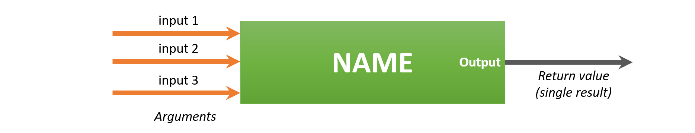
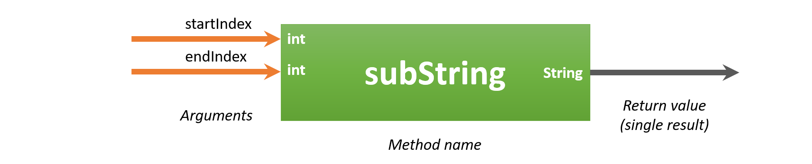

## Methods

Methods allow us to **group blocks of code** together and **separate** them from the rest of our code. Using the name of the method we can then ask the compiler/interpreter to execute the code inside of it. This is also known as **calling the method**. Why would we want to do this? Several reasons:
* It **makes our code more clear** to the reader/developer of it, if we name the methods correctly and clearly
* It allows us to call the method from different places, so actually we **reuse parts of our code**. **Code duplication is bad** and easily leads to bugs and what is called spaghetti code (a mess of code).

The fun thing about programming is that a lot of libraries are already available for us packed with things we can use. Take for example the `Scanner` and `String` classes we have been using for some time. On the other hand we, as programmers, can also create our own methods. This allows us to make our code more maintainable and reusable.

Ideally a method should do only one thing, for example:
* display an array
* calculate the area of a shape
* determine the minimal of two numbers
* make the sum of an array of numbers
* ...

A method can be though of as a building block of your application that performs some sort of processing.
* It can take input data to use inside the method via arguments
* It can produce an output value which the called of the method can use



The general structure of a method looks like this:

```java
<access_modifier> <return_data_type> nameOfTheMethod(<list_of_parameters>) {
   // Code inside method (this is called the body)
   // return <value> or do not return a value in which case the <return_data_type> is void
}
```

* **access_modifier** - It defines the access type of the method (`public`, `protected` or `private`) and it defaults to package access if you specify none;
 * `public`: everyone can use the method - depicted with a plus sign `+` in UML.
 * `protected`: only classes that inherit from this class can use the method - depicted with a hashtag `#` in UML. More on this later
 * none specified - package access, meaning only other classes in the same package can call the method - there is no equivalent sign in UML for this (leave empty)
 * `private`: the method can only be used inside the class itself - depicted with a minus sign `-` in UML. Most often private methods are excluded from the UML class diagram as they are of part of the inner workings of the class.

* **return_data_type** - A method **may or may not return a value** (a single result value of the method). This can be any of the datatypes used for variables (e.g. `int`, `double`, `char`, references to objects such as `String` and any other types, even arrays such as for example `int[]`). If no value is returned, the *return_data_type* should be set to `void`.

* **nameOfTheMethod** - This is the name of the method. Make it **clear and informative**. Methods should always **start with a lower case letter** and use **camel casing** (an uppercase letter for each following word).

* **list_of_parameters** - Arguments (also called parameters) are **similar to the variables** we have been using. They allow the code that is calling the method to pass data to the method. The arguments can then be used as variables and their usage is **contained to the method itself**. The different arguments in the parameter list are separated from each other using a comma `,`. You need to specify both a type and a name for every parameter. Arguments are optional, methods may contain zero arguments - the parenthesis `()` **are mandatory** even if no arguments are defined. The argument variables only exist within the scope of the method itself (between the curly braces).

* **The method body** - The part from the starting curly brace `{` till the closing curly brace `}` is called the body of the method. You should place the code statements that execute the task of the method between these two curly braces.

* The name of the method and the parameter list are together called the **signature** of the method.

Remember the `main` method where most of our code is placed. Let us take a look at it.

```java
public static void main(String[] args) {
    // TODO code application logic here
}
```

The name of this method is `main` and it is `public`. It also takes an array of Strings named `args` as argument. These are actually parameters that you can pass to the method when you start your application. Notice that the main method does not return a value and therefore has its return type set to `void`. The main method is what is called the **entry point** of your application. It is the first method that is executed when you start your application.

When creating methods inside the class that contains the main method of your program, you will also need to make the method `static`. This means that methods can be called without creating an object from the class. Most methods we create in our own classes should not be `static`. More on this later however. So a method inside the class with main will need to look like this:

```java
<access_modifier> static <return_data_type> nameOfTheMethod(<list_of_parameters>) {
  // Body
}
```

### Calling methods

Calling a method is not that hard. Actually you have already called a couple of methods without realizing it. To call a method you need to state it's name, supply the correct arguments and place parentheses around those arguments. Last but not least you need to place a semicolon `;` at the end.

#### The println method

Let us take a look at the `println` method you have been calling for some time.

```java
System.out.println("Hello and welcome to Java");
```

The actual name of the method here is `println`. The use of `System.out` is not important for the moment. The `println` method takes a single argument, namely a String that will be printed to the terminal.

#### The substring method of String

Let us first take a look at an existing method of the `String` class called `substring`. The following information has been grabbed from the official Java API [https://docs.oracle.com/javase/8/docs/api/java/lang/String.html](https://docs.oracle.com/javase/8/docs/api/java/lang/String.html):

```text
public String substring(int beginIndex, int endIndex)

Returns a new string that is a substring of this string. The substring begins at the specified beginIndex and extends to the character at index endIndex - 1. Thus the length of the substring is endIndex-beginIndex.

Examples:
 "hamburger".substring(4, 8) returns "urge"
 "smiles".substring(1, 5) returns "mile"

Parameters:
  beginIndex - the beginning index, inclusive.
  endIndex - the ending index, exclusive.

Returns:
  the specified substring.
```

A graphical representation of this method is shown below. The method can extract a piece of String from a larger String based on the start and end positions you provide the method. The method is called on an object of type `String`, in other words, the method belongs to the class `String`. Also note from the description of the method above that the method is `public` is therefor be used from outside of the `String` class.

It takes two pieces of information as arguments (input data):
* `beginIndex` (of type `int`) that provides the starting point from where the extraction should start
* `endIndex` (of type `int`) that provides the ending point from where the extraction should stop



The result of the method is again a value of type `String` that contains a part of the full string.

To call the method we first need to create an object of type `String`. Next we need to provide the input data (arguments) required by the method to perform it's job. Last we need to save the result that the method returns. This is again a `String` reference.

```java
public static void main(String[] args) {
  // We need a string object
  String helloWorld = "Hello World!";

  // Next we call the substring method on the String object and save the
  // result inside another String
  String hello = helloWorld.substring(0, 5);

  // Now we can use the result from the method
  System.out.println(hello);
}
```

which will output:

```text
Hello
```

#### The nextInt method of Scanner

Another example is the Scanner method `nextInt()`. An example is shown below.

```java
Scanner console = new Scanner(System.in);

System.out.print("Please enter a number: ");
int number = console.nextInt();
```

The `nextInt()` method does not take any arguments, however you do need to place the empty parentheses behind its name. It does however return a value of type `int`. This can be assigned to a variable so it can be used later in our code.

#### Java API

A lot of information about all the methods that are available in Java can be found at the API website of Oracle: [https://docs.oracle.com/javase/8/docs/api/](https://docs.oracle.com/javase/8/docs/api/). Try to look up some information on the `Scanner` class and the methods that it has available.

### Creating our own Methods

A method should be kept **as small as possible** to **do a single task**. Often it is stated that a perfect method has no more than 5 lines of code. The shorter the method the easier it will be to understand what it is doing. However, as a beginning programmer this will be hard to achieve.

A method will most often use some sort of input data, do some processing on it and return a result based on it's findings. The input data is often supplied using arguments passed to the method when it is called.

As stated before, arguments are very similar to a variable you create inside your main. They require both a **type** and a **name**. If you wish your method to take multiple arguments, you can separate them using a comma `,`. Important to note is that every argument needs a type, even if multiple arguments have the same type.

#### Where to place your own methods

For the moment there are two places where we can place our own methods:
* Inside our own classes such as `LightBulb`
* Inside the application class where `main` resides. In this case remember to make the method `static` to indicate that it should not be called on an object.

All methods need to be placed between the curly braces `{}` of the class itself. Make sure not to place methods inside the body of other methods. Some examples are shown below.

```java
public class Demo {
  public void someMethod() {
    // This is ok!
  }
}
```

In the same class as the main method (notice the `static` keyword).

```java
public class DemoApplication {
  public static void someMethod() {
    // This is ok!
  }

  public static void main(String[] args) {
      // TODO code application logic here
  }
}
```

Example below is wrong, the method is inside the body of another method.

```java
public class DemoApplication {
  public static void main(String[] args) {

    public static void someMethod() {
      // This is NOT OK!
    }

  }
}
```

The order of the methods has no influence. You can place them in any order inside the class body.

#### Naming your Methods

Giving your methods a clear name is very important. Methods that have names like *do_something*, *printit*, *count*, ... have no meaning at all. A method should always have a name that says exactly what it is doing. Do not be afraid of longer method names (do however be sensible about it).

There are some rules that are followed by all Java programmers concerning naming things. For methods the rules are:
* always start with a lowercase letter
* don't place spaces, underscores or other special characters between words
* start each consecutive word after the first with a capital letter (this is called **camel casing**)

Some good examples are:
* determineSumOfNumbers
* calculateAreaOfCircle
* getRadiusOfCircle
* isPlayerAlive
* ...

Method names should also reflect the result that they generate. For example `isPlayerAlive()` suggests that it returns a `boolean`, `getRadiusOfCircle()` suggests that it returns a `double`.

#### Methods that do not return a value

One of the most simple methods that can be created is one that prints a hello message to the user stating the purpose of your program.

```java
public class Demo {
  public void printWelcome() {
    System.out.println("Hello and Welcome to this program.");
    System.out.println("Here we print a simple message stating the purpose of the program.");
    System.out.println("This application is made by none other than mister Java Himself.");
  }
}
```

Notice that the return type is set to `void` - because the method actually does not return anything. It just prints some text to the terminal. Also notice that no parameters are needed as the method does not really need any data from outside of the method.

Calling this method inside your main would result in the following code:

```java
public static void main(String[] args) {
  Demo demo = new Demo();
  demo.printWelcome();
}
```

First an object of the class `Demo` is created. After which the method can be called on the object.

Let us extend the `LightBulb` class and add a method that prints some information about the state of the bulb to the screen. A possible implementation is shown below.

```java
public class LightBulb {
  // Attributes (instance variables) of the class
  private int brightness = 0;

  // Method without return value and no arguments
  public void printInfo() {
    if (brightness == 0) {
      System.out.println("Currently the light is turned off");
    } else if (brightness == 255) {
      System.out.println("Currently the light is turned on");
    } else {
      System.out.println("Currently the light is dimmed to a brightness of " + brightness);
    }
  }
}
```

Take note on how the `brightness` attribute can be accessed inside the `printInfo()` method. This is because the method is part of the class and can therefore access the private attributes of the `LightBulb`.

To use this method an object first needs to be instantiated upon which the method can be called. The method does not require any external data so it does not take any arguments. So the parentheses can be left empty.

```java
public static void main(String[] args) {
    LightBulb kitchen = new LightBulb();
    kitchen.printInfo();
}
```

which outputs:

```text
Currently the light is turned off
```

At the moment there is no way to turn the light on or off. Let us add two methods that allow us to do exactly that:
* a method `on()` that turns the bulb on at full brightness (255)
* a method `off()` that turns the bulb off, setting the brightness to 0

The code below shows the implementation of `LightBulb` with both the methods `on()` and `off()`. Neither of these two methods return any data and neither require external data.

```java
public class LightBulb {
  // Attributes (instance variables) of the class
  private int brightness = 0;

  // Method without return value and no arguments
  public void printInfo() {
    if (brightness == 0) {
      System.out.println("Currently the light is turned off");
    } else if (brightness == 255) {
      System.out.println("Currently the light is turned on");
    } else {
      System.out.println("Currently the light is dimmed to a brightness of " + brightness);
    }
  }

  public void on() {
      brightness = 255;
  }

  public void off() {
      brightness = 0;
  }
}
```

The `on()` and `off()` methods are an elegant way of letting us control the brightness of the bulb without giving public access to the brightness attribute itself. This makes sure that we, as developers of the `LightBulb` class, are in full control. They also make it more easy for the users of our class because they do not need to know of the limitations of the brightness. All they see are methods to turn the bulb on or off.

Let's adapt the main method a bit:
```java
public static void main(String[] args) {
    LightBulb kitchen = new LightBulb();
    kitchen.printInfo();
    kitchen.on();         // Turn the light on
    kitchen.printInfo();
    kitchen.off();         // Turn the light off
    kitchen.printInfo();
}
```

which results in the following output:

```text
Currently the light is turned off
Currently the light is turned on
Currently the light is turned off
```

At the moment our `LightBulb` class can be visualized in UML using the following class diagram:


#### Methods that return a value

Most methods will have some sort of result that they want to share with the code that made the call to the method. It is stated that the method **returns a value**. This is achieved using the `return` keyword in Java followed by a value or the name of a variable.

Methods can return a value without taking arguments. The most simple example would be the previous `printWelcome()` method. However instead of printing the message to the screen we could return it as a value allowing the code that calls the method to decide what to do with it (you could for example write it to a file, send it to a printer or put it into an html file).

```java
public class Demo {
  public String createWelcomeMessage() {
    String message = "Hello and Welcome to this program.";
    message += "Here we print a simple message stating the purpose of the program.";
    message += "This application is made by none other than mister Java Himself.";
    return message;
  }
}
```

Notice how we create a variable `message` of type `String` to create the full message. This makes our code more readable. The eventual message String is then returned by the method by stating `return message` as the last statement in the method. Once the interpreter encounters a return statement it returns the result from the method and jumps back to the place where the method is originally called.

The name of the method has also been changed from `printWelcome` to `createWelcomeMessage`. This because the method does something else compared to the previous one.

Calling this method inside your main would result in the following code:

```java
public static void main(String[] args) {
  // With a variable to store the return value of the method
  Demo demo = new Demo();
  String welcome = demo.createWelcomeMessage();
  System.out.println(welcome);

  // Or without a variable
  System.out.println(demo.createWelcomeMessage());
}
```

Two ways to print the return value of the `createWelcomeMessage()` are shown in the code above. A first stores the return value inside a variable and then prints the value of the variable. A second option consists of immediately passing the return value of `createWelcomeMessage()` to the `println` method. In this code either way works. It is up to you as a developer to decide which of these two options to use.

##### The toString method

In Java every object that is created automatically gets a number of methods that are provided by the Java language. One of these methods is the `toString()` method which is implicitly called when an object reference is placed inside a String context as for example:

```java
public static void main(String[] args) {
  Demo demo = new Demo();

  // Here an implicit call to demo.toString() is made by Java
  System.out.println(demo);

  // You can explicitly call the toString() method
  System.out.println(demo.toString());
}
```

The Java `toString()` method is used when we need a `String` representation of an object. It is defined in the class Object.

For some classes that are part of the Java classes this method generates a sensible result. However custom classes created by ourselves return a cryptic text consisting of the name of the class and a hashed value of its internal state as shown below.

```text
exampleprogram.Demo@15db9742
exampleprogram.Demo@15db9742
```

The result should be a concise but informative representation that is easy for a person to read. It is recommended that all classes override this method and add their own implementation.

This can be achieved by adding the following method to your class (the method signature must be exact and the `override` annotation must also be present):

```java
@Override
public String toString() {
    return super.toString();
}
```

Of course the return statement `return super.toString();` must be changed according to the representation you wish to return.

For the `LightBulb` class we can actually refactor the `printInfo()` method to a `toString()` method and return a `String` instead of printing to the terminal. This also allows the user of our classes to decide what he/she does with the String representation.

For example:
```java
public class LightBulb {
  // Attributes (instance variables) of the class
  private int brightness = 0;

  @Override
  public String toString() {
    if (brightness == 0) {
      return "Currently the light is turned off";
    } else if (brightness == 255) {
      return  "Currently the light is turned on";
    } else {
      return  "Currently the light is dimmed to a brightness of " + brightness;
    }
  }

  public void on() {
    brightness = 255;
  }

  public void off() {
    brightness = 0;
  }
}
```

This would require our main to be refactored to:

```java
public static void main(String[] args) {
    LightBulb kitchen = new LightBulb();
    System.out.println(kitchen);
    kitchen.on();         // Turn the light on
    System.out.println(kitchen);
    kitchen.off();         // Turn the light off
    System.out.println(kitchen);
}
```

Resulting in the following UML class diagram:


Notice how the return datatype of the `toString()` method is also specified in the UML diagram, in the same way as an attribute, by placing a colon `:` after the method and then stating the datatype (`String` in this case).
