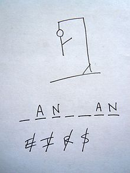

<!-- toc -->

# Creating a Simple Hangman Game
https://en.wikipedia.org/wiki/Hangman_(game)
It is a good idea to build a bigger application or game to really apply all the knowledge that you gained so far. This section will help you create a simple version of the Hangman game.

> Hangman is a paper and pencil guessing game for two or more players. One player thinks of a word, phrase or sentence and the other tries to guess it by suggesting letters or numbers, within a certain number of guesses.
>
> Source: https://en.wikipedia.org/wiki/Hangman_(game)

An example game of Hangman in progress is shown in the image below. The underlined letters appear in the word in their correct places, while the crossed-out letters do not appear, and each crossed-out letter corresponds to one part of the drawing. In this case, the secret word is "hangman".



A graphical representation will be hard for us to build. However we could just show a textual progress bar or something similar or just a counter that display the number of tries remaining.

## Defining the minimum requirements

* Select a random word from a list (words should be between 5 and 8 letters)
* Allow the user to guess for letters
* Display the number of tries and the number of guesses left
* Initial display of word as underscores, replacing the letters guessed by the user
* Show a list of letters not part of the word but tried by the user

Example of output

```text
Word: h e _ _ o

Wrong letters: x, y, q, d, a

You have made 8 guesses, 5 of which were wrong. You have 4 wrong guesses left.
```

## Building it step by step

Let us create the game step by step and improve the code as we advance. In the first phase we will build the game using the single main method. In a second phase we will refactor this code so it makes use of some custom methods. In a third phase we will extend the game with some extra's.

This application will also try to build upon the logic of keeping methods small and easy to understand. As we advance through this chapter the use of methods should become more clear and you should start to feel when to create separate methods for certain pieces of code.

Methods are mainly created for two reasons:
1. To make your code more clear and understandable
2. To allow the code inside the method to be reused by different parts of your application

## Basic flow chart

A flowchart is a type of diagram that represents an algorithm, workflow or process, showing the steps as boxes of various kinds, and their order by connecting them with arrows. This diagrammatic representation illustrates a solution model to a given problem. Flowcharts are used in analyzing, designing, documenting or managing a process or program in various fields.

While you do need to know the shapes to create a flowchart, it is not a requirement to be able to understand one. This is a mayor advantage. It is also user often between developers to explain certain algorithms or flows inside software.

### Symbols

The American National Symbols Institute (ANSI) set standards for flowcharts and their symbols in the 1960s. The International Organizations for Standardization (ISO) adopted the ANSI symbols in 1970. The current standard was revised in 1985. Generally, flowcharts flow from top to bottom and left to right.

| Symbol | Name | Description |
| --- | --- | --- |
|  | Flowline (Arrowhead) | Shows the program's order of operation. A line coming from one symbol and ending at another. Arrowheads are added if the flow is not the standard top-to-bottom, left-to right. |
|  | Terminal | Beginning or ending of a program or sub-process. Represented as a stadium, oval or rounded (fillet) rectangle. They usually contain the word "Start" or "End", or another phrase signaling the start or end of a process, such as "submit inquiry" or "receive product". |
|  | Process | Set of operations that change value, form, or location of data. Represented as a rectangle. |
|  | Decision | Conditional operation determining which of two paths the program will take. The operation is commonly a yes/no question or true/false test. Represented as a diamond (rhombus). |
|  | Input/Output | Input and output of data, as in entering data or displaying results. Represented as a parallelogram. |
|  | Annotation (Comment) | Additional information about a step the program. Represented as an open rectangle with a dashed or solid line connecting it to the corresponding symbol in the flowchart. |
|  | Predefined Process | Named process which is defined elsewhere. Represented as a rectangle with double-struck vertical edges. |
|  | On-page Connector | Pairs of labeled connectors replace long or confusing lines on a flowchart page. Represented by a small circle with a letter inside. |
|  | Off-page Connector | A labeled connector for use when the target is on another page. Represented as a home plate-shaped pentagon. |

## Phase 1 - Hangman the First (single main method)

A possible flowchart is shown below. This can be a lead on how to start with building the game. it is however not written in stone and may change as we progress through the development of this application.


In this first phase we will create hangman the game without creating our own methods. In the next phase we will refactor our code to make use of some methods. This will make our code more readable and more maintainable.

### Step 1 - Displaying information and rules

A simple start for this application could be the displaying the information that the user needs to know. Always give the user enough information to use your application. Inform him/her about the rules and information it expects. This code it not hard, it's just some a lot of print statements.

```java
public class HangmanTheFirst {
    public static void main(String[] args) {
        // Step 1 - Display info to user
        System.out.println("-----------------------------------------------------------------------------------------------");
        System.out.println("Hello and welcome to Hangman the Sequel");
        System.out.println("Hangman is a word guessing game.");
        System.out.println("The player needs to try to guess the secret word by suggesting letters.");
        System.out.println("The player needs to guess all letters and each miss generates a part of the gallow.");
        System.out.println("This continues until the player wins the game or the gallow is completed and the player loses.");
        System.out.println("In this version you have 9 wrong guessed before you lose the game.");
        System.out.println("Good luck and have fun");
        System.out.println("-----------------------------------------------------------------------------------------------\n\n");
    }
}
```

### Step 2 - The secret word to guess

Next to implement is the word that the player has to guess. This should be a randomly selected word from a list of words (an array of Strings). Ideally this list is read from a file. However to start of it is better to keep it simple. To store the word, a variable of type String can be used. For the moment a pre-defined word like `hello` can be used until the guessing logic has been implemented.

Next we also show the user how many letters the secret word contains. This can be achieved my calling the method `length()` of the `secretWord` String.

It is also a good idea to add some print statements to test if your application is behaving as it should. Of course once the application is finished some of these print statements need to be removed. Especially in the case of a game you do not wish to display the solution at the start of the game.

```java
public class HangmanTheFirst {
    public static void main(String[] args) {
        // Step 1 - Display info to user
        System.out.println("-----------------------------------------------------------------------------------------------");
        System.out.println("Hello and welcome to Hangman the Sequel");
        System.out.println("Hangman is a word guessing game.");
        System.out.println("The player needs to try to guess the secret word by suggesting letters.");
        System.out.println("The player needs to guess all letters and each miss generates a part of the gallow.");
        System.out.println("This continues until the player wins the game or the gallow is completed and the player loses.");
        System.out.println("In this version you have 9 wrong guessed before you lose the game.");
        System.out.println("Good luck and have fun");
        System.out.println("-----------------------------------------------------------------------------------------------\n\n");

        // Step 2 - The secret
        // TODO: Select a random word instead of a literal
        String secretWord = "hello";
        System.out.println("We are searching for a word with "
            + secretWord.length() + " letters");
    }
}
```

Note how we added a `TODO` comment to our code to state that some implementation is still missing here. These `TODO` comments are supported by many IDE's these days and can often be displayed as a task list. In NetBeans you can open a list of TODO's by selecting `Window => Action Items`. This will open a list of all TODO's and will also allow you to double click them to jump to the correct part in your code.


### Step 3 - Tracking Guessed Letters

Next a representation of the letters that the user has already guessed is needed. This information can be stored in a variable of type `String` or as an array of characters. The easiest solution is to store the letters in an array of characters. This way we can easily change them later on. It should contain the same number of characters as the word that needs to be guessed. This is an indication to the user how many letters the secret word contains. It should also be initialized to for example all underscores `_`, where each underscore corresponds to a letter that has not yet been guessed. This can be achieved using a for-loop that uses the `length()` method of the `secretWord` string. The `length()` method of a string returns how many characters the String contains.

Again a print statement is added to view the result. You can add a `TODO` to indicate that this print statement should be deleted later on.

```java
public class HangmanTheFirst {
    public static void main(String[] args) {
        // Step 1 - Display info to user
        System.out.println("-----------------------------------------------------------------------------------------------");
        System.out.println("Hello and welcome to Hangman the Sequel");
        System.out.println("Hangman is a word guessing game.");
        System.out.println("The player needs to try to guess the secret word by suggesting letters.");
        System.out.println("The player needs to guess all letters and each miss generates a part of the gallow.");
        System.out.println("This continues until the player wins the game or the gallow is completed and the player loses.");
        System.out.println("In this version you have 9 wrong guessed before you lose the game.");
        System.out.println("Good luck and have fun");
        System.out.println("-----------------------------------------------------------------------------------------------\n\n");

        // Step 2 - The secret
        // TODO: Select a random word instead of a literal
        String secretWord = "hello";
        System.out.println("We are searching for a word with "
            + secretWord.length() + " letters");

        // Part 3 - Creating an array of guesses letters and placing underscores in the beginning
        char[] guessedLetters = new char[secretWord.length()];
        for (int i = 0; i < guessedLetters.length; i++) {
            guessedLetters[i] = '_';
        }

        // TODO: Remove print when finished
        System.out.println("Guessed letters: " + guessedLetters);
    }
}
```

However something goes wrong when we execute this code.

```text
-----------------------------------------------------------------------------------------------
Hello and welcome to Hangman the Sequel
Hangman is a word guessing game.
The player needs to try to guess the secret word by suggesting letters.
The player needs to guess all letters and each miss generates a part of the gallow.
This continues until the player wins the game or the gallow is completed and the player loses.
In this version you have 9 wrong guessed before you lose the game.
Good luck and have fun
-----------------------------------------------------------------------------------------------


We are searching for a word with 5 letters
Guessed letters: [C@15db9742
Please enter your guess (single letter):
```

The guessed letters are printed as a cryptic String. This is not the content of the array. Actually when we concatenate objects with a `String`, the `toString()` method of that object is called. The `toString()` method for an Object returns a string consisting of the name of the class of which the object is an instance, the at-sign character `@`, and the unsigned hexadecimal representation of the hash code of the object.

To display the actual content of an array of characters we can use the following line of code:

```java
String.valueOf(guessedLetters);
```

So the code of this third step would change to the following:

```java
        // Part 3 - Creating an array of guesses letters and placing underscores in the beginning
        char[] guessedLetters = new char[secretWord.length()];
        for (int i = 0; i < guessedLetters.length; i++) {
            guessedLetters[i] = '_';
        }

        // TODO: Remove print when finished
        System.out.println("Guessed letters: " + String.valueOf(guessedLetters));
```

This resolves to the output we were looking for.

### Step 4 - Asking the User for Input

Next is user input. The user needs to supply his/her guess. Once retrieved from the terminal, the game needs to check if the guess of the user is a letter that is part of the secret word. If so the all the occurrences of that letter need to be placed in the `guessedLetters` variable. If the user his/her guess is incorrect, we need to make this clear to the user.

To read a letter from the terminal a `Scanner` can be used. The `next()` method supplies the next token/word entered by the user. To make sure the letter is lowercased we can also call the method `toLowerCase()`. Special about these methods is that they all return the resulting String. This means that one method can be called after another. This is called **method chaining** and we will come back to this later.

However the result is a `String`, while we actually need a single character (type `char`), even while the String only contains a single letter it is still a String. To fix this the last method we call is the `charAt()` method that will return the character at the specified index. So by passing the value `0` to the `charAt()` method, we get the first character of the String.

This results in the following piece of code:

```java
// Step 4 - Asking user for input
Scanner console = new Scanner(System.in);

System.out.print("Please enter your guess (single letter): ");
char userGuess = console.next().toLowerCase().charAt(0);
```

While this is a valid starting option, we should add some more safety rules to make sure the user enters a letter of the alphabet and not a number of some exotic symbol. Validating user input is often done using a do-while loop as shown in the following code:

```java
// Making sure we get lower case letter and only a single letter
char userGuess;
do {
    System.out.print("Please enter your guess (single letter): ");
    userGuess = console.next().toLowerCase().charAt(0);
} while (!(userGuess >= 'a' && userGuess <= 'z'));
```

Notice how the variable `userGuess` needs to be declared outside the loop as we will need it later on outside the loop. The loop terminates when the user enters a character of the alphabet. This can actually be evaluated by checking if the input character is bigger than or equal to `'a'` and smaller than or equal to `'z'`.

```java
public class HangmanTheFirst {
    public static void main(String[] args) {
        // Step 1 - Display info to user
        System.out.println("-----------------------------------------------------------------------------------------------");
        System.out.println("Hello and welcome to Hangman the Sequel");
        System.out.println("Hangman is a word guessing game.");
        System.out.println("The player needs to try to guess the secret word by suggesting letters.");
        System.out.println("The player needs to guess all letters and each miss generates a part of the gallow.");
        System.out.println("This continues until the player wins the game or the gallow is completed and the player loses.");
        System.out.println("In this version you have 9 wrong guessed before you lose the game.");
        System.out.println("Good luck and have fun");
        System.out.println("-----------------------------------------------------------------------------------------------\n\n");

        // Step 2 - The secret
        // TODO: Select a random word instead of a literal
        String secretWord = "hello";
        System.out.println("We are searching for a word with "
            + secretWord.length() + " letters");

        // Part 3 - Creating an array of guesses letters and placing underscores in the beginning
        char[] guessedLetters = new char[secretWord.length()];
        for (int i = 0; i < guessedLetters.length; i++) {
            guessedLetters[i] = '_';
        }

        // TODO: Remove print when finished
        System.out.println("Guessed letters: " + String.valueOf(guessedLetters));

        // Step 4 - Asking user for input
        Scanner console = new Scanner(System.in);

        // Making sure we get lower case letter and only a single letter
        char userGuess;
        do {
            System.out.print("Please enter your guess (single letter): ");
            userGuess = console.next().toLowerCase().charAt(0);
        } while (!(userGuess >= 'a' && userGuess <= 'z'));
    }
}
```

### Step 5 - Checking if User Guessed correct

To check if the letter the user supplied is part of the secret word, a for-loop can be used to check all the letters of the secret word (by calling the `charAt()` method with the value of the iteration variable `i` of the for-loop). If a match is found, the corresponding underscore of the `guessedLetters` should be replaced by the actual letter.

For example:
```text
We are searching for a word with 5 letters
Guessed letters: _____
Please enter your guess (single letter): e

Your current progress: _e___
```

```java
// Step 5 - Check if guess is correct
for (int i = 0; i < guessedLetters.length; i++) {
    if (secretWord.charAt(i) == userGuess) {
        guessedLetters[i] = userGuess;      // Update guessed letters
    }
}
```

While we did replace all the occurrences of the guessed letter of the user, if any, at the end of the for-loop we do not have an actual result stating if the user guessed a correct letter or not. Later we need to be able to change the stats/progress of the game based on the fact if the user made a correct or incorrect guess. This can be achieved by creating a variable of type `boolean` in which we place the value `false` if the user made an incorrect guess or `true` when he/she made a correct guess. Since we need this variable later on we do need to declare it outside of the for-loop.

```java
// Step 5 - Check if guess is correct
boolean correctGuess = false;
for (int i = 0; i < guessedLetters.length; i++) {
    if (secretWord.charAt(i) == userGuess) {
        correctGuess = true;
        guessedLetters[i] = userGuess;      // Update guessed letters
    }
}
```

The easiest solution is to initialize the variable to `false` and set it to `true` when a letter is guessed correctly. If no letter is correct, then the variable stays `false`.

We can also output some message to the user based on the value of the `correctGuess` variable. This leads to the following code:

```java
public class HangmanTheFirst {
    public static void main(String[] args) {
        // Step 1 - Display info to user
        System.out.println("-----------------------------------------------------------------------------------------------");
        System.out.println("Hello and welcome to Hangman the Sequel");
        System.out.println("Hangman is a word guessing game.");
        System.out.println("The player needs to try to guess the secret word by suggesting letters.");
        System.out.println("The player needs to guess all letters and each miss generates a part of the gallow.");
        System.out.println("This continues until the player wins the game or the gallow is completed and the player loses.");
        System.out.println("In this version you have 9 wrong guessed before you lose the game.");
        System.out.println("Good luck and have fun");
        System.out.println("-----------------------------------------------------------------------------------------------\n\n");

        // Step 2 - The secret
        // TODO: Select a random word instead of a literal
        String secretWord = "hello";
        System.out.println("We are searching for a word with "
            + secretWord.length() + " letters");

        // Part 3 - Creating an array of guesses letters and placing underscores in the beginning
        char[] guessedLetters = new char[secretWord.length()];
        for (int i = 0; i < guessedLetters.length; i++) {
            guessedLetters[i] = '_';
        }

        // TODO: Remove print when finished
        System.out.println("Guessed letters: " + String.valueOf(guessedLetters));

        // Step 4 - Asking user for input
        Scanner console = new Scanner(System.in);

        // Making sure we get lower case letter and only a single letter
        char userGuess;
        do {
            System.out.print("Please enter your guess (single letter): ");
            userGuess = console.next().toLowerCase().charAt(0);
        } while (!(userGuess >= 'a' && userGuess <= 'z'));

        // Step 5 - Check if guess is correct
        boolean correctGuess = false;
        for (int i = 0; i < guessedLetters.length; i++) {
            if (secretWord.charAt(i) == userGuess) {
                correctGuess = true;
                guessedLetters[i] = userGuess;      // Update guessed letters
            }
        }

        if (correctGuess) {
            System.out.println("Correct guess. Nice!");
        } else {
            System.out.println("Incorrect guess.");
        }
    }
}
```

Running the game we get the following output:

```text
We are searching for a word with 5 letters
Guessed letters: _____
Please enter your guess (single letter): l
Correct guess. Nice!
```

Or with a wrong guess:

```text
We are searching for a word with 5 letters
Guessed letters: _____
Please enter your guess (single letter): x
Incorrect guess.
```


While one could just use the code `String secretWord = 'hello';`, it would be better to create a method that returns the randomly selected String (which is for the moment just the string `"hello"`). Later on the implementation of this method can easily be changed, while the rest of the application can be left unchanged.


```java
public class HangmanTheGame {

    public static String selectRandomWord() {
        return "hello";
    }

    public static void main(String[] args) {
        String secretWord = selectRandomWord();

        System.out.println("Secret Word: " + secretWord);
    }
}
```

Notice how the method `selectRandomWord()` is used to create a String for the main method where the result is then saved in a String variable.

### Step 2 - The guessed letters


One of our goals is to keep our methods as short as possible (in a sensible way of course) and to make sure our code stays understandable. A good idea here would be to create a method that generates the `guessedLetters` String and returns the result. Important to see here is that the method requires knowledge of the `secretWord` or actually to be more exact, its length needs to be known. This means the `initializeGuessedLetters()` methods will need to take an argument of type `int`, namely the length of the secret word.

```java
public class HangmanTheGame {

    public static String selectRandomWord() {
        return "hello";
    }

    public static String initializeGuessedLetters(int lengthOfSecretWord) {
        String guessedLetters = "";
        for (int i = 0; i < lengthOfSecretWord; i++) {
            guessedLetters += "_";
        }
        return guessedLetters;
    }

    public static void main(String[] args) {
        String secretWord = selectRandomWord();        
        String guessedLetters = initializeGuessedLetters(secretWord.length());

        System.out.println("Secret Word: " + secretWord);
        System.out.println("Guessed Letters: " + guessedLetters);
    }
}
```

Notice how the length of the secret word is passed to the `initializeGuessedLetters()` method. No variable is first created; the result of `length()` is directly passed as a value to the `initializeGuessedLetters()` method.

While the code actually became longer, it did also become more easy to read. If you got this code from someone and had to try to understand what is happening it would take you less time than when no methods would have been used. This only works when your methods have clear names that tell exactly what that method does.

Note that we first implemented the logic inside the main method and later created a separate method for it. This also happens a lot in real-life. Even advanced programmers don't always create methods immediately. Often they are the result of code that already works and is then refactored (changed without adding more functionality).

### Step 3 - User Input

Next is user input. The user needs to supply his/her guess. Once retrieved from the terminal, the game needs to check if the guess of the user is a letter that is part of the secret word. If so the all the occurrences of that letter need to be placed in the `guessedLetters` variable. If the user his/her guess is incorrect, we need to make this clear to the user.

To read a letter from the terminal a `Scanner` can be used. The `next()` method supplies the next token/word entered by the user. To make sure the letter is lowercased we can also call the method `toLowerCase()`. Special about these methods is that they all return the resulting String. This means that one method can be called after another. This is called method chaining and we will come back to this later.

However the result is a String, while we actually need a single character (type `char`), even while the String only contains a single letter it is still a String. To fix this the last method we call is the `charAt()` method that will return the character at the specified index. So by passing the value `0` to the `charAt()` method, we get the first character of the String.

This results in the following piece of code:

```java
Scanner console = new Scanner(System.in);

System.out.print("Please supply a letter as a guess: ");
char userGuess = console.next().toLowerCase().charAt(0);
```


Placing this code and the code to retrieve the input from the user into our main method, would result in the code shown below. To check if everything is working as expected it is also a good idea to add a print statement of the `guessedLetters` after the for-loop. This allows us to experiment a bit and see the result of our coding efforts.

```java
public class HangmanTheGame {

    public static String selectRandomWord() {
        return "hello";
    }

    public static String initializeGuessedLetters(int lengthOfSecretWord) {
        String guessedLetters = "";
        for (int i = 0; i < lengthOfSecretWord; i++) {
            guessedLetters += "_";
        }
        return guessedLetters;
    }

    public static void main(String[] args) {
        String secretWord = selectRandomWord();        
        String guessedLetters = initializeGuessedLetters(secretWord.length());

        System.out.println("Secret Word: " + secretWord);
        System.out.println("Guessed Letters: " + guessedLetters);

        Scanner console = new Scanner(System.in);

        System.out.print("Please supply a letter as a guess: ");
        char userGuess = console.next().toLowerCase().charAt(0);

        for (int i = 0; i < secretWord.length(); i++) {
            if (secretWord.charAt(i) == userGuess) {
                String newGuessedLetters = "";

                if (i != 0) {
                    newGuessedLetters += guessedLetters.substring(0, i);
                }

                newGuessedLetters += userGuess;

                if (i != guessedLetters.length()) {
                    newGuessedLetters += guessedLetters.substring(i+1, guessedLetters.length());
                }            

                guessedLetters = newGuessedLetters;
            }
        }

        System.out.println("Guessed Letters: " + guessedLetters);
    }
}
```

Let us refactor this again. The code to retrieve a letter as a guess from the user can again be placed in a separate method. Let us call it `getGuessFromUser()` which has a return type of `char`.

```java
public class HangmanTheGame {

    public static String selectRandomWord() {
        return "hello";
    }

    public static String initializeGuessedLetters(int lengthOfSecretWord) {
        String guessedLetters = "";
        for (int i = 0; i < lengthOfSecretWord; i++) {
            guessedLetters += "_";
        }
        return guessedLetters;
    }

    public static char getGuessFromUser() {
        Scanner console = new Scanner(System.in);

        System.out.print("Please supply a letter as a guess: ");
        return console.next().toLowerCase().charAt(0);
    }

    public static void main(String[] args) {
        String secretWord = selectRandomWord();        
        String guessedLetters = initializeGuessedLetters(secretWord.length());

        System.out.println("Secret Word: " + secretWord);
        System.out.println("Guessed Letters: " + guessedLetters);

        char userGuess = getGuessFromUser();

        for (int i = 0; i < secretWord.length(); i++) {
            if (secretWord.charAt(i) == userGuess) {
                String newGuessedLetters = "";

                if (i != 0) {
                    newGuessedLetters += guessedLetters.substring(0, i);
                }

                newGuessedLetters += userGuess;

                if (i != guessedLetters.length()) {
                    newGuessedLetters += guessedLetters.substring(i+1, guessedLetters.length());
                }            

                guessedLetters = newGuessedLetters;
            }
        }

        System.out.println("Guessed Letters: " + guessedLetters);
    }
}
```

The for-loop is harder to extract because it actually accesses multiple variables (`secretWord`, `guessedLetters` and `userGuess`). However the replacement of a letter of the `guessedLetters` String can be easily extracted. This will actually make the main code a lot easier to understand. So let us start by making a method of that. For this we need a couple of pieces of information:
* the `guessedLetters` String which is actually the original string with the underscores still inside
* the index of the letter to replace in the original string
* the letter that needs to be placed inside the new string at the position of index

This would lead to this method:
```java
    public static String replaceCharacterInString(String original, int index, char letter) {
        String newString = "";

        if (index != 0) {
            newString += original.substring(0, index);
        }

        newString += letter;

        if (index != original.length()) {
            newString += original.substring(index+1, original.length());
        }            

        return newString;
    }
```

Notice that the names of the arguments have been chosen to make more sense in a general way. The names of the arguments have no influence on the names of the variables inside the main code. It does however imply that we also had to change the names inside the actual code of the `replaceCharacterInString()` method. This method might actually be useful in another place later on. Who knows.

Of course the main code also has to be changed to make use of our new method:

```java
public static void main(String[] args) {
    String secretWord = selectRandomWord();        
    String guessedLetters = initializeGuessedLetters(secretWord.length());

    System.out.println("Secret Word: " + secretWord);
    System.out.println("Guessed Letters: " + guessedLetters);

    char userGuess = getGuessFromUser();

    for (int i = 0; i < secretWord.length(); i++) {
        if (secretWord.charAt(i) == userGuess) {
            guessedLetters = replaceCharacterInString(guessedLetters, i, userGuess);
        }
    }

    System.out.println("Guessed Letters: " + guessedLetters);
}
```

Did that main just became a lot more readable or what?

### Step 4 - Stats

The next logical step would be to keep asking the user for guesses. However for this we need to keep track of some things such as the number of guesses the user has made, the number of wrong guesses, the letters that he/she guessed but are incorrect.

To keep track of the number wrong and correct guesses two variables are needed of type `int`. Both need to be initialized to `0`. So:

```java
int numberOfWrongGuesses = 0;
int numberOfCorrectGuesses = 0;
```

In the hangman game the player loses if he/she makes 9 wrong guesses. So we also need to implement the maximum number of wrong guesses the user has before he/she loses the game. This can be achieved using a constant value (indicated by the `final` keyword) as shown in the code below.

```java
final int MAX_NUMBER_OF_WRONG_GUESSES = 9;

int numberOfWrongGuesses = 0;
int numberOfCorrectGuesses = 0;
```

This code can be placed at the top of our main method.

```java
public static void main(String[] args) {
    final int MAX_NUMBER_OF_WRONG_GUESSES = 9;

    int numberOfWrongGuesses = 0;
    int numberOfCorrectGuesses = 0;

    String secretWord = selectRandomWord();        
    String guessedLetters = initializeGuessedLetters(secretWord.length());

    System.out.println("Secret Word: " + secretWord);
    System.out.println("Guessed Letters: " + guessedLetters);

    char userGuess = getGuessFromUser();

    for (int i = 0; i < secretWord.length(); i++) {
        if (secretWord.charAt(i) == userGuess) {
            guessedLetters = replaceCharacterInString(guessedLetters, i, userGuess);
        }
    }

    System.out.println("Guessed Letters: " + guessedLetters);
}
```

Now let's create a method that creates a nice print for the terminal each time the player makes a guess. We need to display the following information to the user:
* His/Her current correctly guessed letters, which can be found in the variable `guessedLetters`
* The number of wrong guesses he/she made: `numberOfWrongGuesses`
* The number of correct guesses he/she made: `numberOfCorrectGuesses`
* The number of tries he/she has left before losing the game. This needs to be calculated using the formula `MAX_NUMBER_OF_WRONG_GUESSES - numberOfWrongGuesses`

A possible implementation of a method that display this information is:

```java
public static void displayPlayerStatistics(String guessedLetters,
    int numberOfWrongGuesses, int numberOfCorrectGuesses, int numberOfTriesLeft) {

      System.out.println("\nYour current progress: " + guessedLetters);
      System.out.println("You made " + numberOfCorrectGuesses + " correct guesses.");
      System.out.println("You did however make " + numberOfWrongGuesses + " mistakes.");
      System.out.println("This leaves you with " + numberOfTriesLeft + " guesses left before you are hung.\n");
}
```

This information can be displayed before the user is asked to make a guess as shown in the implementation below.

```java
public static void main(String[] args) {
    final int MAX_NUMBER_OF_WRONG_GUESSES = 9;

    int numberOfWrongGuesses = 0;
    int numberOfCorrectGuesses = 0;

    String secretWord = selectRandomWord();        
    String guessedLetters = initializeGuessedLetters(secretWord.length());

    System.out.println("Secret Word: " + secretWord);

    displayPlayerStatistics(guessedLetters, numberOfWrongGuesses,
            numberOfCorrectGuesses, MAX_NUMBER_OF_WRONG_GUESSES-numberOfWrongGuesses);

    char userGuess = getGuessFromUser();

    for (int i = 0; i < secretWord.length(); i++) {
        if (secretWord.charAt(i) == userGuess) {
            guessedLetters = replaceCharacterInString(guessedLetters, i, userGuess);
        }
    }

    System.out.println("Guessed Letters: " + guessedLetters);
}
```
