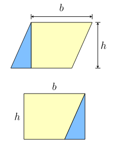

## Basic Exercises

The exercises in this chapter require a basic knowledge of:

* Classes and Objects
* Constructors
* Attributes and variables
* Methods
* The for-loop
* Strings

### Circumference and area of a parallelogram

Create a class that takes the base and height of a parallelogram.

Add two methods to the class. One to determine the area and one to determine the circumference of the parallelogram.

Make a small main program to show that the implementation works.

### A resistor model

Create a class that simulates the behavior of a resistor. You should be able
to only set the resistance once through a constructor of the class. This means that
the resistance cannot change after an object of the Resistor class has been created.

You should supply methods to set the current that passes through the resistor.
In this case the resulting voltage is calculated using U = I x R.

It should also be possible to change the voltage that is applied across the resistor.
In that case the resulting current through the resistor should be calculated using
I = U / R.

You should make sure that the created objects are in a valid state at all times. This
means if the current changes, the voltage should also change and vice versa.

Make sure to choose floating point values for all attributes of the resistor class.

Make a small main program to show that the implementation works.

### ASCII valued Strings

Create a class that takes a single String as argument of its constructor.
Add a method that calculates the value of all the characters of the string.

You can use the `charAt(index)` method of a string to get a value for a single character.
The length of the string can be requested using the `length()` method.

Make a small main program to show that the implementation works.

### Randomizer checker

Make a class that calculates the average of a number of randomly generated numbers.

Make sure to create a single `Random` instance in the constructor of the class you are
creating. The constructor should also take in the number of generated random numbers.

You can use the `nextInt(max)` method of the class `Random` to generate random integers.
Make sure to select a low max (for example 50) or your sum will overflow.

Make a small main program to show that the implementation works. Generate for example 5000 random numbers.
