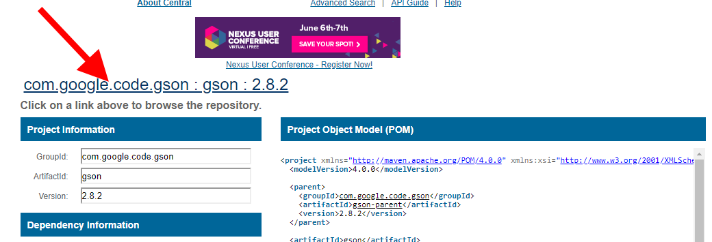
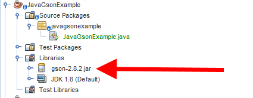

## Adding Gson as a Dependency

Start by creating a simple Java Application (no JavaFX application). Call it for example `JavaGsonExample`.

You starter code should be looking familiar from the first part of this course:

```java
public class JavaGsonExample {
    // ...
    public static void main(String[] args) {
        // TODO code application logic here
    }
}
```

### Downloading the Library

Before we can start using Google's Gson library we need to download the library as a jar file and add it as a dependency to our project. Navigate to [https://github.com/google/gson](https://github.com/google/gson) and scroll down to the `Gson Download and Maven` section. Click the link `Gson Download downloads at Maven Central`.

You are taken to the *Maven Central*. Now select the link at the top left that looks like `com.google.code.gson : gson : 2.8.2`.



Download the jar file (not the javadoc!) and save it inside a `lib` subdirectory (you will need to create this directory) of your new project.

Next right click on `Libraries` of your project (in NetBeans) and select `Add JAR/Folder`. Traverse to the `lib` folder and select the jar file.


