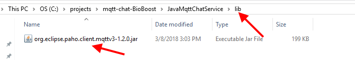
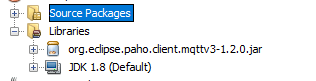

## Starting with Eclipse Paho Java Library

You can find the latest documentation of the Paho library via [https://www.eclipse.org/paho/clients/java/](https://www.eclipse.org/paho/clients/java/).

They also provide download links for the latest stable releases. Currently this is version `1.2.0` which can be downloaded by navigating to [https://repo.eclipse.org/content/repositories/paho-releases/](https://repo.eclipse.org/content/repositories/paho-releases/). Traverse to `org/eclipse/paho/org.eclipse.paho.client.mqttv3/` and select the latest release. Download the jar file and drop it inside your Java application under for example a `lib` folder as shown below.

Next add the JAR file as a dependency to your project by right clicking Libraries and selecting `Add JAR/Folder`. Browse to the `lib` directory and select the jar. The end result should be the following:

