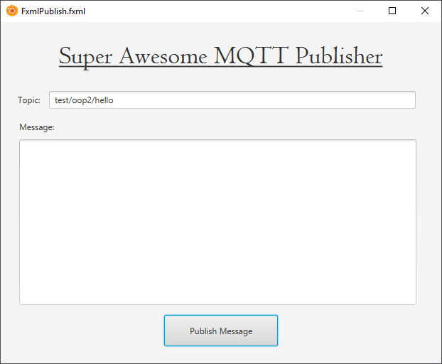

## Getting Started

Let us start with a simple example application that publishes a message to a certain topic. We can get the message from a graphical component such as a `TextArea` on our GUI.

### A JavaFX FXML Application

Start by creating a new JavaFX FXML application. Call it for example `MqttPublish`. Call the FXML document `FxmlPublish`.

Now create a small graphical interface that looks similar to the one shown below:



The following components have an id:
* The message `TextArea` has an id of `message`
* The topic `TextField` has an id of `topic`
* The publish `Button` has an id of `publish`

The topic `TextField` has a default text value set, namely `test/oop2/hello`.

Add both `message` and `topic` as attributes to your controller as shown below:

```java
public class FxmlPublishController implements Initializable {

    @FXML private TextField topic;
    @FXML private TextArea message;

    // ....
}
```

Remove the code of the `Label` that came with the starter code.

Also make sure to rename the button handler to something more useful such as `handlePublish`. Do not forget to change to `On Action` in Scene Builder of the publish button.

```java
public class FxmlPublishController implements Initializable {
    //..
    @FXML
    private void handlePublish(ActionEvent event) {
        System.out.println("You clicked me!");
    }
    //..
}
```

### Publish Example

At the bottom of the library information page [https://www.eclipse.org/paho/clients/java/](https://www.eclipse.org/paho/clients/java/) there is a starter example.

The included code below is a very basic sample that connects to a server and publishes a message using the MqttClient synchronous API.

```java
import org.eclipse.paho.client.mqttv3.MqttClient;
import org.eclipse.paho.client.mqttv3.MqttConnectOptions;
import org.eclipse.paho.client.mqttv3.MqttException;
import org.eclipse.paho.client.mqttv3.MqttMessage;
import org.eclipse.paho.client.mqttv3.persist.MemoryPersistence;

public class MqttPublishSample {
  public static void main(String[] args) {

      String topic        = "MQTT Examples";
      String content      = "Message from MqttPublishSample";
      int qos             = 2;
      String broker       = "tcp://iot.eclipse.org:1883";
      String clientId     = "JavaSample";
      MemoryPersistence persistence = new MemoryPersistence();

      try {
          MqttClient sampleClient = new MqttClient(broker, clientId, persistence);
          MqttConnectOptions connOpts = new MqttConnectOptions();
          connOpts.setCleanSession(true);
          System.out.println("Connecting to broker: "+broker);
          sampleClient.connect(connOpts);
          System.out.println("Connected");
          System.out.println("Publishing message: "+content);
          MqttMessage message = new MqttMessage(content.getBytes());
          message.setQos(qos);
          sampleClient.publish(topic, message);
          System.out.println("Message published");
          sampleClient.disconnect();
          System.out.println("Disconnected");
          System.exit(0);
      } catch(MqttException me) {
          System.out.println("reason "+me.getReasonCode());
          System.out.println("msg "+me.getMessage());
          System.out.println("loc "+me.getLocalizedMessage());
          System.out.println("cause "+me.getCause());
          System.out.println("excep "+me);
          me.printStackTrace();
      }
  }
}
```

### Refactor Example to Controller

Basically we need to achieve the following:
* When our application starts we need to connect with the client to the mqtt broker. This only needs to be done once. This indicates we should do this inside the `initialize()` method of our controller.
* When the user presses the publish button the message inside the TextArea should be published to the topic. This should be done inside the button handler.

This indicates that the `MqttClient` object (called `sampleClient` in the example code above) should be available both inside the initialize method and the button handler. In other words, we need to make it an attribute of the controller.

```java
public class FxmlPublishController implements Initializable {

    @FXML private TextField topic;
    @FXML private TextArea message;

    private MqttClient sampleClient;

    // ...
}
```

<!-- WORK IN PROGRESS  -->

Before we can refactor the creation of the `MqttClient` and the connection, we need to add the required arguments as properties to the controller. Why not as local variables?

The instantiation of the `MqttClient` object and `MqttConnectOptions` can also be placed inside the `initialize()` method of the controller.


and the `connect()` method call
