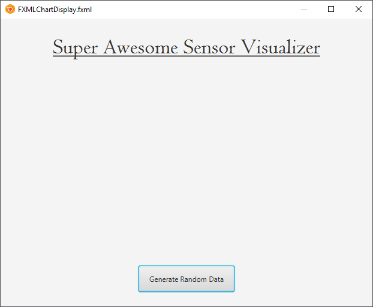
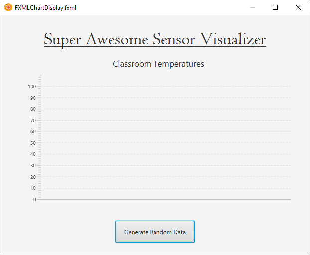

## Step 1 - Adding a Chart

In this first iteration we will start by just trying to visualize some random generated number in a chart. Just to get started and get a feeling on how to handle a chart in JavaFX.

Start by creating a new `Java FXML Application` in NetBeans. Call the project `SensorVisualizer` and the FXML file `FXMLChartDisplay`. You are free to choose either but if you cannot decide on a better name, use the ones given here. Open the FXML file in Scene Builder.

Change the default GUI a bit so it resembles the one below. It does not need to be exact. You can also make it a bit nicer of course.

Now select the *Charts* library and search for the `LineChart` component.

Drop a `LineChart` component in the middle of your Scene and adjust the boundaries a bit to make it fit. Add a nice title to it and also make sure to set the `id` of the component to `temperatureChart`. Later the chart will need to be made available inside our controller via its id.

Last but not least make sure to the change the id of the button that was already present. Change it to `generateRandomData`. You can keep the OnAction handler for the moment as is. This will be changed later.
