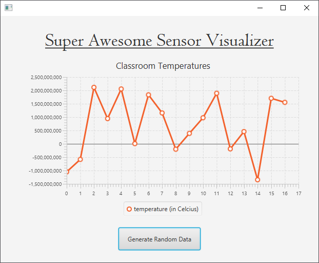
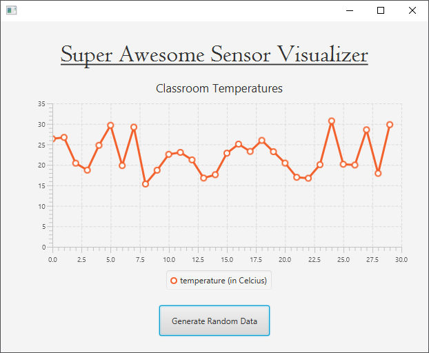

## Step 4 - Random Temperature Data

Let us add some random data to the chart. This can be achieved by adding a reference of the `Random` class as an attribute of the controller:

```java
public class FXMLChartDisplayController implements Initializable {
    //..
    private Random dataGenerator = new Random();
    //..
}
```

Now the random generator can be used as a data supplier for adding fake data to the chart:

```java
public class FXMLChartDisplayController implements Initializable {
    //...
    @FXML
    private void generateRandomDataHandler(ActionEvent event) {
        int randomTemperature = dataGenerator.nextInt();
        temperatureValues.getData().add(new XYChart.Data(xValue++, randomTemperature));
    }
    //...
}
```

While the chart looks a lot better now, it is not very realistic:



This is because the random numbers are way out of range of a realistic temperature. First we need to determine the minimum and maximum values we accept. Let for example say a maximum of 30 degrees and a minimum of 15 degrees (taking into account that it is classroom temperature). By adding both values as `final` attributes, we can use them inside our code later and we can also change them really easily later on.

```java
public class FXMLChartDisplayController implements Initializable {
    //..
    private Random dataGenerator = new Random();
    private final int MAXIMUM_TEMPERATURE = 30;
    private final int MINIMUM_TEMPERATURE = 15;
    //..
}
```

Now to get a random value between a minimum and maximum the following formula can be used:

```math
val = random * (MAX - MIN + 1) + MIN
```

where random is a random value in the range of [0, 1.0]. Try to understand for yourself why the above formula works. Would you be able to reconstruct it yourself? All it takes is some logical thinking.

To implement this in Java we do need to change our code a little. Most importantly instead of using the `nextInt()` method we need to call the `nextDouble()` method of the Random object, as this will deliver a value between 0 and 1.0.

The final result is shown below.

```java
public class FXMLChartDisplayController implements Initializable {

    @FXML private LineChart temperatureChart;
    private XYChart.Series temperatureValues;

    private int xValue = 0;

    private Random dataGenerator = new Random();
    private final int MAXIMUM_TEMPERATURE = 30;
    private final int MINIMUM_TEMPERATURE = 15;

    @FXML
    private void generateRandomDataHandler(ActionEvent event) {
        double randomTemperature = dataGenerator.nextDouble()
                * (MAXIMUM_TEMPERATURE - MINIMUM_TEMPERATURE + 1) + MINIMUM_TEMPERATURE;
        temperatureValues.getData().add(new XYChart.Data(xValue++, randomTemperature));
    }

    @Override
    public void initialize(URL url, ResourceBundle rb) {
        temperatureValues = new XYChart.Series();
        temperatureValues.setName("temperature (in Celcius)");

        // Add series to chart
        temperatureChart.getData().add(temperatureValues);
    }    
}
```

This results in a much cleaner emulation of a temperature sensor:


