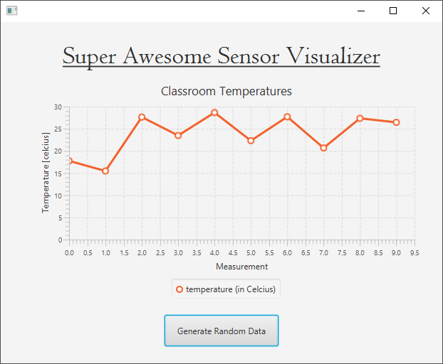

## Step 5 - Changing Axis Labels

Currently the x-axis and y-axis have no labels. A user of the application may guess that the y-axis is in degrees Celsius, but it should be clearly labeled. To do this we can set labels on both of them. This can be done inside the controllers `initialize()` method as it only needs to be done once and it should be visible from the start.

```java
public class FXMLChartDisplayController implements Initializable {

    // ...

    @Override
    public void initialize(URL url, ResourceBundle rb) {
        temperatureValues = new XYChart.Series();
        temperatureValues.setName("temperature (in Celcius)");

        // Add series to chart
        temperatureChart.getData().add(temperatureValues);

        // Set Axis
       temperatureChart.getYAxis().setLabel("Temperature [celcius]");
       temperatureChart.getXAxis().setLabel("Measurement");
    }    
}
```



When looking at the chart there is something that does not quite fit and needs to be refactored. The legend of the chart shows that the orange line is a temperature in Celsius. It would be more logical that the legend would label the chart data more clearly. For example with the label `Classroom 2.85`. To fix this, we can simply change the name that is passed to the series when it is created.

```java
public class FXMLChartDisplayController implements Initializable {

    // ...
    @Override
    public void initialize(URL url, ResourceBundle rb) {
        temperatureValues = new XYChart.Series();
        temperatureValues.setName("Classroom 2.85");

        // ...
    }    
}
```
