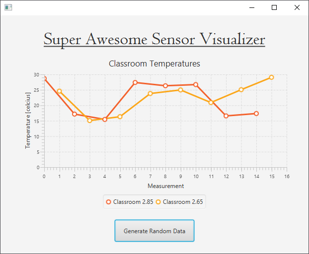

## Step 6 - Multiple Series

The `LineChart` is build to support displaying multiple series. Take for example the values of multiple temperature sensors.

Before we can add another series of temperature values, our code screams refactor. Take a close look at our current code. How would we call the new series? `temperatureValues2`? That would be an awful choice.

The best option would be to create an array of series. Let us refactor the code so the `temperatureValues` becomes an array of `XYChart.Series`.

### Refactoring the Code

Start by changing the attribute. We also add a final (constant value) to indicate how many series we will be placing inside the array of series. For the moment we still initialize it to a value of `1`. Remember that a refactoring should not add any functionality.

```java
public class FXMLChartDisplayController implements Initializable {

    @FXML private LineChart temperatureChart;
    private XYChart.Series temperatureValues[];
    private final int NUMBER_OF_TEMPERATURE_SERIES = 1;

    // ....
}
```

Next the `initialize()` method should also be changed so it creates a new array and a new series. We place the reference of the actual series on index `0`. Do note that we also need to change the line of code where the series is added to the chart.

```java
public class FXMLChartDisplayController implements Initializable {

    // ....

    @Override
    public void initialize(URL url, ResourceBundle rb) {
        temperatureValues = new XYChart.Series[NUMBER_OF_TEMPERATURE_SERIES];
        temperatureValues[0] = new XYChart.Series();
        temperatureValues[0].setName("Classroom 2.85");

        // Add series to chart
        temperatureChart.getData().add(temperatureValues[0]);

        // ...
    }    
}
```

Last we also need to refactor the button handler. All we need to do is replaced the series with the first element of the array.

```java
public class FXMLChartDisplayController implements Initializable {

    // ...

    @FXML
    private void generateRandomDataHandler(ActionEvent event) {
        double randomTemperature = dataGenerator.nextDouble()
                * (MAXIMUM_TEMPERATURE - MINIMUM_TEMPERATURE + 1) + MINIMUM_TEMPERATURE;
        temperatureValues[0].getData().add(new XYChart.Data(xValue++, randomTemperature));
    }

    // ...
}
```

Test the application to make sure it still works before proceeding.

### Adding Another Series

Now we can add another series, for example with random values that represent the temperature of `Classroom 2.65`. Start by changing the constant value `NUMBER_OF_TEMPERATURE_SERIES` to `2`.

```java
private final int NUMBER_OF_TEMPERATURE_SERIES = 2;
```

Next a new `Series` needs to be created and added to both the array and the chart. This is done inside the `initialize()` method.

```java
    @Override
    public void initialize(URL url, ResourceBundle rb) {
        temperatureValues = new XYChart.Series[NUMBER_OF_TEMPERATURE_SERIES];
        temperatureValues[0] = new XYChart.Series();
        temperatureValues[0].setName("Classroom 2.85");

        temperatureValues[1] = new XYChart.Series();
        temperatureValues[1].setName("Classroom 2.65");

        // Add series to chart
        temperatureChart.getData().add(temperatureValues[0]);
        temperatureChart.getData().add(temperatureValues[1]);

        // Set Axis
        temperatureChart.getYAxis().setLabel("Temperature [celcius]");
        temperatureChart.getXAxis().setLabel("Measurement");
    }  
```

Last we also need to add values to it when the user presses the `Generate Random Data` button. So another random values must be generated.

```java
    @FXML
    private void generateRandomDataHandler(ActionEvent event) {
        double randomTemperature = dataGenerator.nextDouble()
                * (MAXIMUM_TEMPERATURE - MINIMUM_TEMPERATURE + 1) + MINIMUM_TEMPERATURE;
        temperatureValues[0].getData().add(new XYChart.Data(xValue++, randomTemperature));

        randomTemperature = dataGenerator.nextDouble()
                * (MAXIMUM_TEMPERATURE - MINIMUM_TEMPERATURE + 1) + MINIMUM_TEMPERATURE;
        temperatureValues[1].getData().add(new XYChart.Data(xValue++, randomTemperature));
    }
```

The above code reuses the local variable `randomTemperature` to store a new random number after the first was copied to the series.

A small bug arises. If you press the button the series of classroom 2.65 is shifted to the right. It does not start at index 0. Can you identify the bug?



Indeed, the `xValue` index variable should only be incremented after both values were added to their series. By adding it as a separate statement we lessen the chance of making the same mistake again later.

```java
    @FXML
    private void generateRandomDataHandler(ActionEvent event) {
        double randomTemperature = dataGenerator.nextDouble()
                * (MAXIMUM_TEMPERATURE - MINIMUM_TEMPERATURE + 1) + MINIMUM_TEMPERATURE;
        temperatureValues[0].getData().add(new XYChart.Data(xValue, randomTemperature));

        randomTemperature = dataGenerator.nextDouble()
                * (MAXIMUM_TEMPERATURE - MINIMUM_TEMPERATURE + 1) + MINIMUM_TEMPERATURE;
        temperatureValues[1].getData().add(new XYChart.Data(xValue, randomTemperature));

        // Advance xValue for the next value
        xValue++;
    }
```


