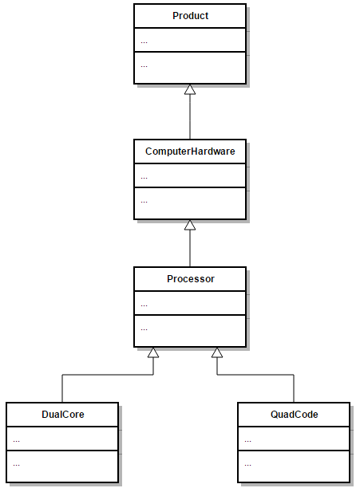

## Constructors and inheritance

When creating objects, Java will not only call the constructor of the type you are creating but it will **implicitly call a constructor of each base class**. Let's take a look at the inheritance hierarchy below.



When for example creating an object of type `QuadCore`, the constructor of `QuadCore` will implicitly call the constructor of `Processor` which will call the constructor of `ComputerHardware` which will call the constructor of `Product`. These calls are provided by default by Java and are done before anything else. That means that the rest of you constructor code will be executed after the constructor call to the base class.

 This basically means that the `Product` will be constructed first, next the `ComputerHardware`, after which the `Processor` and last the `QuadCore`. This is a bit logical as you can only initialize the specific data of `ComputerHardware` after the data of `Product` has been initialized.

There is however a catch to this whole construction system.

Remember that if you do not define a constructor in Java, it will provide you with a **default constructor** for a class. However once you create a constructor yourself Java will not provide this default constructor anymore. That means if you create a single constructor that takes arguments, your class will not have a default constructor anymore.

Let us take a look at a simplified `Animal` class:

```java
public class Animal {
    private String name;
    private int age;

    public Product(String name, int age) {
        // Initialization
    }
}
```

The implementation above defines a single constructor taking a *name* and an *age*. This means that we can only construct objects using that constructor an **NOT** as follows:

```java
// This fails because Animal has no default constructor !!
Animal giraffe = new Animal();
```

Now take a subclass `Pet` of `Animal` as defined below. As can be seen a single constructor is provided.

```java
public class Pet extends Animal {
    private boolean isChipped;

    public Pet(String name, int age, boolean isChipped) {
        // Initialization
    }
}
```

The implementation of `Pet` will actually not work because Java will add an implicit call to the default constructor of `Animal` as the first line of code in the `Pet` class. In other words, currently no default constructor exists for the base class `Animal`, resulting in an application that will fail.

This can be fixed using two approaches:
* **add a default constructor to the base class**. This is however not always possible or even advisable as you may not have access to the implementation of the base class or it might not make sense to add a default constructor.
* **add an explicit call to the correct constructor of the base class**. This can be achieved by using the keyword `super` which can be called as a method `super()` to indicate that a base class constructor needs to be called first.

The second approach mostly takes the preference. Important to note here is that this call to the base class constructor has to happen **before anything** else in the constructor. This means that `super()` will be the first line of code inside your constructor in this case.

Let us apply this knowledge to the `Pet` class.

```java
public class Pet extends Animal {
    private boolean isChipped;

    public Pet(String name, int age, boolean isChipped) {
        super(name, age);    // Call correct base class constructor FIRST !!!!

        // Rest of initialization for Pet
        this.isChipped = isChipped;
    }
}
```

### Quick summary

* Java provides a default constructor if you provide no constructor(s).
* With inheritance each constructor is called from bottom to top but actually executed from top to bottom.
* If no default constructor exists for the base class you will need to add one or call another constructor explicitly as the first line of code in the current class constructor using  `super()` and provide the required arguments.
