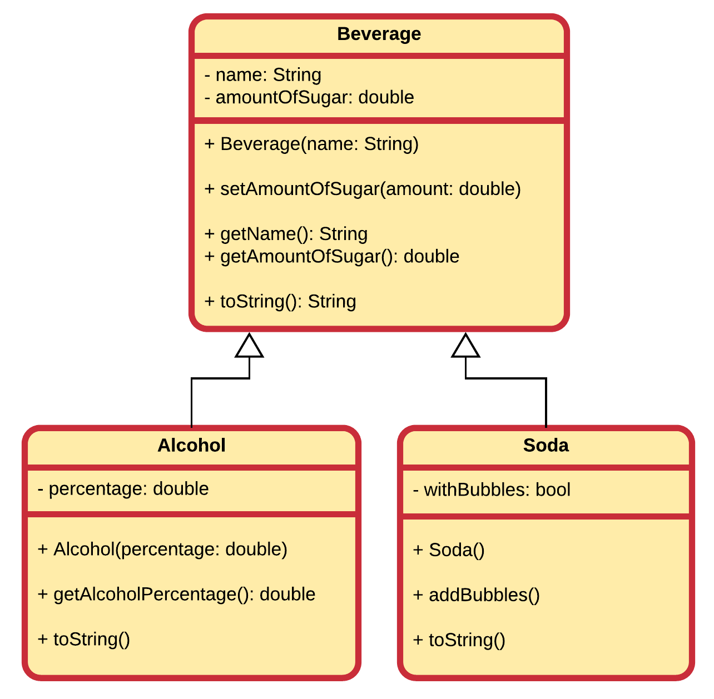

## Exercises

### Computer Store

Take the example of the computer store from this chapter.

Extend the UML class diagram with a class `Software` with the following attributes:
* id
* price
* title
* minimum requirements

### Drinks and Beverages

Below is a UML diagram of model of beverages. It contains a class `Beverage`, which is as a base class for a class `Alcohol` and a class `Soda`.

Implement these classes in Java. Make sure to override all `toString()` methods and personalize it for each class.
