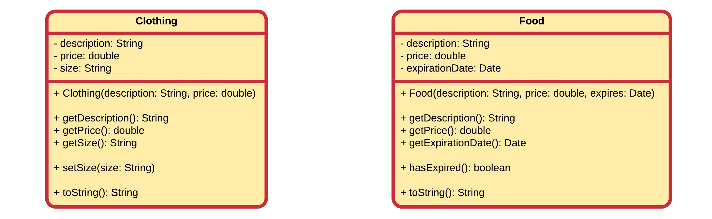
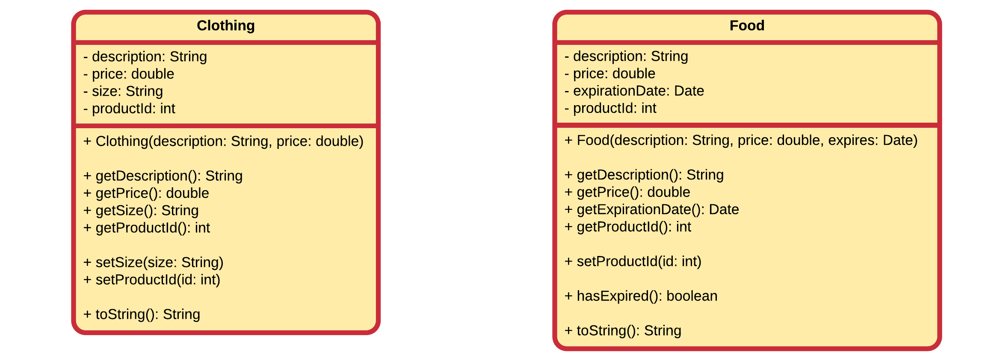
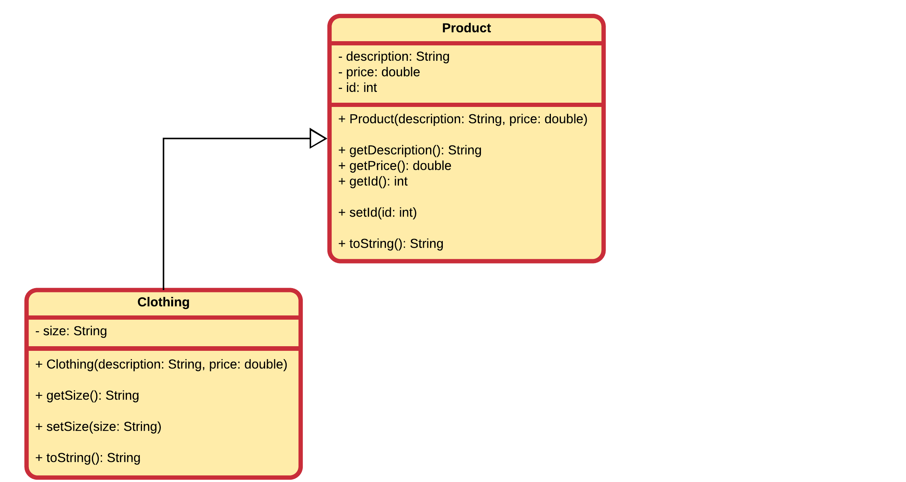
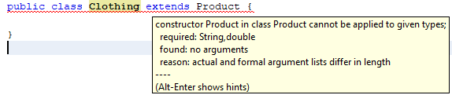

## Implementing a WebShop

Let's image we have to build an application to track all the goods that are sold in a specific store. The store owner asked us to create a simple application in Java. Since he only started a few weeks ago his supply of goods is very limited. He currently only sells some food products and some basic clothing.

To start of we create a `Clothing` class and a `Food` class. The UML diagrams of both classes are depicted below.



For the `Clothing` class we define the properties to be a description, a price and a size. The type of size is set to `String` to be able to contain sizes like "XL" and "M". We provide a constructor that takes both the description and price of a clothing piece. The size we will set to "M" by default and add a setter to allow a user of the class to change it if needed.

The `Food` class is similar as it also has the properties description and price. On top of those it also has an expiration date of type `Date` (more info on this class can be found at [https://docs.oracle.com/javase/9/docs/api/java/util/Date.html](https://docs.oracle.com/javase/9/docs/api/java/util/Date.html)). Note that it also contain a method `hasExpired()` which returns true if the expiration date is greater than or equal to todays date.

Both classes contain constructors, some getters and a `toString()` method that returns a full description of the product (containing description, price and depending on the class the size or the expiration date).

### Code always changes

Something to remember is that code evolves. It changes over time as things get added, removed or refactored. Static code will eventually become outdated and die.

So let's take the store example from the previous section as an example. You created the `Clothing` and `Food` classes after which your boss shows up and tells you to add a database identifier to all the goods. This means you need to change both classes as shown in the following UML class diagrams.



Note that the product id is not added as an argument to the constructor of the class but instead set using a setter method `setProductId()`. This because of the assumption that most of the time the product id will be generated based on the ones that are already taken (products are most likely to be stored in a database).

Notice that we had to change two classes to add a product id attribute, a getter and a setter. And if we are not careful we might forget to change the `toString()` implementation.

It should feel awkward to change two classes for a single change based on a single property. And what if we had like 10, 20 or a 100 sorts of goods. It would be a days work to add such a simple thing to our application.

Let's be lazier but smarter programmers and take another approach to this problem.

### Back to inheritance

The extension of the classes with a product id can be easily solved (literally minutes, even with 100 different types of products) if we had some sort of general class that held all the common properties and actions of all the products our client sells. This is exactly what inheritance provides for us.

Inheritance allows a class to inherit (get) the properties and methods of another class. In other words, the **subclass** inherits the states and behaviors from the **base class**. The subclass is also called the **derived class** while the base class is also known as the **super-class**. The derived class can add its own additional variables and methods. These additional variable and methods differentiates the derived class from the base class.

A super-class can have any number of subclasses. But a subclass can have only one superclass. This is because Java does not support *multiple inheritance*.

So going back to our example we could create a `Product` class and put all the common properties of `Clothing` and `Food` in this class. The same can be done for the methods of the `Clothing` and `Food` class. Do take note that the constructor of the `Product` class can only be used to create a general `Product` object and does not know of the `Food` and `Clothing` classes and their more specific properties such as expiration date and size.


Also notice how we changed the name of the `productId` attribute to `id`. As it is part of the `Product` class it is not necessary to call it `productId`.

We also provided an implementation for the `toString()` method.

Now our derived class `Clothing` can be refactored to a very simple class with only the specific size attribute, a constructor, a getter and a more specific implementation of `toString()`.



Make sure not to change the arguments of the constructor of the `Clothing` class. It still needs to take in the `description` and `price`, even when these attributes are actually part of the `Product` class. This is because later on you will see that we actually call the constructors of the subclasses. Description and price are part of the base class `Product` but are inherited by the `Clothing` class.

A similar refactor needs to be done to the `Food` class.


In an UML class diagram inheritance is depicted by drawing a closed arrow from the subclass to the base class.

### Is-a relationship check

Before we continue, let's do the `is-a` check:
* `Food` is-a `Product`? Ok sounds good
* `Clothing` is-a `Product`? Ok sounds good too

### Implementing the Product class

Now that our design seems fine, we start by implementing the `Product` class. The implementation is pretty straightforward.

```java
public class Product {
    private String description = "";
    private double price = 0;
    private int id = 0;

    public Product(String description, double price) {
        this.description = description;
        this.price = price;
    }

    public String getDescription() { return description; }
    public double getPrice() { return price; }
    public int getId() { return id; }

    public void setId(int id) { this.id = id; }

    @Override
    public String toString() {
        return "|" + id + "| " + description + " [" + price + "eur]";
    }
}
```

### Implementing the Clothing class

The `Clothing` class is less straightforward. We need add the `size` attribute with a setter and a getter. We also need to provide a non-default constructor and a `toString()` method that override the `toString()` method of the base class. To enable the inheritance mechanism, we also must add `extends Product` after the name of the class.

Remember that when no default constructor exists for the base class, an explicit call to the correct constructor must be added. When implementing the `Clothing` class NetBeans will immediately warn you for this:



Realizing all this results in the implementation shown below.

```java
public class Clothing extends Product {
    private String size = "M";

    public Clothing(String description, double price) {
        super(description, price);      // Call correct base class constructor FIRST !!!!
    }

    public void setSize(String size) { this.size = size; }

    public String getSize() { return size; }

    @Override
    public String toString() {
        // We can use the super keyword to specify we want to call a
        // method of the base class
        return super.toString() + " Size = " + size;
    }
}
```

### Implementing the Food class

Implementing the Food class should now be more straightforward. The same principles apply as with the `Clothing` class.

```java
public class Food extends Product {
    private Date expirationDate;

    public Food(String description, double price, Date expirationDate) {
        super(description, price);    // Call baseclass constructor FIRST !!!!

        // Rest of initialization for Food
        this.expirationDate = expirationDate;
    }

    public Date getExpirationDate() { return expirationDate; }

    public boolean hasExpired() {
        Date today = new Date();
        return expirationDate.before(today);
    }

    @Override
    public String toString() {
        String output = super.toString() + " Expires at " + expirationDate;
        if (hasExpired()) {
            output += " => HAS EXPIRED!";
        }
        return output;
    }
}
```

Note how the `toString()` method has been extended a bit to show if the `Food` has expired.


### A Small Application

To test our newly created classes we need a small main class.

```java
public class WebShop {
    public static void main(String[] args) throws ParseException {
        // Some date helper object
        DateFormat dateFormat = new SimpleDateFormat("dd/MM/yyyy");

        // Creating a Food object
        Food canOfTomatoSoup = new Food("Can of tomato soup with meat balls",
                2.99, dateFormat.parse("21/12/2034"));

        // Creating a Food object that has expired
        Food chips = new Food("Lays paprika chips",
                1.30, dateFormat.parse("10/1/2016"));

        // Creating a piece of clothing
        Clothing socks = new Clothing("Pair of black socks for men", 3.45);

        // Changing the size of clothing piece
        Clothing metallicaShirt = new Clothing("Cool t-shirt of Metallica", 18.99);
        metallicaShirt.setSize("XL");

        // Lets print everything
        System.out.println(canOfTomatoSoup);
        System.out.println(chips);
        System.out.println(socks);
        System.out.println(metallicaShirt);
    }
}
```

This produces the following output:

```text
|0| Can of tomato soup with meat balls [2.99eur] Expires at Thu Dec 21 00:00:00 CET 2034
|0| Lays paprika chips [1.3eur] Expires at Sun Jan 10 00:00:00 CET 2016 => HAS EXPIRED!
|0| Pair of black socks for men [3.45eur] Size = M
|0| Cool t-shirt of Metallica [18.99eur] Size = XL
```

For the moment you can ignore the id's that are `0`.
